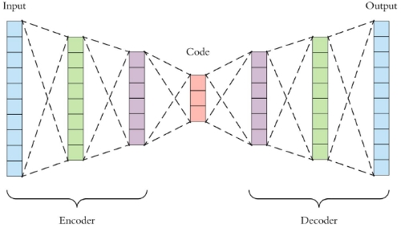
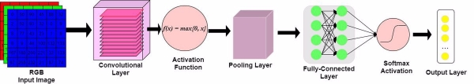

**ML Cheatsheet Documentation**

**Team**

**Jul 01, 2022**

Basics

1  [Linear Regression](#_page6_x72.00_y72.00) 3
1  [Gradient Descent](#_page24_x72.00_y72.00) 21
1  [Logistic Regression](#_page28_x72.00_y72.00) 25
1  [Glossary](#_page42_x72.00_y72.00) 39
1  [Calculus](#_page48_x72.00_y72.00) 45
1  [Linear Algebra](#_page60_x72.00_y72.00) 57
1  [Probability](#_page70_x72.00_y72.00) 67
1  [Statistics](#_page72_x72.00_y72.00) 69
1  [Notation](#_page74_x72.00_y72.00) 71 [10 Concepts](#_page78_x72.00_y72.00) 75 [11 Forwardpropagation](#_page84_x72.00_y72.00) 81 [12 Backpropagation](#_page94_x72.00_y72.00) 91 [13 Activation Functions](#_page100_x72.00_y72.00) 97 [14 Layers](#_page108_x72.00_y72.00) 105 [15 Loss Functions](#_page120_x72.00_y72.00) 117 [16 Optimizers](#_page124_x72.00_y72.00) 121 [17 Regularization](#_page130_x72.00_y72.00) 127 [18 Architectures](#_page140_x72.00_y72.00) 137 [19 ClassificationAlgorithms](#_page154_x72.00_y72.00) 151 [20 Clustering Algorithms](#_page164_x72.00_y72.00) 161

**i**

[21 Regression Algorithms](#_page166_x72.00_y72.00) 163 [22 Reinforcement Learning](#_page168_x72.00_y72.00) 165 [23 Datasets](#_page174_x72.00_y72.00) 171 [24 Libraries](#_page190_x72.00_y72.00) 187 [25 Papers](#_page220_x72.00_y72.00) 217 [26 Other Content](#_page226_x72.00_y72.00) 223 [27 Contribute](#_page232_x72.00_y72.00) 229

**ii**

**ML Cheatsheet Documentation**

Brief visual explanations of machine learning concepts with diagrams, code examples and links to resources for learning more.

Warning: If you finderrors, please raise an[ issue ](https://github.com/bfortuner/ml-cheatsheet/issues)or[ contribute ](https://github.com/bfortuner/ml-cheatsheet/blob/master/README.md)a better definition!

**Basics 1**

**ML Cheatsheet Documentation**

**2 Basics**

1 CHAPTER

Linear Regression

- [Introduction](#_page7_x72.00_y72.00)
- [Simple regression](#_page7_x72.00_y392.24)
  - [Making predictions](#_page7_x72.00_y572.31)
  - [Cost function](#_page8_x72.00_y530.72)
  - [Gradient descent](#_page9_x72.00_y291.86)
  - [Training](#_page10_x72.00_y609.96)
  - [Model evaluation](#_page11_x72.00_y293.42)
  - [Summary](#_page16_x72.00_y447.43)
- [Multivariable regression](#_page16_x72.00_y567.67)
- [Growing complexity](#_page17_x72.00_y72.00)
- [Normalization](#_page17_x72.00_y492.48)
- [Making predictions](#_page18_x72.00_y369.67)
- [Initialize weights](#_page18_x72.00_y578.14)
- [Cost function](#_page19_x72.00_y72.00)
- [Gradient descent](#_page19_x72.00_y370.60)
- [Simplifying with matrices](#_page20_x72.00_y201.62)
- [Bias term](#_page21_x72.00_y324.00)
- [Model evaluation](#_page21_x72.00_y529.92)

**3**

**ML Cheatsheet Documentation**

1. **Introduction**

Linear Regression is a supervised machine learning algorithm where the predicted output is continuous and has a constant slope. It’s used to predict values within a continuous range, (e.g. sales, price) rather than trying to classify them into categories (e.g. cat, dog). There are two main types:

**Simple regression**

Simple linear regression uses traditional slope-intercept form, where 𝑚and 𝑏are the variables our algorithm will try to “learn” to produce the most accurate predictions. 𝑥represents our input data and 𝑦represents our prediction.

𝑦= 𝑚𝑥+ 𝑏

**Multivariable regression**

A more complex, multi-variable linear equation might look like this, where 𝑤represents the coefficients, or weights, our model will try to learn.

𝑓(𝑥,𝑦,𝑧) = 𝑤1𝑥+ 𝑤2𝑦+ 𝑤3𝑧

The variables 𝑥,𝑦,𝑧represent the attributes, or distinct pieces of information, we have about each observation. For sales predictions, these attributes might include a company’s advertising spend on radio, TV, and newspapers.

𝑆𝑎𝑙𝑒𝑠= 𝑤1𝑅𝑎𝑑𝑖𝑜+ 𝑤2𝑇𝑉+ 𝑤3𝑁𝑒𝑤𝑠

2. **Simple regression**

Let’s say we are given a[ dataset ](http://www-bcf.usc.edu/~gareth/ISL/Advertising.csv)with the following columns (features): how much a company spends on Radio advertising each year and its annual Sales in terms of units sold. We are trying to develop an equation that will let us to predict units sold based on how much a company spends on radio advertising. The rows (observations) represent companies.

|Company|Radio ($)|Sales|
| - | - | - |
|Amazon|37.8|22.1|
|Google|39.3|10.4|
|Facebook|45.9|18.3|
|Apple|41.3|18.5|
1. **Making predictions**

Our prediction function outputs an estimate of sales given a company’s radio advertising spend and our current values for Weightand Bias.

𝑆𝑎𝑙𝑒𝑠= 𝑊𝑒𝑖𝑔ℎ𝑡·𝑅𝑎𝑑𝑖𝑜+ 𝐵𝑖𝑎𝑠

Weight the coefficientfor the Radio independent variable. In machine learning we call coefficientsweights. Radio the independent variable. In machine learning we call these variables features.

Bias the intercept where our line intercepts the y-axis. In machine learning we can call intercepts bias. Bias offsets

all predictions that we make.

Our algorithm will try to learn the correct values for Weight and Bias. By the end of our training, our equation will approximate the line of best fit.

**Code**

**def** predict\_sales(radio, weight, bias):

**return** weight\*radio + bias

2. **Cost function**

The prediction function is nice, but for our purposes we don’t really need it. What we need is a[ cost function](#_page120_x72.00_y72.00) so we can start optimizing our weights.

Let’s use[ MSE (L2)](#_page123_x72.00_y309.16)as our cost function. MSE measures the average squared difference between an observation’s actual and predicted values. The output is a single number representing the cost, or score, associated with our current set of weights. Our goal is to minimize MSE to improve the accuracy of our model.

**Math**

Given our simple linear equation 𝑦= 𝑚𝑥+ 𝑏, we can calculate MSE as:

𝑀𝑆𝐸= 𝑁1 ∑︁ 𝑖 𝑖 (𝑦− (𝑚𝑥+ 𝑏))2

𝑛

𝑖=1

Note:

- 𝑁is the total number of observations (data points) 1 ∑︀𝑛
- 𝑁 𝑖=1 is the mean
- 𝑦𝑖is the actual value of an observation and 𝑚𝑥𝑖+ 𝑏is our prediction

**Code**

**def** cost\_function(radio, sales, weight, bias):

companies = len(radio)

total\_error = 0.0

**for** i **in** range(companies):

total\_error += (sales[i] - (weight\*radio[i] + bias))\*\*2 **return** total\_error / companies

3. **Gradient descent**

To minimize MSE we use[ Gradient Descent ](#_page24_x72.00_y72.00)to calculate the gradient of our cost function. Gradient descent consists of looking at the error that our weight currently gives us, using the derivative of the cost function to findthe gradient (The slope of the cost function using our current weight), and then changing our weight to move in the direction opposite of the gradient. We need to move in the opposite direction of the gradient since the gradient points up the slope instead of down it, so we move in the opposite direction to try to decrease our error.

**Math**

There are two[ parameters ](#_page44_x72.00_y454.73)(coefficients) in our cost function we can control: weight 𝑚and bias 𝑏. Since we need to consider the impact each one has on the finalprediction, we use partial derivatives. To findthe partial derivatives, we use the[ Chain rule.](#_page51_x72.00_y641.63) We need the chain rule because (𝑦− (𝑚𝑥+ 𝑏))2 is really 2 nested functions: the inner function 𝑦− (𝑚𝑥+ 𝑏) and the outer function 𝑥2.

Returning to our cost function:

1 ∑︁𝑛

𝑓(𝑚,𝑏) = (𝑦𝑖− (𝑚𝑥𝑖+ 𝑏))2

𝑁

𝑖=1

Using the following:

(𝑦𝑖− (𝑚𝑥𝑖+ 𝑏))2 = 𝐴(𝐵(𝑚,𝑏)) We can split the derivative into

𝐴(𝑥) = 𝑥2

𝑑𝑓= 𝐴′(𝑥) = 2 𝑥 𝑑𝑥

and

𝐵(𝑚,𝑏) = 𝑦𝑖− (𝑚𝑥𝑖+ 𝑏) = 𝑦𝑖− 𝑚𝑥𝑖− 𝑏

𝑑𝑥

𝑑𝑚= 𝐵′(𝑚) = 0 − 𝑥𝑖− 0 = − 𝑥𝑖

𝑑𝑥= 𝐵′(𝑏) = 0 − 0 − 1 = − 1 𝑑𝑏

And then using the[ Chain rule ](#_page51_x72.00_y641.63)which states:

𝑑𝑓𝑑𝑓𝑑𝑥 =

𝑑𝑚𝑑𝑥𝑑𝑚

𝑑𝑓𝑑𝑓𝑑𝑥 =

𝑑𝑏𝑑𝑥𝑑𝑏

We then plug in each of the parts to get the following derivatives

𝑑𝑓= 𝐴′(𝐵(𝑚,𝑓))𝐵′(𝑚) = 2( 𝑦− (𝑚𝑥+ 𝑏)) · −𝑥 𝑑𝑚 𝑖 𝑖 𝑖

𝑑𝑓= 𝐴′(𝐵(𝑚,𝑓))𝐵′(𝑏) = 2( 𝑦− (𝑚𝑥+ 𝑏)) · −1 𝑑𝑏 𝑖 𝑖

We can calculate the gradient of𝑓this(𝑚,cost𝑏) =function𝑑𝑚𝑑𝑑𝑓𝑓=as: 𝑁11∑︀∑︀− 2(𝑦− (𝑚𝑥𝑖+ 𝑏))(1.2) (1.1)

[︂ ]︂ [︂ ∑︀ ]︂

- 𝑁11 ∑︀− 1 ·2(𝑦𝑖− (𝑚𝑥𝑖+ 𝑏))

− 𝑥𝑖·2(𝑦𝑖− (𝑚𝑥𝑖+ 𝑏))

𝑑𝑏 [︂𝑁 ]︂

- − 2𝑥𝑖(𝑦𝑖− (𝑚𝑥𝑖+ 𝑏))

𝑁 𝑖

**Code**

To solve for the gradient, we iterate through our data points using our new weight and bias values and take the average of the partial derivatives. The resulting gradient tells us the slope of our cost function at our current position (i.e. weight and bias) and the direction we should update to reduce our cost function (we move in the direction opposite the gradient). The size of our update is controlled by the[ learning rate.](#_page43_x72.00_y720.00)

**def** update\_weights(radio, sales, weight, bias, learning\_rate):

weight\_deriv = 0

bias\_deriv = 0

companies = len(radio)

**for** i **in** range(companies):

- Calculate partial derivatives
- -2x(y - (mx + b))

weight\_deriv += -2\*radio[i] \* (sales[i] - (weight\*radio[i] + bias))

- -2(y - (mx + b))

bias\_deriv += -2\*(sales[i] - (weight\*radio[i] + bias))

- We subtract because the derivatives point in direction of steepest ascent weight -= (weight\_deriv / companies) \* learning\_rate

bias -= (bias\_deriv / companies) \* learning\_rate

**return** weight, bias

4. **Training**

Training a model is the process of iteratively improving your prediction equation by looping through the dataset multiple times, each time updating the weight and bias values in the direction indicated by the slope of the cost function (gradient). Training is complete when we reach an acceptable error threshold, or when subsequent training iterations fail to reduce our cost.

Before training we need to initialize our weights (set default values), set our[ hyperparameters ](#_page43_x72.00_y588.49)(learning rate and number of iterations), and prepare to log our progress over each iteration.

**Code**

**def** train(radio, sales, weight, bias, learning\_rate, iters):

cost\_history = []

**for** i **in** range(iters):

weight,bias = update\_weights(radio, sales, weight, bias, learning\_rate)

#Calculate cost for auditing purposes

cost = cost\_function(radio, sales, weight, bias) cost\_history.append(cost)

- Log Progress

**if** i % 10 == 0:

print "iter={:d} weight={:.2f} bias={:.4f} cost={:.2}".format(i, ˓→weight, bias, cost)

**return** weight, bias, cost\_history

5. **Model evaluation**

If our model is working, we should see our cost decrease after every iteration. **Logging**

iter=1 weight=.03 bias=.0014 cost=197.25 iter=10 weight=.28 bias=.0116 cost=74.65 iter=20 weight=.39 bias=.0177 cost=49.48 iter=30 weight=.44 bias=.0219 cost=44.31 iter=30 weight=.46 bias=.0249 cost=43.28

**Visualizing**

**1.2. Simple regression 11****
**ML Cheatsheet Documentation**

**Cost history**

6. **Summary**

By learning the best values for weight (.46) and bias (.25), we now have an equation that predicts future sales based on radio advertising investment.

𝑆𝑎𝑙𝑒𝑠= .46𝑅𝑎𝑑𝑖𝑜+ .025 How would our model perform in the real world? I’ll let you think about it :)

3. **Multivariable regression**

Let’s say we are given[ data ](http://www-bcf.usc.edu/~gareth/ISL/Advertising.csv)on TV, radio, and newspaper advertising spend for a list of companies, and our goal is to predict sales in terms of units sold.

|Company|TV|Radio|News|Units|
| - | - | - | - | - |
|Amazon|230.1|37.8|69.1|22.1|
|Google|44.5|39.3|23.1|10.4|
|Facebook|17.2|45.9|34.7|18.3|
|Apple|151.5|41.3|13.2|18.5|
1. **Growing complexity**

As the number of features grows, the complexity of our model increases and it becomes increasingly difficult to visualize, or even comprehend, our data.

One solution is to break the data apart and compare 1-2 features at a time. In this example we explore how Radio and TV investment impacts Sales.

2. **Normalization**

As the number of features grows, calculating gradient takes longer to compute. We can speed this up by “normalizing” our input data to ensure all values are within the same range. This is especially important for datasets with high standard deviations or differences in the ranges of the attributes. Our goal now will be to normalize our features so they are all in the range -1 to 1.

**Code**

For each feature column {

#1 Subtract the mean of the column (mean normalization)

#2 Divide by the range of the column (feature scaling) }

Our input is a 200 x 3 matrix containing TV, Radio, and Newspaper data. Our output is a normalized matrix of the same shape with all values between -1 and 1.

**def** normalize(features):

\*\*

features - (200, 3) features.T - (3, 200)

We transpose the input matrix, swapping cols **and** rows to make vector math easier \*\*

**for** feature **in** features.T:

fmean = np.mean(feature)

frange = np.amax(feature) - np.amin(feature)

#Vector Subtraction feature -= fmean

#Vector Division feature /= frange

**return** features

Note: Matrix math. Before we continue, it’s important to understand basic [Linear Algebra ](#_page60_x72.00_y72.00)concepts as well as numpy functions like[ numpy.dot().](https://docs.scipy.org/doc/numpy/reference/generated/numpy.dot.html)

3. **Making predictions**

Our predict function outputs an estimate of sales given our current weights (coefficients) and a company’s TV, radio, and newspaper spend. Our model will try to identify weight values that most reduce our cost function.

𝑆𝑎𝑙𝑒𝑠= 𝑊1𝑇𝑉+ 𝑊2𝑅𝑎𝑑𝑖𝑜+ 𝑊3𝑁𝑒𝑤𝑠𝑝𝑎𝑝𝑒𝑟

**def** predict(features, weights):

\*\*

features - (200, 3)

weights - (3, 1) predictions - (200,1)

\*\*

predictions = np.dot(features, weights)

**return** predictions

4. **Initialize weights**

W1 = 0.0

W2 = 0.0

W3 = 0.0

weights = np.array([

[W1],

[W2],

[W3]

])

5. **Cost function**

Now we need a cost function to audit how our model is performing. The math is the same, except we swap the 𝑚𝑥+ 𝑏 expression for 𝑊1𝑥1 + 𝑊2𝑥2 + 𝑊3𝑥3. We also divide the expression by 2 to make derivative calculations simpler.

𝑀𝑆𝐸= 1 ∑︁𝑛(𝑦𝑖− (𝑊1𝑥1 + 𝑊2𝑥2 + 𝑊3𝑥3))2

2𝑁

𝑖=1

**def** cost\_function(features, targets, weights):

\*\* features:(200,3)

targets: (200,1)

weights:(3,1)

returns average squared error among predictions

\*\*

N = len(targets)

predictions = predict(features, weights)

- Matrix math lets use do this without looping sq\_error = (predictions - targets)\*\*2
- Return average squared error among predictions **return** 1.0/(2\*N) \* sq\_error.sum()
6. **Gradient descent**

Again using the[ Chain rule ](#_page51_x72.00_y641.63)we can compute the gradient–a vector of partial derivatives describing the slope of the cost function for each weight.

𝑓′(𝑊1) = − 𝑥1(𝑦− (𝑊1𝑥1 + 𝑊2𝑥2 + 𝑊3𝑥3)) (1.3) 𝑓′(𝑊2) = − 𝑥2(𝑦− (𝑊1𝑥1 + 𝑊2𝑥2 + 𝑊3(1.4)𝑥3))

𝑓′(𝑊3) = − 𝑥3(𝑦− (𝑊1𝑥1 + 𝑊2𝑥2 + 𝑊3(1.5)𝑥3))

**def** update\_weights(features, targets, weights, lr):

'''

Features:(200, 3)

Targets: (200, 1)

Weights:(3, 1)

'''

predictions = predict(features, weights)

#Extract our features x1 = features[:,0]

x2 = features[:,1]

x3 = features[:,2]

- Use dot product to calculate the derivative for each weight d\_w1 = -x1.dot(targets - predictions)

d\_w2 = -x2.dot(targets - predictions)

d\_w2 = -x2.dot(targets - predictions)

- Multiply the mean derivative by the learning rate

(continues on next page)

(continued from previous page)

- and subtract from our weights (remember gradient points in direction of

˓→steepest ASCENT)

weights[0][0] -= (lr \* np.mean(d\_w1))

weights[1][0] -= (lr \* np.mean(d\_w2))

weights[2][0] -= (lr \* np.mean(d\_w3))

**return** weights

And that’s it! Multivariate linear regression.

7. **Simplifying with matrices**

The gradient descent code above has a lot of duplication. Can we improve it somehow? One way to refactor would be to loop through our features and weights–allowing our function to handle any number of features. However there is another even better technique: vectorized gradient descent.

**Math**

We use the same formula as above, but instead of operating on a single feature at a time, we use matrix multiplication to operative on all features and weights simultaneously. We replace the 𝑥𝑖terms with a single feature matrix 𝑋.

𝑔𝑟𝑎𝑑𝑖𝑒𝑛𝑡= − 𝑋(𝑡𝑎𝑟𝑔𝑒𝑡𝑠− 𝑝𝑟𝑒𝑑𝑖𝑐𝑡𝑖𝑜𝑛𝑠)

**Code** X = [

[x1, x2, x3] [x1, x2, x3] .

.

.

[x1, x2, x3]

]

targets = [

[1], [2], [3]

]

**def** update\_weights\_vectorized(X, targets, weights, lr):

\*\*

gradient = X.T \* (predictions - targets) / N

X: (200, 3)

Targets: (200, 1) Weights: (3, 1)

\*\*

companies = len(X)

#1 - Get Predictions

predictions = predict(X, weights)

(continues on next page)

(continued from previous page)

#2 - Calculate error/loss error = targets - predictions

#3 Transpose features from (200, 3) to (3, 200)

- So we can multiply w the (200,1) error matrix.
- Returns a (3,1) matrix holding 3 partial derivatives --
- one for each feature -- representing the aggregate
- slope of the cost function across all observations gradient = np.dot(-X.T, error)

#4 Take the average error derivative for each feature gradient /= companies

#5 - Multiply the gradient by our learning rate gradient \*= lr

#6 - Subtract from our weights to minimize cost weights -= gradient

**return** weights

8. **Bias term**

Our train function is the same as for simple linear regression, however we’re going to make one final tweak before running: add a[ bias term ](#_page42_x72.00_y487.61)to our feature matrix.

In our example, it’s very unlikely that sales would be zero if companies stopped advertising. Possible reasons for this might include past advertising, existing customer relationships, retail locations, and salespeople. A bias term will help us capture this base case.

**Code**

Below we add a constant 1 to our features matrix. By setting this value to 1, it turns our bias term into a constant.

bias = np.ones(shape=(len(features),1)) features = np.append(bias, features, axis=1)

9. **Model evaluation**

After training our model through 1000 iterations with a learning rate of .0005, we finallyarrive at a set of weights we can use to make predictions:

𝑆𝑎𝑙𝑒𝑠= 4 .7𝑇𝑉+ 3 .5𝑅𝑎𝑑𝑖𝑜+ .81𝑁𝑒𝑤𝑠𝑝𝑎𝑝𝑒𝑟+ 13 .9

Our MSE cost dropped from 110.86 to 6.25.

**References**

**1.3. Multivariable regression 19****
**ML Cheatsheet Documentation**

` `**Chapter 1. Linear Regression**

2 CHAPTER

Gradient Descent

Gradient descent is an optimization algorithm used to minimize some function by iteratively moving in the direction of steepest descent as definedby the negative of the gradient. In machine learning, we use gradient descent to update the[ parameters ](#_page44_x72.00_y454.73)of our model. Parameters refer to coefficientsin[ Linear Regression ](#_page6_x72.00_y72.00)and[ weights](#_page80_x72.00_y166.56)in neural networks.

1. **Introduction**

Consider the 3-dimensional graph below in the context of a cost function. Our goal is to move from the mountain in the top right corner (high cost) to the dark blue sea in the bottom left (low cost). The arrows represent the direction of steepest descent (negative gradient) from any given point–the direction that decreases the cost function as quickly as possible.[ Source](http://www.adalta.it/Pages/-GoldenSoftware-Surfer-010.asp)

Starting at the top of the mountain, we take our first step downhill in the direction specified by the negative gradient. Next we recalculate the negative gradient (passing in the coordinates of our new point) and take another step in the direction it specifies. We continue this process iteratively until we get to the bottom of our graph, or to a point where we can no longer move downhill–a local minimum.[ image source.](https://youtu.be/5u0jaA3qAGk)

**21**

2. **Learning rate**

The size of these steps is called the learning rate. With a high learning rate we can cover more ground each step, but we risk overshooting the lowest point since the slope of the hill is constantly changing. With a very low learning rate, we can confidently move in the direction of the negative gradient since we are recalculating it so frequently. A low learning rate is more precise, but calculating the gradient is time-consuming, so it will take us a very long time to get to the bottom.

3. **Cost function**

A[ Loss Functions ](#_page120_x72.00_y72.00)tells us “how good” our model is at making predictions for a given set of parameters. The cost function has its own curve and its own gradients. The slope of this curve tells us how to update our parameters to make the model more accurate.

4. **Step-by-step**

Now let’s run gradient descent using our new cost function. There are two parameters in our cost function we can control: 𝑚(weight) and 𝑏(bias). Since we need to consider the impact each one has on the final prediction, we need to use partial derivatives. We calculate the partial derivatives of the cost function with respect to each parameter and store the results in a gradient.

**Math**

Given the cost function:

𝑓(𝑚,𝑏) = 1 ∑︁𝑁(𝑦𝑖− (𝑚𝑥𝑖+ 𝑏))2

𝑁

𝑖=1

**ML Cheatsheet Documentation **The gradient can be calculated as:

[︂ ]︂ [︂ ∑︀ ]︂

𝑓′(𝑚,𝑏) = 𝑑𝑚𝑑𝑓= 𝑁11 ∑︀− 2𝑥𝑖(𝑦𝑖− (𝑚𝑥𝑖+ 𝑏))

𝑑𝑓 𝑁 − 2(𝑦𝑖− (𝑚𝑥𝑖+ 𝑏))

𝑑𝑏

To solve for the gradient, we iterate through our data points using our new 𝑚and 𝑏values and compute the partial derivatives. This new gradient tells us the slope of our cost function at our current position (current parameter values) and the direction we should move to update our parameters. The size of our update is controlled by the learning rate.

**Code**

**def** update\_weights(m, b, X, Y, learning\_rate):

m\_deriv = 0

b\_deriv = 0

N = len(X)

**for** i **in** range(N):

- Calculate partial derivatives
- -2x(y - (mx + b))

m\_deriv += -2\*X[i] \* (Y[i] - (m\*X[i] + b))

- -2(y - (mx + b))

b\_deriv += -2\*(Y[i] - (m\*X[i] + b))

- We subtract because the derivatives point in direction of steepest ascent m -= (m\_deriv / float(N)) \* learning\_rate

b -= (b\_deriv / float(N)) \* learning\_rate

**return** m, b **References**

**2.4. Step-by-step 23**

3 CHAPTER

Logistic Regression

- [Introduction](#_page28_x72.00_y655.16)
  - [Comparison to linear regression](#_page29_x72.00_y98.06)
  - [Types of logistic regression](#_page29_x72.00_y237.91)
- [Binary logistic regression](#_page29_x72.00_y335.14)
  - [Sigmoid activation](#_page30_x72.00_y357.38)
  - [Decision boundary](#_page31_x72.00_y619.10)
  - [Making predictions](#_page32_x72.00_y400.38)
  - [Cost function](#_page33_x72.00_y173.41)
  - [Gradient descent](#_page35_x72.00_y324.00)
  - [Mapping probabilities to classes](#_page36_x72.00_y577.60)
  - [Training](#_page37_x72.00_y270.75)
  - [Model evaluation](#_page37_x72.00_y509.10)
- [Multiclass logistic regression](#_page39_x72.00_y608.87)
- [Procedure](#_page40_x72.00_y72.00)
- [Softmax activation](#_page40_x72.00_y206.11)
- [Scikit-Learn example](#_page40_x72.00_y405.60)
1. **Introduction**

Logistic regression is a classification algorithm used to assign observations to a discrete set of classes. Unlike linear regressionwhichoutputscontinuousnumbervalues, logisticregressiontransformsitsoutputusingthelogisticsigmoid

**25**

**ML Cheatsheet Documentation**

function to return a probability value which can then be mapped to two or more discrete classes.

1. **Comparison to linear regression**

Given data on time spent studying and exam scores. [Linear Regression ](#_page6_x72.00_y72.00)and logistic regression can predict different things:

- Linear Regression could help us predict the student’s test score on a scale of 0 - 100. Linear regression predictions are continuous (numbers in a range).
- Logistic Regression could help use predict whether the student passed or failed. Logistic regression predictions are discrete (only specificvalues or categories are allowed). We can also view probability scores underlying the model’s classifications.
2. **Types of logistic regression**
- Binary (Pass/Fail)
- Multi (Cats, Dogs, Sheep)
- Ordinal (Low, Medium, High)
2. **Binary logistic regression**

Say we’re given[ data ](http://scilab.io/wp-content/uploads/2016/07/data_classification.csv)on student exam results and our goal is to predict whether a student will pass or fail based on number of hours slept and hours spent studying. We have two features (hours slept, hours studied) and two classes: passed (1) and failed (0).

|Studied|Slept|Passed|
| - | - | - |
|4.85|9.63|1|
|8.62|3.23|0|
|5.43|8.23|1|
|9.21|6.34|0|
Graphically we could represent our data with a scatter plot.

1. **Sigmoid activation**

In order to map predicted values to probabilities, we use the[ sigmoid ](#_page105_x72.00_y203.27)function. The function maps any real value into another value between 0 and 1. In machine learning, we use sigmoid to map predictions to probabilities.

**Math**

1 𝑆(𝑧) =

1 + 𝑒− 𝑧

Note:

- 𝑠(𝑧) = output between 0 and 1 (probability estimate)
- 𝑧= input to the function (your algorithm’s prediction e.g. mx + b)
- 𝑒= base of natural log

**Graph**

**Code**

**def** sigmoid(z):

**return** 1.0 / (1 + np.exp(-z))

2. **Decision boundary**

Our current prediction function returns a probability score between 0 and 1. In order to map this to a discrete class (true/false, cat/dog), we select a threshold value or tipping point above which we will classify values into class 1 and below which we classify values into class 2.

𝑝≥ 0.5,𝑐𝑙𝑎𝑠𝑠= 1 𝑝 <0.5,𝑐𝑙𝑎𝑠𝑠= 0

For example, if our threshold was .5 and our prediction function returned .7, we would classify this observation as positive. If our prediction was .2 we would classify the observation as negative. For logistic regression with multiple classes we could select the class with the highest predicted probability.

3. **Making predictions**

Using our knowledge of sigmoid functions and decision boundaries, we can now write a prediction function. A prediction function in logistic regression returns the probability of our observation being positive, True, or “Yes”. We call this class 1 and its notation is 𝑃(𝑐𝑙𝑎𝑠𝑠= 1) . As the probability gets closer to 1, our model is more confidentthat the observation is in class 1.

**Math**

Let’s use the same[ multiple linear regression ](#_page18_x72.00_y369.67)equation from our linear regression tutorial.

𝑧= 𝑊0 + 𝑊1𝑆𝑡𝑢𝑑𝑖𝑒𝑑+ 𝑊2𝑆𝑙𝑒𝑝𝑡

This time however we will transform the output using the sigmoid function to return a probability value between 0 and 1.

1 𝑃(𝑐𝑙𝑎𝑠𝑠= 1) =

1 + 𝑒− 𝑧

If the model returns .4 it believes there is only a 40% chance of passing. If our decision boundary was .5, we would categorize this observation as “Fail.””

**Code**

We wrap the sigmoid function over the same prediction function we used in[ multiple linear regression](#_page18_x72.00_y369.67)

**def** predict(features, weights):

'''

Returns 1D array of probabilities that the class label == 1

'''

z = np.dot(features, weights) **return** sigmoid(z)

4. **Cost function**

Unfortunately we can’t (or at least shouldn’t) use the same cost function[ MSE (L2)](#_page123_x72.00_y309.16)as we did for linear regression. Why? There is a great math explanation in chapter 3 of Michael Neilson’s deep learning book[^1][,](#_page33_x72.00_y506.81) but for now I’ll simply say it’s because our prediction function is non-linear (due to sigmoid transform). Squaring this prediction as we do in MSE results in a non-convex function with many local minimums. If our cost function has many local minimums, gradient descent may not findthe optimal global minimum.

**Math**

Instead of Mean Squared Error, we use a cost function called[ Cross-Entropy,](#_page120_x72.00_y493.82) also known as Log Loss. Cross-entropy loss can be divided into two separate cost functions: one for 𝑦= 1 and one for 𝑦= 0 .

The benefits of taking the logarithm reveal themselves when you look at the cost function graphs for y=1 and y=0. These smooth monotonic functions[7 ](#_page33_x72.00_y516.51)(always increasing or always decreasing) make it easy to calculate the gradient and minimize cost. Image from Andrew Ng’s slides on logistic regression[1.](#_page33_x72.00_y526.06)

The key thing to note is the cost function penalizes confident and wrong predictions more than it rewards confident and right predictions! The corollary is increasing prediction accuracy (closer to 0 or 1) has diminishing returns on reducing cost due to the logistic nature of our cost function.

**Above functions compressed into one**

Multiplying by 𝑦and (1 − 𝑦) in the above equation is a sneaky trick that let’s us use the same equation to solve for both y=1 and y=0 cases. If y=0, the first side cancels out. If y=1, the second side cancels out. In both cases we only perform the operation we need to perform.

**Vectorized cost function**

**Code**

**def** cost\_function(features, labels, weights):

'''

Using Mean Absolute Error

Features:(100,3) Labels: (100,1) Weights:(3,1)

(continues on next page)

(continued from previous page)

Returns 1D matrix of predictions

Cost = (labels\*log(predictions) + (1-labels)\*log(1-predictions) ) / len(labels) '''

observations = len(labels)

predictions = predict(features, weights)

#Take the error when label=1

class1\_cost = -labels\*np.log(predictions) #Take the error when label=0

class2\_cost = (1-labels)\*np.log(1-predictions)

#Take the sum of both costs

cost = class1\_cost - class2\_cost

#Take the average cost

cost = cost.sum() / observations

**return** cost

5. **Gradient descent**

To minimize our cost, we use[ Gradient Descent ](#_page24_x72.00_y72.00)just like before in[ Linear Regression.](#_page6_x72.00_y72.00) There are other more sophisti- cated optimization algorithms out there such as conjugate gradient like[ BFGS,](#_page127_x72.00_y72.00) but you don’t have to worry about these. Machine learning libraries like Scikit-learn hide their implementations so you can focus on more interesting things!

**Math**

One of the neat properties of the sigmoid function is its derivative is easy to calculate. If you’re curious, there is a good walk-through derivation on stack overflow[^2][.](#_page35_x72.00_y684.72) Michael Neilson also covers the topic in chapter 3 of his book.

𝑠′(𝑧) = 𝑠(𝑧)(1 − 𝑠(𝑧)) (3.1) Which leads to an equally beautiful and convenient cost function derivative:

𝐶′ = 𝑥(𝑠(𝑧) − 𝑦)

Note:

- 𝐶′ is the derivative of cost with respect to weights
- 𝑦is the actual class label (0 or 1)
- 𝑠(𝑧) is your model’s prediction
- 𝑥is your feature or feature vector.

Notice how this gradient is the same as the[ MSE (L2)](#_page123_x72.00_y309.16)gradient, the only difference is the hypothesis function.

**Pseudocode** Repeat {

1. Calculate gradient average
1. Multiply by learning rate
1. Subtract **from weights**

}

**Code**

**def** update\_weights(features, labels, weights, lr):

'''

Vectorized Gradient Descent

Features:(200, 3) Labels: (200, 1) Weights:(3, 1)

'''

N = len(features)

#1 - Get Predictions

predictions = predict(features, weights)

#2 Transpose features from (200, 3) to (3, 200)

- So we can multiply w the (200,1) cost matrix.
- Returns a (3,1) matrix holding 3 partial derivatives --
- one for each feature -- representing the aggregate
- slope of the cost function across all observations gradient = np.dot(features.T, predictions - labels)

#3 Take the average cost derivative for each feature gradient /= N

#4 - Multiply the gradient by our learning rate gradient \*= lr

#5 - Subtract from our weights to minimize cost weights -= gradient

**return** weights

6. **Mapping probabilities to classes**

The finalstep is assign class labels (0 or 1) to our predicted probabilities. **Decision boundary**

**def** decision\_boundary(prob):

**return** 1 **if** prob >= .5 **else** 0

**Convert probabilities to classes**

**def** classify(predictions):

'''

input - N element array of predictions between 0 and 1 output - N element array of 0s (False) and 1s (True) '''

decision\_boundary = np.vectorize(decision\_boundary) **return** decision\_boundary(predictions).flatten()

**Example output**

Probabilities = [ 0.967, 0.448, 0.015, 0.780, 0.978, 0.004] Classifications = [1, 0, 0, 1, 1, 0]

7. **Training**

Our training code is the same as we used for[ linear regression. ](#_page10_x72.00_y609.96)**def** train(features, labels, weights, lr, iters):

cost\_history = []

**for** i **in** range(iters):

weights = update\_weights(features, labels, weights, lr)

#Calculate error for auditing purposes

cost = cost\_function(features, labels, weights) cost\_history.append(cost)

- Log Progress

**if** i % 1000 == 0:

print "iter: "+str(i) + " cost: "+str(cost)

**return** weights, cost\_history

8. **Model evaluation**

If our model is working, we should see our cost decrease after every iteration.

iter: 0 cost: 0.635 iter: 1000 cost: 0.302 iter: 2000 cost: 0.264

Final cost: 0.2487. Final weights: [-8.197, .921, .738]

**Cost history**

**Accuracy**

[Accuracy](#_page42_x266.02_y330.03) measures how correct our predictions were. In this case we simply compare predicted labels to true labels and divide by the total.

**def** accuracy(predicted\_labels, actual\_labels):

diff = predicted\_labels - actual\_labels

**return** 1.0 - (float(np.count\_nonzero(diff)) / len(diff)) **Decision boundary**

Another helpful technique is to plot the decision boundary on top of our predictions to see how our labels compare to the actual labels. This involves plotting our predicted probabilities and coloring them with their true labels.

**3.2. Binary logistic regression 37****
**ML Cheatsheet Documentation**

**Code to plot the decision boundary def** plot\_decision\_boundary(trues, falses):

fig = plt.figure()

ax = fig.add\_subplot(111)

no\_of\_preds = len(trues) + len(falses)

ax.scatter([i **for** i **in** range(len(trues))], trues, s=25, c='b', marker="o", label= ˓→'Trues')

ax.scatter([i **for** i **in** range(len(falses))], falses, s=25, c='r', marker="s", ˓→label='Falses')

plt.legend(loc='upper right'); ax.set\_title("Decision Boundary") ax.set\_xlabel('N/2') ax.set\_ylabel('Predicted Probability') plt.axhline(.5, color='black') plt.show()

3. **Multiclass logistic regression**

Insteadof𝑦= 0 ,1wewillexpandourdefinitionsothat𝑦= 0 ,1...𝑛. Basicallywere-runbinaryclassificationmultiple times, once for each class.

1. **Procedure**
1. Divide the problem into n+1 binary classificationproblems (+1 because the index starts at 0?).
1. For each class...
1. Predict the probability the observations are in that single class.
1. prediction = <math>max(probability of the classes)

For each sub-problem, we select one class (YES) and lump all the others into a second class (NO). Then we take the class with the highest predicted value.

2. **Softmax activation**

The softmax function (softargmax or normalized exponential function) is a function that takes as input a vector of K real numbers, and normalizes it into a probability distribution consisting of K probabilities proportional to the exponentials of the input numbers. That is, prior to applying softmax, some vector components could be negative, or greater than one; and might not sum to 1; but after applying softmax, each component will be in the interval [ 0 , 1 ] , and the components will add up to 1, so that they can be interpreted as probabilities. The standard (unit) softmax function is definedby the formula

𝑒𝑧(𝑖)

(𝑧𝑖) = ∑︀ 𝑓𝑜𝑟 𝑖= 1 ,.,.,.,𝐾 𝑎𝑛𝑑 𝑧= 𝑧1,.,.,.,𝑧𝐾 (3.2)

𝐾 𝑒𝑧(𝑗)

𝑗=1

In words: we apply the standard exponential function to each element 𝑧𝑖of the input vector 𝑧and normalize these values by dividing by the sum of all these exponentials; this normalization ensures that the sum of the components of the output vector (𝑧) is 1.[^3]

3. **Scikit-Learn example**

Let’s compare our performance to the LogisticRegression model provided by scikit-learn[8.](#_page40_x72.00_y709.69)

**import sklearn**

**from sklearn.linear\_model import** LogisticRegression **from sklearn.cross\_validation import** train\_test\_split

- Normalize grades to values between 0 and 1 for more efficient computation normalized\_range = sklearn.preprocessing.MinMaxScaler(feature\_range=(-1,1))
- Extract Features + Labels

labels.shape = (100,) #scikit expects this features = normalized\_range.fit\_transform(features)

- Create Test/Train

features\_train,features\_test,labels\_train,labels\_test = train\_test\_split(features,

˓→labels,test\_size=0.4)

- Scikit Logistic Regression

scikit\_log\_reg = LogisticRegression() scikit\_log\_reg.fit(features\_train,labels\_train)

#Score is Mean Accuracy

(continues on next page)

**ML Cheatsheet Documentation**

(continued from previous page)

scikit\_score = clf.score(features\_test,labels\_test) print 'Scikit score: ', scikit\_score

#Our Mean Accuracy

observations, features, labels, weights = run() probabilities = predict(features, weights).flatten() classifications = classifier(probabilities)

our\_acc = accuracy(classifications,labels.flatten()) print 'Our score: ',our\_acc

Scikit score: 0.88. Our score: 0.89 **References**

41 **Chapter 3. Logistic Regression**

CHAPTER 4

Glossary

Definitionsof common machine learning terms.

Accuracy Percentage of correct predictions made by the model.

Algorithm Amethod, function, orseriesofinstructionsusedtogenerateamachinelearning[model.](#_page44_x72.00_y239.54) Examplesinclude

linear regression, decision trees, support vector machines, and neural networks.

Attribute A quality describing an observation (e.g. color, size, weight). In Excel terms, these are column headers. Bias metric What is the average difference between your predictions and the correct value for that observation?

- Low bias could mean every prediction is correct. It could also mean half of your predictions are above their actual values and half are below, in equal proportion, resulting in low average difference.
- High bias (with low variance) suggests your model may be underfittingand you’re using the wrong archi- tecture for the job.

Bias term Allow models to represent patterns that do not pass through the origin. For example, if all my features

were 0, would my output also be zero? Is it possible there is some base value upon which my features have an effect? Bias terms typically accompany weights and are attached to neurons or filters.

Categorical Variables Variables with a discrete set of possible values. Can be ordinal (order matters) or nominal

(order doesn’t matter).

Classification Predicting a categorical output.

- Binary classification predicts one of two possible outcomes (e.g. is the email spam or not spam?)
- Multi-class classification predicts one of multiple possible outcomes (e.g. is this a photo of a cat, dog, horse or human?)

ClassificationThreshold The lowest probability value at which we’re comfortable asserting a positive classification.

For example, if the predicted probability of being diabetic is > 50%, return True, otherwise return False.

Clustering Unsupervised grouping of data into buckets.

Confusion Matrix Table that describes the performance of a classification model by grouping predictions into 4

categories.

- True Positives: we correctly predicted they do have diabetes

43**
**ML Cheatsheet Documentation**

- True Negatives: we correctly predicted they don’t have diabetes
- False Positives: we incorrectly predicted they do have diabetes (Type I error)
- False Negatives: we incorrectly predicted they don’t have diabetes (Type II error)

Continuous Variables Variables with a range of possible values definedby a number scale (e.g. sales, lifespan).

Convergence A state reached during the training of a model when the[ loss ](#_page44_x72.00_y131.94)changes very little between each iteration.

Deduction A top-down approach to answering questions or solving problems. A logic technique that starts with a

theory and tests that theory with observations to derive a conclusion. E.g. We suspect X, but we need to test our hypothesis before coming to any conclusions.

Deep Learning Deep Learning is derived from a machine learning algorithm called perceptron or multi layer percep-

tron that is gaining more and more attention nowadays because of its success in different fields like, computer vision to signal processing and medical diagnosis to self-driving cars. Like other AI algorithms, deep learning is based on decades of research. Nowadays, we have more and more data and cheap computing power that makes this algorithm really powerful in achieving state of the art accuracy. In modern world this algorithm is known as artificial neural network. Deep learning is much more accurate and robust compared to traditional artificial neural networks. But it is highly influencedby machine learning’s neural network and perceptron networks.

Dimension Dimension for machine learning and data scientist is different from physics. Here, dimension of data

means how many features you have in your data ocean(data-set). e.g in case of object detection application, flattenimage size and color channel(e.g 28\*28\*3) is a feature of the input set. In case of house price prediction (maybe) house size is the data-set so we call it 1 dimentional data.

Epoch An epoch describes the number of times the algorithm sees the entire data set.

Extrapolation Making predictions outside the range of a dataset. E.g. My dog barks, so all dogs must bark. In

machine learning we often run into trouble when we extrapolate outside the range of our training data.

False Positive Rate Definedas

𝐹𝑎𝑙𝑠𝑒𝑃𝑜𝑠𝑖𝑡𝑖𝑣𝑒𝑠 𝐹𝑃𝑅= 1 − 𝑆𝑝𝑒𝑐𝑖𝑓𝑖𝑐𝑖𝑡𝑦=

𝐹𝑎𝑙𝑠𝑒𝑃𝑜𝑠𝑖𝑡𝑖𝑣𝑒𝑠+ 𝑇𝑟𝑢𝑒𝑁𝑒𝑔𝑎𝑡𝑖𝑣𝑒𝑠 The False Positive Rate forms the x-axis of the[ ROC curve.](#_page45_x72.00_y245.51)

Feature With respect to a dataset, a feature represents an[ attribute ](#_page42_x72.00_y391.97)and value combination. Color is an attribute.

“Color is blue” is a feature. In Excel terms, features are similar to cells. The term feature has other definitions in different contexts.

Feature Selection Featureselectionistheprocessofselectingrelevantfeaturesfromadata-setforcreatingaMachine

Learning model.

Feature Vector A list of features describing an observation with multiple attributes. In Excel we call this a row.

Gradient Accumulation A mechanism to split the batch of samples—used for training a neural network—into sev-

eral mini-batches of samples that will be run sequentially. This is used to enable using large batch sizes that require more GPU memory than available.

Hyperparameters Hyperparameters are higher-level properties of a model such as how fast it can learn (learning

rate) or complexity of a model. The depth of trees in a Decision Tree or number of hidden layers in a Neural Networks are examples of hyper parameters.

Induction A bottoms-up approach to answering questions or solving problems. A logic technique that goes from

observations to theory. E.g. We keep observing X, so we infer that Y must be True.

Instance A data point, row, or sample in a dataset. Another term for[ observation.](#_page44_x72.00_y377.02)

Label The “answer” portion of an[ observation ](#_page44_x72.00_y377.02)in[ supervised learning.](#_page45_x72.00_y426.24) For example, in a dataset used to classify

flowers into different species, the features might include the petal length and petal width, while the label would be the flower’s species.

Learning Rate The size of the update steps to take during optimization loops like[ Gradient Descent.](#_page24_x72.00_y72.00) With a high

learning rate we can cover more ground each step, but we risk overshooting the lowest point since the slope of the hill is constantly changing. With a very low learning rate, we can confidently move in the direction of the negative gradient since we are recalculating it so frequently. A low learning rate is more precise, but calculating the gradient is time-consuming, so it will take us a very long time to get to the bottom.

Loss Loss = true\_value(from data-set)- predicted value(from ML-model) The lower the loss, the better a model (un-

less the model has over-fitted to the training data). The loss is calculated on training and validation and its interpretation is how well the model is doing for these two sets. Unlike accuracy, loss is not a percentage. It is a summation of the errors made for each example in training or validation sets.

Machine Learning Mitchell (1997) provides a succinct definition: “A computer program is said to learn from expe-

rience E with respect to some class of tasks T and performance measure P, if its performance at tasks in T, as measured by P, improves with experience E.” In simple language machine learning is a field in which human made algorithms have an ability learn by itself or predict future for unseen data.

Model A data structure that stores a representation of a dataset (weights and biases). Models are created/learned when

you train an algorithm on a dataset.

Neural Networks Neural Networks are mathematical algorithms modeled after the brain’s architecture, designed to

recognize patterns and relationships in data.

Normalization Restriction of the values of weights in regression to avoid overfitting and improving computation

speed.

Noise Any irrelevant information or randomness in a dataset which obscures the underlying pattern.

Null Accuracy Baseline accuracy that can be achieved by always predicting the most frequent class (“B has the

highest frequency, so lets guess B every time”).

Observation A data point, row, or sample in a dataset. Another term for[ instance. ](#_page43_x72.00_y660.22)Outlier An observation that deviates significantlyfrom other observations in the dataset.

Overfitting Overfitting occurs when your model learns the training data too well and incorporates details and noise

specific to your dataset. You can tell a model is overfitting when it performs great on your training/validation set, but poorly on your test set (or new real-world data).

Parameters Parameters are properties of training data learned by training a machine learning model or classifier.

They are adjusted using optimization algorithms and unique to each experiment.

Examples of parameters include:

- weights in an artificialneural network
- support vectors in a support vector machine
- coefficientsin a linear or logistic regression

Precision In the context of binary classification(Yes/No), precision measures the model’s performance at classifying

positive observations (i.e. “Yes”). In other words, when a positive value is predicted, how often is the prediction correct? We could game this metric by only returning positive for the single observation we are most confident in.

𝑇𝑟𝑢𝑒𝑃𝑜𝑠𝑖𝑡𝑖𝑣𝑒𝑠

𝑃=

𝑇𝑟𝑢𝑒𝑃𝑜𝑠𝑖𝑡𝑖𝑣𝑒𝑠+ 𝐹𝑎𝑙𝑠𝑒𝑃𝑜𝑠𝑖𝑡𝑖𝑣𝑒𝑠

Recall Also called sensitivity. In the context of binary classification (Yes/No), recall measures how “sensitive” the

classifieris at detecting positive instances. In other words, for all the true observations in our sample, how many did we “catch.” We could game this metric by always classifying observations as positive.

𝑇𝑟𝑢𝑒𝑃𝑜𝑠𝑖𝑡𝑖𝑣𝑒𝑠

𝑅=

𝑇𝑟𝑢𝑒𝑃𝑜𝑠𝑖𝑡𝑖𝑣𝑒𝑠+ 𝐹𝑎𝑙𝑠𝑒𝑁𝑒𝑔𝑎𝑡𝑖𝑣𝑒𝑠

Recall vs Precision Say we are analyzing Brain scans and trying to predict whether a person has a tumor (True) or

not (False). We feed it into our model and our model starts guessing.

- Precision is the % of True guesses that were actually correct! If we guess 1 image is True out of 100 images and that image is actually True, then our precision is 100%! Our results aren’t helpful however because we missed 10 brain tumors! We were super precise when we tried, but we didn’t try hard enough.
- Recall, or Sensitivity, provides another lens which with to view how good our model is. Again let’s say there are 100 images, 10 with brain tumors, and we correctly guessed 1 had a brain tumor. Precision is 100%, but recall is 10%. Perfect recall requires that we catch all 10 tumors!

Regression Predicting a continuous output (e.g. price, sales).

Regularization Regularization is a technique utilized to combat the overfitting problem. This is achieved by adding

a complexity term to the loss function that gives a bigger loss for more complex models

Reinforcement Learning Training a model to maximize a reward via iterative trial and error.

ROC (Receiver Operating Characteristic) Curve A plot of the[ true positive rate ](#_page45_x72.00_y543.85)against the[ false positive rate ](#_page43_x72.00_y388.98)at

all[ classification thresholds.](#_page42_x72.00_y624.72) This is used to evaluate the performance of a classification model at different classification thresholds. The area under the ROC curve can be interpreted as the probability that the model correctly distinguishes between a randomly chosen positive observation (e.g. “spam”) and a randomly chosen negative observation (e.g. “not spam”).

Segmentation It is the process of partitioning a data set into multiple distinct sets. This separation is done such that

the members of the same set are similar to each otherand different from the members of other sets.

Specificity In the context of binary classification (Yes/No), specificity measures the model’s performance at classi-

fying negative observations (i.e. “No”). In other words, when the correct label is negative, how often is the prediction correct? We could game this metric if we predict everything as negative.

𝑇𝑟𝑢𝑒𝑁𝑒𝑔𝑎𝑡𝑖𝑣𝑒𝑠

𝑆=

𝑇𝑟𝑢𝑒𝑁𝑒𝑔𝑎𝑡𝑖𝑣𝑒𝑠+ 𝐹𝑎𝑙𝑠𝑒𝑃𝑜𝑠𝑖𝑡𝑖𝑣𝑒𝑠 Supervised Learning Training a model using a labeled dataset.

Test Set A set of observations used at the end of model training and validation to assess the predictive power of your

model. How generalizable is your model to unseen data?

Training Set A set of observations used to generate machine learning models.

Transfer Learning A machine learning method where a model developed for a task is reused as the starting point

for a model on a second task. In transfer learning, we take the pre-trained weights of an already trained model (one that has been trained on millions of images belonging to 1000’s of classes, on several high power GPU’s for several days) and use these already learned features to predict new classes.

True Positive Rate Another term for[ recall,](#_page44_x72.00_y649.48) i.e.

𝑇𝑟𝑢𝑒𝑃𝑜𝑠𝑖𝑡𝑖𝑣𝑒𝑠 𝑇𝑃𝑅=

𝑇𝑟𝑢𝑒𝑃𝑜𝑠𝑖𝑡𝑖𝑣𝑒𝑠+ 𝐹𝑎𝑙𝑠𝑒𝑁𝑒𝑔𝑎𝑡𝑖𝑣𝑒𝑠 The True Positive Rate forms the y-axis of the[ ROC curve.](#_page45_x72.00_y245.51)

Type 1 Error False Positives. Consider a company optimizing hiring practices to reduce false positives in job offers.

A type 1 error occurs when candidate seems good and they hire him, but he is actually bad.

Type 2 Error False Negatives. The candidate was great but the company passed on him.

Underfitting Underfitting occurs when your model over-generalizes and fails to incorporate relevant variations in

your data that would give your model more predictive power. You can tell a model is underfitting when it performs poorly on both training and test sets.

Universal Approximation Theorem A neural network with one hidden layer can approximate any continuous func-

tion but only for inputs in a specificrange. If you train a network on inputs between -2 and 2, then it will work well for inputs in the same range, but you can’t expect it to generalize to other inputs without retraining the model or adding more hidden neurons.

Unsupervised Learning Training a model to findpatterns in an unlabeled dataset (e.g. clustering).

Validation Set A set of observations used during model training to provide feedback on how well the current param-

eters generalize beyond the training set. If training error decreases but validation error increases, your model is likely overfittingand you should pause training.

Variance How tightly packed are your predictions for a particular observation relative to each other?

- Low variance suggests your model is internally consistent, with predictions varying little from each other after every iteration.
- High variance (with low bias) suggests your model may be overfitting and reading too deeply into the noise found in every training set.

**References**

47**
**ML Cheatsheet Documentation**

` `**Chapter 4. Glossary**

CHAPTER 5

Calculus

- [Introduction](#_page49_x72.00_y108.29)
- [Derivatives](#_page49_x72.00_y244.09)
  - [Geometric definition](#_page49_x72.00_y364.71)
  - [Taking the derivative](#_page49_x72.00_y676.18)
  - [Step-by-step](#_page50_x72.00_y558.97)
  - [Machine learning use cases](#_page51_x72.00_y534.51)
- [Chain rule](#_page51_x72.00_y641.63)
  - [How It Works](#_page52_x72.00_y72.00)
  - [Step-by-step](#_page52_x72.00_y261.75)
  - [Multiple functions](#_page53_x72.00_y72.00)
- [Gradients](#_page53_x72.00_y530.05)
  - [Partial derivatives](#_page53_x72.00_y642.00)
  - [Step-by-step](#_page54_x72.00_y72.00)
  - [Directional derivatives](#_page54_x72.00_y644.38)
  - [Useful properties](#_page55_x72.00_y452.00)
- [Integrals](#_page55_x72.00_y545.11)
- [Computing integrals](#_page57_x72.00_y72.00)
- [Applications of integration](#_page58_x72.00_y340.13)
* [Computing probabilities](#_page58_x72.00_y410.14)
* [Expected value](#_page58_x72.00_y615.08)

49**
**ML Cheatsheet Documentation**

* [Variance](#_page59_x72.00_y72.00)
1. **Introduction**

You need to know some basic calculus in order to understand how functions change over time (derivatives), and to calculate the total amount of a quantity that accumulates over a time period (integrals). The language of calculus will allow you to speak precisely about the properties of functions and better understand their behaviour.

Normally taking a calculus course involves doing lots of tedious calculations by hand, but having the power of com- puters on your side can make the process much more fun. This section describes the key ideas of calculus which you’ll need to know to understand machine learning concepts.

2. **Derivatives**

A derivative can be definedin two ways:

1. Instantaneous rate of change (Physics)
1. Slope of a line at a specificpoint (Geometry)

Both represent the same principle, but for our purposes it’s easier to explain using the geometric definition.

1. **Geometric definition**

In geometry slope represents the steepness of a line. It answers the question: how much does 𝑦or 𝑓(𝑥) change given a specificchange in 𝑥?

Using this definitionwe can easily calculate the slope between two points. But what if I asked you, instead of the slope between two points, what is the slope at a single point on the line? In this case there isn’t any obvious “rise-over-run” to calculate. Derivatives help us answer this question.

A derivative outputs an expression we can use to calculate the instantaneous rate of change, or slope, at a single point on a line. After solving for the derivative you can use it to calculate the slope at every other point on the line.

2. **Taking the derivative**

Consider the graph below, where 𝑓(𝑥) = 𝑥2 + 3 .

The slope between (1,4) and (3,12) would be:

𝑦2 − 𝑦1 12 − 4

𝑠𝑙𝑜𝑝𝑒= = = 4

𝑥2 − 𝑥1 3 − 1

But how do we calculate the slope at point (1,4) to reveal the change in slope at that specificpoint?

One way would be to findthe two nearest points, calculate their slopes relative to 𝑥and take the average. But calculus provides an easier, more precise way: compute the derivative. Computing the derivative of a function is essentially the same as our original proposal, but instead of finding the two closest points, we make up an imaginary point an infinitesimallysmall distance away from 𝑥and compute the slope between 𝑥and the new point.

In this way, derivatives help us answer the question: how does 𝑓(𝑥) change if we make a very very tiny increase to x? In other words, derivatives help estimate the slope between two points that are an infinitesimallysmall distance away from each other. A very, very, very small distance, but large enough to calculate the slope.

In math language we represent this infinitesimally small increase using a limit. A limit is defined as the output value a function approaches as the input value approaches another value. In our case the target value is the specificpoint at which we want to calculate slope.

3. **Step-by-step**

Calculating the derivative is the same as calculating normal slope, however in this case we calculate the slope between our point and a point infinitesimally close to it. We use the variable ℎ to represent this infinitesimally distance. Here are the steps:

1. Given the function:

𝑓(𝑥) = 𝑥2

2. Increment 𝑥by a very small value ℎ(ℎ = 𝑥)

𝑓(𝑥+ ℎ) = ( 𝑥+ ℎ)2

3. Apply the slope formula
2. **Derivatives 47**

𝑓(𝑥+ ℎ) − 𝑓(𝑥)

ℎ

4. Simplify the equation

𝑥2 + 2 𝑥ℎ+ ℎ2 − 𝑥2

ℎ

2𝑥ℎ+ ℎ2

- 2 𝑥+ ℎ

ℎ

5. Set ℎ to 0 (the limit as ℎ heads toward 0)

2𝑥+ 0 = 2 𝑥

So what does this mean? It means for the function 𝑓(𝑥) = 𝑥2, the slope at any point equals 2𝑥. The formula is defined as:

𝑓(𝑥+ ℎ) − 𝑓(𝑥) lim

ℎ→0 ℎ

**Code**

Let’s write code to calculate the derivative of any function 𝑓(𝑥). We test our function works as expected on the input 𝑓(𝑥) = 𝑥2 producing a value close to the actual derivative 2𝑥.

**def** get\_derivative(func, x):

"""Compute the derivative of `func` at the location `x`."""

h = 0.0001 # step size

**return** (func(x+h) - func(x)) / h # rise-over-run

**def** f(x): **return** x\*\*2 # some test function f(x)=x^2

x = 3 # the location of interest

computed = get\_derivative(f, x)

actual = 2\*x

computed, actual # = 6.0001, 6 # pretty close if you ask me...

In general it’s preferable to use the math to obtain exact[ derivative formulas,](https://www.teachoo.com/9722/1227/Differentiation-Formulas/category/Finding-derivative-of-a-function-by-chain-rule/) but keep in mind you can always compute derivatives numerically by computing the rise-over-run for a “small step” ℎ.

4. **Machine learning use cases**

Machine learning uses derivatives in optimizationproblems. Optimization algorithmslike gradientdescent use deriva- tives to decide whether to increase or decrease weights in order to maximize or minimize some objective (e.g. a model’s accuracy or error functions). Derivatives also help us approximate nonlinear functions as linear functions (tangent lines), which have constant slopes. With a constant slope we can decide whether to move up or down the slope (increase or decrease our weights) to get closer to the target value (class label).

3. **Chain rule**

The chain rule is a formula for calculating the derivatives of composite functions. Composite functions are functions composed of functions inside other function(s).

1. **How It Works**

Given a composite function 𝑓(𝑥) = 𝐴(𝐵(𝑥)), the derivative of 𝑓(𝑥) equals the product of the derivative of 𝐴with respect to 𝐵(𝑥) and the derivative of 𝐵with respect to 𝑥.

composite function derivative = outer function derivative \* inner function derivative For example, given a composite function 𝑓(𝑥), where:

𝑓(𝑥) = ℎ(𝑔(𝑥))

The chain rule tells us that the derivative of 𝑓(𝑥) equals:

𝑑𝑓𝑑ℎ𝑑𝑔

- ·

𝑑𝑥𝑑𝑔𝑑𝑥

2. **Step-by-step**

Say 𝑓(𝑥) is composed of two functions ℎ(𝑥) = 𝑥3 and 𝑔(𝑥) = 𝑥2. And that:

𝑓(𝑥) = ℎ(𝑔(𝑥)) (5.1)

- ( (5.2)𝑥2)3

(5.3)

The derivative of 𝑓(𝑥) would equal:

𝑑𝑓𝑑ℎ𝑑𝑔

- (5.4)

𝑑𝑥𝑑𝑔𝑑𝑥

𝑑ℎ𝑑𝑔

- (5.5) 𝑑(𝑥2) 𝑑𝑥

**Steps**

1. Solve for the inner derivative of 𝑔(𝑥) = 𝑥2

𝑑𝑔

- 2 𝑥

𝑑𝑥

2. Solve for the outer derivative of ℎ(𝑥) = 𝑥3, using a placeholder 𝑏to represent the inner function 𝑥2

𝑑ℎ= 3 𝑏2 𝑑𝑏

3. Swap out the placeholder variable (b) for the inner function (g(x)) 3(𝑥2)2

3𝑥4

4. Return the product of the two derivatives

3𝑥4 ·2𝑥= 6 𝑥5

3. **Chain rule 49**
3. **Multiple functions**

In the above example we assumed a composite function containing a single inner function. But the chain rule can also be applied to higher-order functions like:

𝑓(𝑥) = 𝐴(𝐵(𝐶(𝑥))) The chain rule tells us that the derivative of this function equals:

𝑑𝑓𝑑𝐴𝑑𝐵𝑑𝐶

= 𝑑𝑥𝑑𝐵𝑑𝐶𝑑𝑥

We can also write this derivative equation 𝑓′ notation:

𝑓′ = 𝐴′(𝐵(𝐶(𝑥)) ·𝐵′(𝐶(𝑥)) ·𝐶′(𝑥)

**Steps**

Given the function 𝑓(𝑥) = 𝐴(𝐵(𝐶(𝑥))), lets assume:

𝐴(𝑥) = 𝑠𝑖𝑛(𝑥) (5.6) 𝐵(𝑥) =(5.7)𝑥2

𝐶(𝑥) =(5.8)4 𝑥

The derivatives of these functions would be:

𝐴′(𝑥) = 𝑐𝑜𝑠(𝑥) (5.9) 𝐵′(𝑥)(5.10)= 2 𝑥

𝐶′(𝑥(5.11)) = 4

We can calculate the derivative of 𝑓(𝑥) using the following formula:

𝑓′(𝑥) = 𝐴′((4𝑥)2) ·𝐵′(4𝑥) ·𝐶′(𝑥) We then input the derivatives and simplify the expression:

𝑓′(𝑥) = 𝑐𝑜𝑠((4𝑥)2) ·2(4𝑥) ·4 (5.12)

- 𝑐𝑜𝑠(16𝑥2) ·(5.13)8𝑥·4
- 𝑐𝑜𝑠(16𝑥(5.14)2)32𝑥
4. **Gradients**

A gradient is a vector that stores the partial derivatives of multivariable functions. It helps us calculate the slope at a specific point on a curve for functions with multiple independent variables. In order to calculate this more complex slope, we need to isolate each variable to determine how it impacts the output on its own. To do this we iterate through each of the variables and calculate the derivative of the function after holding all other variables constant. Each iteration produces a partial derivative which we store in the gradient.

1. **Partial derivatives**

In functions with 2 or more variables, the partial derivative is the derivative of one variable with respect to the others. If we change 𝑥, but hold all other variables constant, how does 𝑓(𝑥,𝑧) change? That’s one partial derivative. The next variable is 𝑧. If we change 𝑧but hold 𝑥constant, how does 𝑓(𝑥,𝑧) change? We store partial derivatives in a gradient, which represents the full derivative of the multivariable function.

2. **Step-by-step**

Here are the steps to calculate the gradient for a multivariable function:

1. Given a multivariable function

𝑓(𝑥,𝑧) = 2 𝑧3𝑥2

2. Calculate the derivative with respect to 𝑥

𝑑𝑓

(𝑥,𝑧) 𝑑𝑥

3. Swap 2𝑧3 with a constant value 𝑏

𝑓(𝑥,𝑧) = 𝑏𝑥2

4. Calculate the derivative with 𝑏constant

𝑑𝑓 𝑓(𝑥+ ℎ) − 𝑓(𝑥)

- lim (5.15)

𝑑𝑥ℎ→0 ℎ

𝑏(𝑥+ ℎ)2 − 𝑏(𝑥2)

- lim (5.16)

ℎ→0 ℎ

𝑏((𝑥+ ℎ)(𝑥+ ℎ)) − 𝑏𝑥2

- lim (5.17)

ℎ→0 ℎ

𝑏((𝑥2 + 𝑥ℎ+ ℎ𝑥+ ℎ2)) − 𝑏𝑥2

- lim (5.18) ℎ→0 ℎ

𝑏𝑥2 + 2 𝑏𝑥ℎ+ 𝑏ℎ2 − 𝑏𝑥2

- lim (5.19) ℎ→0 ℎ

2𝑏𝑥ℎ+ 𝑏ℎ2

- lim (5.20)

ℎ→0 ℎ

- lim 2𝑏𝑥(5.21)+ 𝑏ℎ

ℎ→0

(5.22)

As ℎ> 0...

2bx + 0

5. Swap 2𝑧3 back into the equation, to findthe derivative with respect to 𝑥.

𝑑𝑓

(𝑥,𝑧) = 2(2 𝑧3)𝑥 (5.23) 𝑑𝑥

=(5.24)4 𝑧3𝑥

6. Repeat the above steps to calculate the derivative with respect to 𝑧

𝑑𝑓(𝑥,𝑧) = 6 𝑥2𝑧2 𝑑𝑧

7. Store the partial derivatives in a gradient

∇𝑓(𝑥,𝑧) = [︂𝑑𝑥𝑑𝑑𝑓𝑓= 6𝑥2𝑧2 ]︂ [︂ ]︂

4𝑧3𝑥 𝑑𝑧

3. **Directional derivatives**

Another important concept is directional derivatives. When calculating the partial derivatives of multivariable func- tions we use our old technique of analyzing the impact of infinitesimally small increases to each of our independent variables. By increasing each variable we alter the function output in the direction of the slope.

4. **Gradients 51**

**ML Cheatsheet Documentation**

But what if we want to change directions? For example, imagine we’re traveling north through mountainous terrain on a 3-dimensional plane. The gradient we calculated above tells us we’re traveling north at our current location. But what if we wanted to travel southwest? How can we determine the steepness of the hills in the southwest direction? Directional derivatives help us findthe slope if we move in a direction different from the one specifiedby the gradient.

**Math**

The directional derivative is computed by taking the dot product[^4]of the gradient of 𝑓and a unit vector ⃗𝑣of “tiny nudges” representing the direction. The unit vector describes the proportions we want to move in each direction. The output of this calculation is a scalar number representing how much 𝑓will change if the current input moves with vector ⃗𝑣.

Let’s say you have the function 𝑓(𝑥,𝑦,𝑧) and you want to compute its directional derivative along the following vector[2:](#_page55_x72.00_y667.37)

- ⎤ 2

⃗𝑣= ⎣ 3 ⎦

−1

As described above, we take the dot product of the gradient⎡⎢𝑑𝑥𝑑𝑓⎤⎥·⎡⎣and23 the⎤⎦ directional vector:

𝑑𝑓

⎣𝑑𝑦⎦

𝑑𝑓 − 1

𝑑𝑧

We can rewrite the dot product as:

∇⃗𝑣𝑓=2 𝑑𝑓+3 𝑑𝑓− 1 𝑑𝑓 𝑑𝑥 𝑑𝑦 𝑑𝑧

This should make sense because a tiny nudge along ⃗𝑣can be broken down into two tiny nudges in the x-direction, three tiny nudges in the y-direction, and a tiny nudge backwards, by 1 in the z-direction.

4. **Useful properties**

There are two additional properties of gradients that are especially useful in deep learning. The gradient of a function:

1. Always points in the direction of greatest increase of a function [(explained here)](https://betterexplained.com/articles/understanding-pythagorean-distance-and-the-gradient)
1. Is zero at a local maximum or local minimum
5. **Integrals**

The integral of 𝑓(𝑥) corresponds to the computation of the area under the graph of 𝑓(𝑥). The area under 𝑓(𝑥) between the points 𝑥= 𝑎and 𝑥= 𝑏is denoted as follows:

∫︁𝑏

𝐴(𝑎,𝑏) = 𝑓(𝑥) 𝑑𝑥.

𝑎

The area 𝐴(𝑎,𝑏) is bounded by the function 𝑓(𝑥) from above, by the 𝑥-axis from below∫︀, and by two vertical lines at 𝑥= 𝑎and 𝑥= 𝑏. The points 𝑥= 𝑎and 𝑥= 𝑏are called the limits of integration. The sign comes from the Latin word summa. The integral is the “sum” of the values of 𝑓(𝑥) between the two limits of integration.

The integral function 𝐹(𝑐) corresponds to the area calculation as a function of the upper limit of integration:

∫︁𝑐

𝐹(𝑐) ≡ 𝑓(𝑥) 𝑑𝑥.

0

There are two variables and one constant in this formula. The input variable 𝑐describes the upper limit of integration. The integration variable 𝑥performs a sweep from 𝑥= 0 until 𝑥= 𝑐. The constant 0 describes the lower limit of integration. Note that choosing 𝑥= 0 for the starting point of the integral function was an arbitrary choice.

The integral function 𝐹(𝑐) contains the “precomputed” information about the area under the graph of 𝑓(𝑥). The derivative function 𝑓′(𝑥) tells us the “slope of the graph” property of the function 𝑓(𝑥) for all values of 𝑥. Similarly,

the integral function 𝐹(𝑐) tells us the “area under the graph” property of the function 𝑓(𝑥) for all possible limits of integration.

Theareaunder𝑓(𝑥) between𝑥= 𝑎and𝑥= 𝑏isobtainedbycalculatingthechange intheintegralfunctionasfollows:

∫︁𝑏

𝐴(𝑎,𝑏) = 𝑓(𝑥) 𝑑𝑥= 𝐹(𝑏) − 𝐹(𝑎).

𝑎

1. **Computing integrals**

We can approximate the total area under the function 𝑓(𝑥) between 𝑥= 𝑎and 𝑥= 𝑏by splitting the region into tiny vertical strips of width ℎ, then adding up the areas of the rectangular strips. The figure below shows how to compute the area under 𝑓(𝑥) = 𝑥2 between 𝑥= 1 and 𝑥= 3 by approximating it as four rectangular strips of width ℎ = 0 .5.

Usually we want to choose ℎ to be a small number so that the approximation is accurate. Here is some sample code that performs integration.

**def** get\_integral(func, a, b):

"""Compute the area under `func` between x=a and x=b."""

h = 0.0001 # width of small rectangle

x = a # start at x=a

total = 0

**while** x <= b: # continue until x=b

total += h\*func(x) # area of rect is base\*height

x += h

**return** total

**def** f(x): **return** x\*\*2 # some test function f(x)=x^2

computed = get\_integral(f, 1, 3)

**def** actualF(x): **return** 1.0/3.0\*x\*\*3

actual = actualF(3) - actualF(1)

computed, actual # = 8.6662, 8.6666 # pretty close if you ask me... Youcanfindintegralfunctionsusingthederivativeformulasandsomereverseengineering. Tofindanintegralfunction

of the function 𝑓(𝑥), we must find a function 𝐹(𝑥) such that 𝐹′(𝑥) = 𝑓(𝑥). Suppose you’re given a function 𝑓(𝑥) and asked to findits integral function 𝐹(𝑥):

∫︁

𝐹(𝑥) = 𝑓(𝑥) 𝑑𝑥.

This problem is equivalent to findinga function 𝐹(𝑥) whose derivative is 𝑓(𝑥):

𝐹′(𝑥) = 𝑓(𝑥).

∫︀

For example, suppose you want to findthe indefiniteintegral 𝑥2 𝑑𝑥. We can rephrase this problem as the search for some function 𝐹(𝑥) such that

𝐹′(𝑥) = 𝑥2.

Remembering the derivative formulas we saw above, you guess that 𝐹(𝑥) must contain an 𝑥3 term. Taking the derivative of a cubic term results in a quadratic term. Therefore, the function you are looking for has the form 𝐹(𝑥) = 𝑐𝑥3, for some constant 𝑐. Pick the constant 𝑐that makes this equation true:

𝐹′(𝑥) = 3 𝑐𝑥2 = 𝑥2.

Solving 3𝑐= 1 , we find𝑐= 13 and so the integral function is

∫︁

𝐹(𝑥) = 𝑥2 𝑑𝑥= 1𝑥3 + 𝐶.

3

[︀ ]︀

You can verify that 𝑑 1𝑥3 + 𝐶= 𝑥2.

𝑑𝑥3

You can also verify Integrals using maths. Here is a set of[ formulas ](https://www.teachoo.com/5643/728/Integration-Formulas---Trig--Definite-Integrals-Properties-and-more/category/Miscellaneous/)for your reference

2. **Applications of integration**

Integral calculations have widespread applications to more areas of science than are practical to list here. Let’s explore a few examples related to probabilities.

**Computing probabilities**

A continuous random variable 𝑋is described by its probability density function 𝑝(𝑥). A probability density function 𝑝(𝑥) is a positive function for which the total area under the curve is 1:

∫︁∞

𝑝(𝑥) ≥ 0,∀𝑥 and 𝑝(𝑥) 𝑑𝑥= 1 .

∞

The probability of observing a value of 𝑋between 𝑎and 𝑏is given by the integral

∫︁𝑏

Pr(𝑎≤ 𝑋≤ 𝑏) = 𝑝(𝑥) 𝑑𝑥.

𝑎

Thus, the notion of integration is central to probability theory with continuous random variables.

We also use integration to compute certain characteristic properties of the random variable. The expected value and the variance are two properties of any random variable 𝑋that capture important aspects of its behaviour.

**Expected value**

The expected valueof the random variable 𝑋is computed using the formula

∫︁∞

𝜇= 𝑥𝑝(𝑥).

∞

The expected value is a single number that tells us what value of 𝑋we can expect to obtain on average from the random variable 𝑋. The expected value is also called the average or the mean of the random variable 𝑋.

**5.5. Integrals 63****
**ML Cheatsheet Documentation**

**Variance**

The variance of the random variable 𝑋is definedas follows:

∫︁∞

𝜎2 = (𝑥− 𝜇)2 𝑝(𝑥).

∞

The variance formula computes the expectation of the squared distance of the random variable 𝑋from its expected value. The variance 𝜎2, also denoted var(𝑋), gives us an indication of how clustered or spread the values of 𝑋are.

A small variance indicates the outcomes of 𝑋are tightly clustered near the expected value 𝜇, while a large variance indicates the outcomes of 𝑋are widely spread. The square root of the variance is called the standard deviation and is usually denoted 𝜎.

The expected value 𝜇and the variance 𝜎2 are two central concepts in probability theory and statistics because they allow us to characterize any random variable. The expected value is a measure of the central tendency of the random variable, while the variance 𝜎2 measures its dispersion. Readers familiar with concepts from physics can think of the expected value as the centre of mass of the distribution, and the variance as the moment of inertiaof the distribution.

**References**

` `**Chapter 5. Calculus**

CHAPTER 6 Linear Algebra

- [Vectors](#_page61_x72.00_y123.04)
  - [Notation](#_page61_x72.00_y211.71)
  - [Vectors in geometry](#_page61_x72.00_y318.82)
  - [Scalar operations](#_page62_x72.00_y72.00)
  - [Elementwise operations](#_page62_x72.00_y179.15)
  - [Dot product](#_page62_x72.00_y390.73)
  - [Hadamard product](#_page62_x72.00_y549.38)
  - [Vector fields](#_page63_x72.00_y72.00)
- [Matrices](#_page63_x72.00_y460.33)
  - [Dimensions](#_page63_x72.00_y539.11)
  - [Scalar operations](#_page64_x72.00_y170.58)
  - [Elementwise operations](#_page64_x72.00_y387.18)
  - [Hadamard product](#_page65_x72.00_y72.00)
  - [Matrix transpose](#_page65_x72.00_y377.43)
  - [Matrix multiplication](#_page65_x72.00_y668.55)
  - [Test yourself](#_page66_x72.00_y551.69)
- [Numpy](#_page67_x72.00_y234.07)
- [Dot product](#_page67_x72.00_y268.84)
- [Broadcasting](#_page67_x72.00_y516.56)

Linear algebra is a mathematical toolbox that offers helpful techniques for manipulating groups of numbers simulta- **57**

**ML Cheatsheet Documentation**

neously. It provides structures like vectors and matrices (spreadsheets) to hold these numbers and new rules for how to add, subtract, multiply, and divide them. Here is a brief overview of basic linear algebra concepts taken from my linear algebra[ post ](https://medium.com/p/cd67aba4526c)on Medium.

1. **Vectors**

Vectors are 1-dimensional arrays of numbers or terms. In geometry, vectors store the magnitude and direction of a potential change to a point. The vector [3, -2] says go right 3 and down 2. A vector with more than one dimension is called a matrix.

1. **Notation**

There are a variety of ways to represent vectors. Here are a few you might come across in your reading.

- ⎤ ⎛ ⎞

1 1 ]︀

𝑣= ⎣2⎦= ⎝2⎠ = [︀1 2 3

3 3

2. **Vectors in geometry**

Vectors typically represent movement from a point. They store both the magnitude and direction of potential changes to a point. The vector [-2,5] says move left 2 units and up 5 units[^5][.](#_page61_x72.00_y647.02)

A vector can be applied to any point in space. The vector’sdirection equals theslope of thehypotenuse created moving up 5 and left 2. Its magnitude equals the length of the hypotenuse.

3. **Scalar operations**

Scalar operations involve a vector and a number. You modify the vector in-place by adding, subtracting, or multiplying the number from all the values in the vector.

- ⎤ ⎡ ⎤ 2 3

⎣2⎦+ 1 = ⎣3⎦ 2 3

4. **Elementwise operations**

In elementwise operations like addition, subtraction, and division, values that correspond positionally are combined to produce a new vector. The 1st value in vector A is paired with the 1st value in vector B. The 2nd value is paired with the 2nd, and so on. This means the vectors must have equal dimensions to complete the operation.\*

[︂𝑎1]︂+ [︂𝑏2]︂= 𝑎2 + 𝑏2 [︂ ]︂

1 𝑎1 + 𝑏1 𝑎2 𝑏

y = np.array([1,2,3]) x = np.array([2,3,4]) y + x = [3, 5, 7]

y - x = [-1, -1, -1]

y / x = [.5, .67, .75]

See below for details on broadcasting in numpy.

5. **Dot product**

The dot product of two vectors is a scalar. Dot product of vectors and matrices (matrix multiplication) is one of the most important operations in deep learning.

[︂𝑎𝑎12]︂·[︂𝑏𝑏1]︂= 𝑎1𝑏1 + 𝑎2𝑏2

2

y = np.array([1,2,3]) x = np.array([2,3,4]) np.dot(y,x) = 20

6. **Hadamard product**

Hadamard Product is elementwise multiplication and it outputs a vector. 𝑎2 ⊙ 𝑏2 = [︂𝑎1 ·𝑏1]︂

[︂ ]︂ [︂ ]︂

𝑎1 𝑏1

𝑎2 ·𝑏2

y = np.array([1,2,3]) x = np.array([2,3,4]) y \* x = [2, 6, 12]

**6.1. Vectors 59**

**ML Cheatsheet Documentation**

7. **Vector fields**

A vector field shows how far the point (x,y) would hypothetically move if we applied a vector function to it like addition or multiplication. Given a point in space, a vector fieldshows the power and direction of our proposed change at a variety of points in a graph[^6][.](#_page63_x72.00_y712.65)

This vector fieldis an interesting one since it moves in different directions depending the starting point. The reason is that the vector behind this fieldstores terms like 2𝑥or 𝑥2 instead of scalar values like -2 and 5. For each point on the graph, we plug the x-coordinate into 2𝑥or 𝑥2 and draw an arrow from the starting point to the new location. Vector

fieldsare extremely useful for visualizing machine learning techniques like Gradient Descent.

2. **Matrices**

A matrix is a rectangular grid of numbers or terms (like an Excel spreadsheet) with special rules for addition, subtrac- tion, and multiplication.

1. **Dimensions**

We describe the dimensions of a matrix in terms of rows by columns.

- ⎤

⎣2 4 ⎦ 𝑎 2𝑎 8 ]︂

[︂

5 −7

18 7𝑎− 4 10

12 5

The firsthas dimensions (3,2). The second (2,3).

a = np.array([

[1,2,3], [4,5,6]

(continues on next page)

(continued from previous page)

])

a.shape == (2,3) b = np.array([

[1,2,3]

])

b.shape == (1,3)

2. **Scalar operations**

Scalar operations with matrices work the same way as they do for vectors. Simply apply the scalar to every element in the matrix—add, subtract, divide, multiply, etc.

- ⎤ ⎡ ⎤

2 3 3 4

⎣2 3⎦+ 1 = ⎣3 4⎦

2 3 3 4

- Addition

a = np.array( [[1,2],

[3,4]])

a + 1

[[2,3],

[4,5]]

3. **Elementwise operations**

In order to add, subtract, or divide two matrices they must have equal dimensions. We combine corresponding values in an elementwise fashion to produce a new matrix.

[︂ ]︂ [︂ ]︂ [︂ ]︂

𝑎 𝑏1 2 𝑎+ 1 𝑏+ 2

\+ =

𝑐 𝑑3 4 𝑐+ 3 𝑑+ 4

a = np.array([

[1,2],

[3,4]])

b = np.array([

[1,2],

[3,4]])

a + b [[2, 4],

[6, 8]]

a -- b [[0, 0],

[0, 0]]

4. **Hadamard product**

Hadamard product of matrices is an elementwise operation. Values that correspond positionally are multiplied to produce a new matrix.

[︂ ]︂ [︂ ]︂ [︂ ]︂ 𝑎1 𝑎2 𝑏1 𝑏2 𝑎1 ·𝑏1 𝑎2 ·𝑏2

𝑎 𝑎⊙ 𝑏 𝑏= 𝑎3 ·𝑏3 𝑎4 ·𝑏4

3 4 3 4

a = np.array( [[2,3],

[2,3]])

b = np.array( [[3,4],

[5,6]])

- Uses python's multiply operator a \* b

[[ 6, 12],

[10, 18]]

In numpy you can take the Hadamard product of a matrix and vector as long as their dimensions meet the requirements of broadcasting.

[︂ ]︂ [︂ ]︂ [︂ ]︂ 𝑏 𝑏2 𝑎1 ·𝑏1 𝑎1 ·𝑏2

𝑎1 ⊙ 𝑏1 𝑏4 = 𝑎2 ·𝑏3 𝑎2 ·𝑏4 𝑎2 3

5. **Matrix transpose**

Neural networks frequently process weights and inputs of different sizes where the dimensions do not meet the re- quirements of matrix multiplication. Matrix transposition (often denoted by a superscript ‘T’ e.g. M^T) provides a way to “rotate” one of the matrices so that the operation complies with multiplication requirements and can continue. There are two steps to transpose a matrix:

1. Rotate the matrix right 90°
1. Reverse the order of elements in each row (e.g. [a b c] becomes [c b a])

As an example, transpose matrix M into T:

- ⎤

𝑎 𝑏 [︂ ]︂ ⎣𝑐 𝑑⎦ ⇒ 𝑎 𝑐 𝑒

𝑏 𝑑 𝑓

𝑒 𝑓

a = np.array([ [1, 2],

[3, 4]])

a.T

[[1, 3],

[2, 4]]

6. **Matrix multiplication**

Matrix multiplication specifiesa set of rules for multiplying matrices together to produce a new matrix.

Rules

Not all matrices are eligible for multiplication. In addition, there is a requirement on the dimensions of the resulting matrix output. Source.

1. The number of columns of the 1st matrix must equal the number of rows of the 2nd
1. The product of an M x N matrix and an N x K matrix is an M x K matrix. The new matrix takes the rows of the 1st and columns of the 2nd

Steps

Matrix multiplication relies on dot product to multiply various combinations of rows and columns. In the image below, taken from Khan Academy’s excellent linear algebra course, each entry in Matrix C is the dot product of a row in matrix A and a column in matrix B[^7][.](#_page66_x72.00_y700.50)

The operation a1 · b1 means we take the dot product of the 1st row in matrix A (1, 7) and the 1st column in matrix B (3, 5).

[︂]︂[︂]︂

1 3

𝑎1 ·𝑏1 = 7 · 5 = (1 ·3) + (7 ·5) = 38

Here’s another way to look at it:

⎡𝑎 𝑏⎤⎦ [︂1 2 = ⎣1𝑐+ 3 𝑑2𝑐+ 4 𝑑⎦

- ⎤

]︂ 1𝑎+ 3 𝑏2𝑎+ 4 𝑏 ⎣𝑐 𝑑·

3 4

𝑒 𝑓 1𝑒+ 3 𝑓2𝑒+ 4 𝑓

7. **Test yourself**
1. What are the dimensions of the matrix product?

[︂ ]︂[︂ ]︂

1 2 1 2 3

- = 2 x 3

5 6 5 6 7

2. What are the dimensions of the matrix product?
   - ⎤
- ⎤ 1 2

⎣1 2 3 4 ⎦ ⎢⎢5 6⎥⎥= 3 x 2

5 6 7 8 ·⎣3 0⎦

9 10 11 12

2 1

**6.2. Matrices 75****
**ML Cheatsheet Documentation**

3. What is the matrix product?

[︂ ]︂[︂ ]︂ [︂ ]︂

2 3 5 4 19 23

- =

1 4 3 5 17 24

4. What is the matrix product?}

[︂]︂ [︂ ]︂

3 [︀ ]︀ 3 6 9

- 1 2 3 =

5 5 10 15

5. What is the matrix product?
- ⎤

4

[︀1 2 3]︀·⎣5⎦= [︀32]︀

6

3. **Numpy**
1. **Dot product**

Numpy uses the function np.dot(A,B) for both vector and matrix multiplication. It has some other interesting features and gotchas so I encourage you to read the documentation here before use. Also, to multiply two matrices A and B, you can use the expression A @ B.

a = np.array([

[1, 2]

])

a.shape == (1,2) b = np.array([

[3, 4],

[5, 6]

])

b.shape == (2,2)

- Multiply

mm = np.dot(a,b) # or a @ b mm == [13, 16]

mm.shape == (1,2)

2. **Broadcasting**

In numpy the dimension requirements for elementwise operations are relaxed via a mechanism called broadcasting. Two matrices are compatible if the corresponding dimensions in each matrix (rows vs rows, columns vs columns) meet the following requirements:

1. The dimensions are equal, or
1. One dimension is of size 1

a = np.array([

[1],

[2]

])

b = np.array([

[3,4],

[5,6]

(continues on next page)

(continued from previous page)

])

c = np.array([

[1,2]

])

- Same no. of rows
- Different no. of columns
- but a has one column so this works

a \* b

[[ 3, 4],

[10, 12]]

- Same no. of columns
- Different no. of rows
- but c has one row so this works

b \* c

[[ 3, 8],

[5, 12]]

- Different no. of columns
- Different no. of rows
- but both a and c meet the
- size 1 requirement rule

a + c

[[2, 3],

[3, 4]]

**Tutorials**

- [Khan Academy Linear Algebra](https://medium.com/r/?url=https%3A%2F%2Fwww.khanacademy.org%2Fmath%2Flinear-algebra)
- [Deep Learning Book Math](https://medium.com/r/?url=http%3A%2F%2Fwww.deeplearningbook.org%2Fcontents%2Fpart_basics.html)
- [Andrew Ng Course Notes](https://medium.com/r/?url=https%3A%2F%2Fwww.coursera.org%2Flearn%2Fmachine-learning%2Fresources%2FJXWWS)
- [Linear Algebra Better Explained](https://medium.com/r/?url=https%3A%2F%2Fbetterexplained.com%2Farticles%2Flinear-algebra-guide%2F)
- [Understanding Matrices Intuitively](https://medium.com/r/?url=http%3A%2F%2Fblog.stata.com%2F2011%2F03%2F03%2Funderstanding-matrices-intuitively-part-1%2F)
- [Intro To Linear Algebra](https://medium.com/r/?url=http%3A%2F%2Fwww.holehouse.org%2Fmlclass%2F03_Linear_algebra_review.html)
- [Immersive Math](https://medium.com/r/?url=http%3A%2F%2Fimmersivemath.com%2Fila%2Findex.html)

**References 6.3. Numpy 65**

**ML Cheatsheet Documentation**

79 **Chapter 6. Linear Algebra**

CHAPTER 7 Probability

- [Links](#_page70_x72.00_y488.37)
- [Screenshots](#_page70_x72.00_y556.26)
- [License](#_page70_x72.00_y624.15)

Basic concepts in probability for machine learning.

This cheatsheet is a 10-page reference in probability that covers a semester’s worth of introductory probability.

The cheatsheet is based off of Harvard’s introductory probability course, Stat 110. It is co-authored by former Stat 110 Teaching Fellow William Chen and Stat 110 Professor Joe Blitzstein.

1. **Links**
- [Probability Cheatsheet PDF]([http://www.wzchen.com/probability-cheatsheet/)](http://www.wzchen.com/probability-cheatsheet/)
2. **Screenshots**

](http://i.imgur.com/Oa73huL.jpg) ](http://i.imgur.com/dyvW2rB.jpg)

3. **License**

This work is licensed under a [Creative Commons Attribution-NonCommercial-ShareAlike 4.0 International License.][by-nc-sa].

[![Creative Commons License][by-nc-sa-img]][by-nc-sa]

**ML Cheatsheet Documentation**

**References**

**68 Chapter 7. Probability**

8 CHAPTER

Statistics

Basic concepts in statistics for machine learning. **References**

**ML Cheatsheet Documentation**

**70 Chapter 8. Statistics**

CHAPTER 9 Notation

Commonly used math symbols in machine learning texts.

- [Algebra](#_page74_x72.00_y545.99)
- [Calculus](#_page75_x72.00_y72.00)
- [Linear algebra](#_page75_x72.00_y189.13)
- [Probability](#_page75_x72.00_y354.68)
- [Set theory](#_page75_x72.00_y446.11)
- [Statistics](#_page75_x72.00_y537.53)

Note: Use the[ table generator ](http://www.tablesgenerator.com/text_tables)to quickly add new symbols. Import current tables into tablesgenerator from figures/\*.tgn. Export and save your changes. Also see helpful [multiline editing in Sublime.](https://www.sublimetext.com/docs/3/multiple_selection_with_the_keyboard.html)

1. **Algebra**

|Symbol|Name|Description|Example|
| - | - | - | - |
|(𝑓𝑔)|composite function|a nested function|(f g)(x) = f(g(x))|
||delta|change / difference|x = x\_1 - x\_0|
|
𝑒∑︀

∏︀
|Euler’s number summation capital pi|e = 2.718281828 sum of all values product of all values|s = frac{1}{1+e^{-z}} x\_i = x\_1 + x\_2 + x\_3 x\_i = x\_1x\_2x\_3|
|𝜖|epsilon|tiny number near 0|lr = 1e-4|

2. **Calculus**

|Symbol|Name|Description|Example|
| - | - | - | - |
|𝑥′|derivative|firstderivative|(x^2)’ = 2x|
|𝑥′′|second derivative|second derivative|(x^2)” = 2|
|lim|limit|function value as x approaches 0||
||nabla|gradient|f(a,b,c)|
3. **Linear algebra**

|Symbol|Name|Description|Example|
| - | - | - | - |
|[]|brackets|matrix or vector|𝑀= [135]|
|·|dot|dot product|(𝑍= 𝑋·𝑊|
|⊙|hadamard|hadamard product|𝐴= 𝐵⊙ 𝐶|
|𝑋𝑇|transpose|matrix transpose|𝑊𝑇·𝑋|
|⃗𝑥|vector|vector|𝑣= [123]|
|𝑋|matrix|capitalized variables are matrices|𝑋,𝑊,𝐵|
|𝑥^|unit vector|vector of magnitude 1|𝑥^ = [0.20.50.3]|
4. **Probability**
4. **Set theory**
4. **Statistics**

|Symbol|Name|Description|Example|
| - | - | - | - |
|𝑃(𝐴)|probability|probability of event A|P(x=1) = 0.5|

|Symbol|Name|Description|Example|
| - | - | - | - |
||set|list of distinct elements|S = {1, 5, 7, 9}|

|Symbol|Name|Description|Example|
| - | - | - | - |
||population mean|mean of population values||
|𝑥|sample mean|mean of subset of population||
|2|population variance|variance of population value||
|𝑠2|sample variance|variance of subset of population||
|𝑋|standard deviation|population standard deviation||
|𝑠|sample std dev|standard deviation of sample||
|𝑋|correlation|correlation of variables X and Y||
|𝑥~|median|median value of variable x||
**ML Cheatsheet Documentation**

**References 9.6. Statistics 73**

CHAPTER 10

Concepts

- [Neural Network](#_page78_x72.00_y563.92)
- [Neuron](#_page79_x72.00_y390.10)
- [Synapse](#_page80_x72.00_y72.00)
- [Weights](#_page80_x72.00_y166.56)
- [Bias](#_page80_x72.00_y269.94)
- [Layers](#_page80_x72.00_y374.07)
- [Weighted Input](#_page81_x72.00_y135.45)
- [Activation Functions](#_page81_x72.00_y400.58)
- [Loss Functions](#_page81_x72.00_y647.80)
- [Optimization Algorithms](#_page82_x72.00_y123.04)
- [Gradient Accumulation](#_page82_x72.00_y188.87)
1. **Neural Network**

Neural networks are a class of machine learning algorithms used to model complex patterns in datasets using multiple hidden layers and non-linear activation functions. A neural network takes an input, passes it through multiple layers of hidden neurons (mini-functions with unique coefficients that must be learned), and outputs a prediction representing the combined input of all the neurons.

**75**

**ML Cheatsheet Documentation**

Neural networks are trained iteratively using optimization techniques like gradient descent. After each cycle of train- ing, an error metric is calculated based on the difference between prediction and target. The derivatives of this error metric are calculated and propagated back through the network using a technique called backpropagation. Each neu- ron’s coefficients (weights) are then adjusted relative to how much they contributed to the total error. This process is repeated iteratively until the network error drops below an acceptable threshold.

2. **Neuron**

A neuron takes a group of weighted inputs, applies an activation function, and returns an output.

Inputs to a neuron can either be features from a training set or outputs from a previous layer’s neurons. Weights are applied to the inputs as they travel along synapses to reach the neuron. The neuron then applies an activation function to the “sum of weighted inputs” from each incoming synapse and passes the result on to all the neurons in the next layer.

3. **Synapse**

Synapses are like roads in a neural network. They connect inputs to neurons, neurons to neurons, and neurons to outputs. In order to get from one neuron to another, you have to travel along the synapse paying the “toll” (weight) along the way. Each connection between two neurons has a unique synapse with a unique weight attached to it. When we talk about updating weights in a network, we’re really talking about adjusting the weights on these synapses.

4. **Weights**

Weights are values that control the strength of the connection between two neurons. That is, inputs are typically multiplied by weights, and that defines how much influence the input will have on the output. In other words: when the inputs are transmitted between neurons, the weights are applied to the inputs along with an additional value (the bias)

5. **Bias**

Bias terms are additional constants attached to neurons and added to the weighted input before the activation function is applied. Bias terms help models represent patterns that do not necessarily pass through the origin. For example, if all your features were 0, would your output also be zero? Is it possible there is some base value upon which your features have an effect? Bias terms typically accompany weights and must also be learned by your model.

6. **Layers**

**Input Layer**

Holds the data your model will train on. Each neuron in the input layer represents a unique attribute in your dataset (e.g. height, hair color, etc.).

**Hidden Layer**

Sitsbetweentheinputandoutputlayersandappliesanactivationfunctionbeforepassingontheresults. Thereareoften multiple hidden layers in a network. In traditional networks, hidden layers are typically fully-connected layers—each neuron receives input from all the previous layer’s neurons and sends its output to every neuron in the next layer. This contrasts with how convolutional layers work where the neurons send their output to only some of the neurons in the next layer.

**10.3. Synapse 77**

**Output Layer**

The finallayer in a network. It receives input from the previous hidden layer, optionally applies an activation function, and returns an output representing your model’s prediction.

7. **Weighted Input**

A neuron’s input equals the sum of weighted outputs from all neurons in the previous layer. Each input is multiplied by the weight associated with the synapse connecting the input to the current neuron. If there are 3 inputs or neurons in the previous layer, each neuron in the current layer will have 3 distinct weights—one for each each synapse.

Single Input

𝑍= 𝐼𝑛𝑝𝑢𝑡·𝑊𝑒𝑖𝑔ℎ𝑡

- 𝑋𝑊

Multiple Inputs

∑︁𝑛

𝑍= 𝑥𝑖𝑤𝑖

𝑖=1

- 𝑥1𝑤1 + 𝑥2𝑤2 + 𝑥3𝑤3

Notice, it’s exactly the same equation we use with linear regression! In fact, a neural network with a single neuron is the same as linear regression! The only difference is the neural network post-processes the weighted input with an activation function.

8. **Activation Functions**

Activation functions live inside neural network layers and modify the data they receive before passing it to the next layer. Activation functions give neural networks their power—allowing them to model complex non-linear relation- ships. Bymodifyinginputswithnon-linearfunctionsneuralnetworkscanmodelhighlycomplexrelationshipsbetween features. Popular activation functions include[ relu ](#_page102_x72.00_y638.72)and[ sigmoid.](#_page105_x72.00_y203.27)

Activation functions typically have the following properties:

- Non-linear - In linear regression we’re limited to a prediction equation that looks like a straight line. This is nice for simple datasets with a one-to-one relationship between inputs and outputs, but what if the patterns in our dataset were non-linear? (e.g. 𝑥2, sin, log). To model these relationships we need a non-linear prediction equation.1 Activation functions provide this non-linearity.
- Continuously differentiable—To improve our model with gradient descent, we need our output to have a nice slope so we can compute error derivatives with respect to weights. If our neuron instead outputted 0 or 1 (perceptron), we wouldn’t know in which direction to update our weights to reduce our error.
- Fixed Range—Activation functions typically squash the input data into a narrow range that makes training the model more stable and efficient.
9. **Loss Functions**

A loss function, or cost function, is a wrapper around our model’s predict function that tells us “how good” the model is at making predictions for a given set of parameters. The loss function has its own curve and its own derivatives. The slope of this curve tells us how to change our parameters to make the model more accurate! We use the model to make predictions. We use the cost function to update our parameters. Our cost function can take a variety of forms as there are many different cost functions available. Popular loss functions include:[ MSE (L2)](#_page123_x72.00_y309.16)and[ Cross-entropy Loss.](#_page120_x72.00_y493.82)

10. **Optimization Algorithms**

Be the firstto[ contribute!](https://github.com/bfortuner/ml-cheatsheet)

11. **Gradient Accumulation**

Gradient accumulation is a mechanism to split the batch of samples—used for training a neural network—into several mini-batches of samples that will be run sequentially.

This is used to enable using large batch sizes that require more GPU memory than available. Gradient accumulation helps in doing so by using mini-batches that require an amount of GPU memory that can be satisfied.

Gradient accumulation means running all mini-batches sequentially (generally on the same GPU) while accumulating their calculated gradients and not updating the model variables - the weights and biases of the model. The model variables must not be updated during the accumulation in order to ensure all mini-batches use the same model variable values to calculate their gradients. Only after accumulating the gradients of all those mini-batches will we generate and apply the updates for the model variables.

This results in the same updates for the model parameters as if we were to use the global batch.

**10.10. Optimization Algorithms 79**

**ML Cheatsheet Documentation**

More details, a technical and algorithmical deep-dive, how-to tutorials, and examples can be found at [2]. **References**

97 **Chapter 10. Concepts**

11 CHAPTER

Forwardpropagation

- [Simple Network](#_page85_x72.00_y72.00)
  - [Steps](#_page85_x72.00_y327.96)
  - [Code](#_page85_x72.00_y421.68)
- [Larger Network](#_page85_x72.00_y657.32)
- [Architecture](#_page86_x72.00_y352.16)
- [Weight Initialization](#_page86_x72.00_y482.92)
- [Bias Terms](#_page87_x72.00_y209.53)
- [Working with Matrices](#_page87_x72.00_y381.03)
- [Dynamic Resizing](#_page89_x72.00_y566.59)
- [Refactoring Our Code](#_page90_x72.00_y585.74)
- [Final Result](#_page92_x72.00_y162.26)

**81**

**ML Cheatsheet Documentation**

1. **Simple Network**

Forward propagation is how neural networks make predictions. Input data is “forward propagated” through the net- work layer by layer to the final layer which outputs a prediction. For the toy neural network above, a single pass of forward propagation translates mathematically to:

𝑃𝑟𝑒𝑑𝑖𝑐𝑡𝑖𝑜𝑛= 𝐴( 𝐴( 𝑋𝑊ℎ )𝑊𝑜)

Where 𝐴is an activation function like[ ReLU,](#_page102_x72.00_y638.72) 𝑋is the input and 𝑊ℎ and 𝑊𝑜are weights.

1. **Steps**
1. Calculate the weighted input to the hidden layer by multiplying 𝑋by the hidden weight 𝑊ℎ
1. Apply the activation function and pass the result to the finallayer
1. Repeat step 2 except this time 𝑋is replaced by the hidden layer’s output, 𝐻
2. **Code**

Let’s write a method feed\_forward() to propagate input data through our simple network of 1 hidden layer. The output of this method represents our model’s prediction.

**def** relu(z):

**return** max(0,z)

**def** feed\_forward(x, Wh, Wo):

- Hidden layer

Zh = x \* Wh

H = relu(Zh)

- Output layer Zo = H \* Wo output = relu(Zo)

**return** output

x is the input to the network, Zo and Zh are the weighted inputs and Woand Whare the weights.

2. **Larger Network**

The simple network above is helpful for learning purposes, but in reality neural networks are much larger and more complex. Modern neural networks have many more hidden layers, more neurons per layer, more variables per input, more inputs per training set, and more output variables to predict. Here is a slightly larger network that will introduce us to matrices and the matrix operations used to train arbitrarily large neural networks.

1. **Architecture**

To accomodate arbitrarily large inputs or outputs, we need to make our code more extensible by adding a few parame- ters to our network’s \_\_init\_\_ method: inputLayerSize, hiddenLayerSize, outputLayerSize. We’ll still limit ourselves to using one hidden layer, but now we can create layers of different sizes to respond to the different inputs or outputs.

INPUT\_LAYER\_SIZE = 1 HIDDEN\_LAYER\_SIZE = 2 OUTPUT\_LAYER\_SIZE = 2

2. **Weight Initialization**

Unlike last time where Whand Wowere scalar numbers, our new weight variables will be numpy arrays. Each array will hold all the weights for its own layer—one weight for each synapse. Below we initialize each array with the numpy’s np.random.randn(rows, cols) method, which returns a matrix of random numbers drawn from a normal distribution with mean 0 and variance 1.

**def** init\_weights():

Wh = np.random.randn(INPUT\_LAYER\_SIZE, HIDDEN\_LAYER\_SIZE) \* \

np.sqrt(2.0/INPUT\_LAYER\_SIZE)

Wo = np.random.randn(HIDDEN\_LAYER\_SIZE, OUTPUT\_LAYER\_SIZE) \* \

np.sqrt(2.0/HIDDEN\_LAYER\_SIZE)

Here’s an example calling random.randn(): arr = np.random.randn(1, 2)

print(arr)

\>> [[-0.36094661 -1.30447338]]

(continues on next page)

(continued from previous page)

print(arr.shape) >> (1,2)

As you’ll soon see, there are strict requirements on the dimensions of these weight matrices. The number of rows must equal the number of neurons in the previous layer. The number of columns must match the number of neurons in the next layer.

A good explanation of random weight initalization can be found in the Stanford CS231 course notes[^8]chapter on neural networks.

3. **Bias Terms**

[Bias ](#_page80_x72.00_y269.94)terms allow us to shift our neuron’s activation outputs left and right. This helps us model datasets that do not necessarily pass through the origin.

Using the numpy method np.full() below, we create two 1-dimensional bias arrays filled with the default value 0.2. The first argument to np.full is a tuple of array dimensions. The second is the default value for cells in the array.

**def** init\_bias():

Bh = np.full((1, HIDDEN\_LAYER\_SIZE), 0.1) Bo = np.full((1, OUTPUT\_LAYER\_SIZE), 0.1) **return** Bh, Bo

4. **Working with Matrices**

To take advantage of fast linear algebra techniques and GPUs, we need to store our inputs, weights, and biases in matrices. Here is our neural network diagram again with its underlying matrix representation.

What’s happening here? To better understand, let’s walk through each of the matrices in the diagram with an emphasis on their dimensions and why the dimensions are what they are. The matrix dimensions above flow naturally from the architecture of our network and the number of samples in our training set.

**Matrix dimensions**

|Var|Name|Di- men- sions|Explanation|
| - | - | :- | - |
|X|Input|(3, 1)|Includes 3 rows of training data, and each row has 1 attribute (height, price, etc.)|
|Wh|Hid- den weight|
(1, 2)

s
|These dimensions are based on number of rows equals the number of attributes for the obser- vations in our training set. The number columns equals the number of neurons in the hidden layer. The dimensions of the weights matrix between two layers is determined by the sizes of the two layers it connects. There is one weight for every input-to-neuron connection between the layers.|
|Bh|Hid- den bias|(1, 2)|Each neuron in the hidden layer has is own bias constant. This bias matrix is added to the weighted input matrix before the hidden layer applies ReLU.|
|Zh|Hid- den weight input|
(1, 2)

ed
|Computed by taking the dot product of X and Wh. The dimensions (1,2) are required by the rules of matrix multiplication. Zh takes the rows of in the inputs matrix and the columns of weights matrix. We then add the hidden layer bias matrix Bh.|
|H|Hid- den acti- va- tions|(3, 2)|Computed by applying the Relu function to Zh. The dimensions are (3,2)—the number of rows matches the number of training samples and the number of columns equals the number of neurons. Each column holds all the activations for a specificneuron.|
|Wo|Out- put weight|
(2, 2)

s
|The number of rows matches the number of hidden layer neurons and the number of columns equals the number of output layer neurons. There is one weight for every hidden-neuron-to- output-neuron connection between the layers.|
|Bo|Out- put bias|(1, 2)|There is one column for every neuron in the output layer.|
|Zo|Out- put weight input|
(3, 2)

ed
|Computed by taking the dot product of H and Wo and then adding the output layer bias Bo. The dimensions are (3,2) representing the rows of in the hidden layer matrix and the columns of output layer weights matrix.|
|O|Out- put acti- va- tions|(3, 2)|Each row represents a prediction for a single observation in our training set. Each column is a unique attribute we want to predict. Examples of two-column output predictions could be a company’s sales and units sold, or a person’s height and weight.|
5. **Dynamic Resizing**

Before we continue I want to point out how the matrix dimensions change with changes to the network architecture or size of the training set. For example, let’s build a network with 2 input neurons, 3 hidden neurons, 2 output neurons, and 4 observations in our training set.

Now let’s use same number of layers and neurons but reduce the number of observations in our dataset to 1 instance:

As you can see, the number of columns in all matrices remains the same. The only thing that changes is the number of rows the layer matrices, which fluctuate with the size of the training set. The dimensions of the weight matrices remain unchanged. This shows us we can use the same network, the same lines of code, to process any number of observations.

6. **Refactoring Our Code**

Here is our new feed forward code which accepts matrices instead of scalar inputs. **def** feed\_forward(X):

'''

X - input matrix

Zh - hidden layer weighted input

Zo - output layer weighted input

H - hidden layer activation

(continues on next page)

(continued from previous page)

y - output layer

yHat - output layer predictions '''

- Hidden layer

Zh = np.dot(X, Wh) + Bh H = relu(Zh)

- Output layer

Zo = np.dot(H, Wo) + Bo yHat = relu(Zo)

**return** yHat

**Weighted input**

The first change is to update our weighted input calculation to handle matrices. Using dot product, we multiply the input matrix by the weights connecting them to the neurons in the next layer. Next we add the bias vector using matrix addition.

Zh = np.dot(X, Wh) + Bh

The first column in Bh is added to all the rows in the first column of resulting dot product of Xand Wh. The second value in Bh is added to all the elements in the second column. The result is a new matrix, Zh which has a column for every neuron in the hidden layer and a row for every observation in our dataset. Given all the layers in our network are fully-connected, there is one weight for every neuron-to-neuron connection between the layers.

The same process is repeated for the output layer, except the input is now the hidden layer activation Hand the weights Wo.

**ReLU activation**

The second change is to refactor ReLU to use elementwise multiplication on matrices. It’s only a small change, but its necessary if we want to work with matrices. np.maximum() is actually extensible and can handle both scalar and array inputs.

**def** relu(Z):

**return** np.maximum(0, Z)

In the hidden layer activation step, we apply the ReLU activation function np.maximum(0,Z) to every cell in the new matrix. The result is a matrix where all negative values have been replaced by 0. The same process is repeated for the output layer, except the input is Zo.

7. **Final Result**

Putting it all together we have the following code for forward propagation with matrices.

INPUT\_LAYER\_SIZE = 1 HIDDEN\_LAYER\_SIZE = 2 OUTPUT\_LAYER\_SIZE = 2

**def** init\_weights():

Wh = np.random.randn(INPUT\_LAYER\_SIZE, HIDDEN\_LAYER\_SIZE) \* \

np.sqrt(2.0/INPUT\_LAYER\_SIZE)

Wo = np.random.randn(HIDDEN\_LAYER\_SIZE, OUTPUT\_LAYER\_SIZE) \* \

np.sqrt(2.0/HIDDEN\_LAYER\_SIZE)

**def** init\_bias():

Bh = np.full((1, HIDDEN\_LAYER\_SIZE), 0.1) Bo = np.full((1, OUTPUT\_LAYER\_SIZE), 0.1) **return** Bh, Bo

**def** relu(Z):

**return** np.maximum(0, Z) **def** relu\_prime(Z):

'''

Z - weighted input matrix

Returns gradient of Z where all negative values are set to 0 and all positive values set to 1

'''

Z[Z < 0] = 0

Z[Z > 0] = 1

**return** Z

**def** cost(yHat, y):

cost = np.sum((yHat - y)\*\*2) / 2.0 **return** cost

**def** cost\_prime(yHat, y):

**return** yHat - y

**def** feed\_forward(X):

'''

X - input matrix

Zh - hidden layer weighted input Zo - output layer weighted input H - hidden layer activation

y - output layer

(continues on next page)

**11.2. Larger Network 107****
**ML Cheatsheet Documentation**

(continued from previous page)

yHat - output layer predictions '''

- Hidden layer

Zh = np.dot(X, Wh) + Bh H = relu(Zh)

- Output layer

Zo = np.dot(H, Wo) + Bo yHat = relu(Zo)

**References**

109 **Chapter 11. Forwardpropagation**

CHAPTER 12 Backpropagation

- [Chain rule refresher](#_page94_x72.00_y483.88)
- [Applying the chain rule](#_page95_x72.00_y72.00)
- [Saving work with memoization](#_page96_x72.00_y266.17)
- [Code example](#_page98_x72.00_y407.62)

The goals of backpropagation are straightforward: adjust each weight in the network in proportion to how much it contributes to overall error. If we iteratively reduce each weight’s error, eventually we’ll have a series of weights that produce good predictions.

1. **Chain rule refresher**

As seen above, foward propagation can be viewed as a long series of nested equations. If you think of feed forward this way, then backpropagation is merely an application of[ Chain rule ](#_page51_x72.00_y641.63)to find the[ Derivatives ](#_page49_x72.00_y244.09)of cost with respect to any variable in the nested equation. Given a forward propagation function:

𝑓(𝑥) = 𝐴(𝐵(𝐶(𝑥)))

A, B, and C are activation functions at different layers. Using the chain rule we easily calculate the derivative of 𝑓(𝑥) with respect to 𝑥:

𝑓′(𝑥) = 𝑓′(𝐴) ·𝐴′(𝐵) ·𝐵′(𝐶) ·𝐶′(𝑥)

How about the derivative with respect to B? To find the derivative with respect to B you can pretend 𝐵(𝐶(𝑥)) is a constant, replace it with a placeholder variable B, and proceed to findthe derivative normally with respect to B.

𝑓′(𝐵) = 𝑓′(𝐴) ·𝐴′(𝐵)

This simple technique extends to any variable within a function and allows us to precisely pinpoint the exact impact each variable has on the total output.

**91**

**ML Cheatsheet Documentation**

2. **Applying the chain rule**

Let’s use the chain rule to calculate the derivative of cost with respect to any weight in the network. The chain rule will help us identify how much each weight contributes to our overall error and the direction to update each weight to reduce our error. Here are the equations we need to make a prediction and calculate total error, or cost:

Given a network consisting of a single neuron, total cost could be calculated as:

𝐶𝑜𝑠𝑡= 𝐶(𝑅(𝑍(𝑋𝑊)))

Using the chain rule we can easily findthe derivative of Cost with respect to weight W.

𝐶′(𝑊) = 𝐶′(𝑅) ·𝑅′(𝑍) ·𝑍′(𝑊)

- ( 𝑦^ − 𝑦) ·𝑅′(𝑍) ·𝑋

Now that we have an equation to calculate the derivative of cost with respect to any weight, let’s go back to our toy neural network example above

What is the derivative of cost with respect to 𝑊𝑜?

𝐶′(𝑊𝑂) = 𝐶′(𝑦^) ·𝑦^′(𝑍𝑂) ·𝑍𝑂′ (𝑊𝑂)

- ( 𝑦^ − 𝑦) ·𝑅′(𝑍) ·𝐻 𝑂

And how about with respect to 𝑊ℎ? To find out we just keep going further back in our function applying the chain rule recursively until we get to the function that has the Wh term.

𝐶′(𝑊ℎ) = 𝐶′(𝑦^) ·𝑂′(𝑍𝑜) ·𝑍𝑜′ (𝐻) ·𝐻′(𝑍ℎ) ·𝑍ℎ′ (𝑊ℎ)

- ( 𝑦^ − 𝑦) ·𝑅′(𝑍𝑜) ·𝑊𝑜·𝑅′(𝑍) ·𝑋

ℎ

And just for fun, what if our network had 10 hidden layers. What is the derivative of cost for the firstweight 𝑤1?

𝐶′(𝑤) = 𝑑𝐶· 𝑑𝑦^ · 𝑑𝑍11 ·

1 𝑑𝑦^ 𝑑𝑍11 𝑑𝐻10

𝑑𝐻10 · 𝑑𝑍10 · 𝑑𝐻9 · 𝑑𝑍9 · 𝑑𝐻8 · 𝑑𝑍8 · 𝑑𝐻7 · 𝑑𝑍10 𝑑𝐻9 𝑑𝑍9 𝑑𝐻8 𝑑𝑍8 𝑑𝐻7 𝑑𝑍7

𝑑𝑍7 𝑑𝐻6 𝑑𝑍6 𝑑𝐻5 𝑑𝑍5 𝑑𝐻4 𝑑𝑍4

- · · · · · ·

𝑑𝐻6 𝑑𝑍6 𝑑𝐻5 𝑑𝑍5 𝑑𝐻4 𝑑𝑍4 𝑑𝐻3

𝑑𝐻3 · 𝑑𝑍3 · 𝑑𝐻2 · 𝑑𝑍2 · 𝑑𝐻1 · 𝑑𝑍1 𝑑𝑍3 𝑑𝐻2 𝑑𝑍2 𝑑𝐻1 𝑑𝑍1 𝑑𝑊1

See the pattern? The number of calculations required to compute cost derivatives increases as our network grows deeper. Notice also the redundancy in our derivative calculations. Each layer’s cost derivative appends two new terms to the terms that have already been calculated by the layers above it. What if there was a way to save our work somehow and avoid these duplicate calculations?

3. **Saving work with memoization**

Memoization is a computer science term which simply means: don’t recompute the same thing over and over. In memoization we store previously computed results to avoid recalculating the same function. It’s handy for speeding up recursive functions of which backpropagation is one. Notice the pattern in the derivative equations below.

Each of these layers is recomputing the same derivatives! Instead of writing out long derivative equations for every weight, we can use memoization to save our work as we backprop error through the network. To do this, we define 3 equations (below), which together encapsulate all the calculations needed for backpropagation. The math is the same, but the equations provide a nice shorthand we can use to track which calculations we’ve already performed and save our work as we move backwards through the network.

3. **Saving work with memoization 93**

We first calculate the output layer error and pass the result to the hidden layer before it. After calculating the hidden layer error, we pass its error value back to the previous hidden layer before it. And so on and so forth. As we move back through the network we apply the 3rd formula at every layer to calculate the derivative of cost with respect that layer’s weights. This resulting derivative tells us in which direction to adjust our weights to reduce overall cost.

|Note: The term layer error refers to the derivative of cost with respect to a layer’s input. It answers the question: how does the cost function output change when the input to that layer changes?|
| :- |
|
**Output layer error**

To calculate output layer error we need to find the derivative of cost with respect to the output layer input, 𝑍𝑜. I answers the question—how are the finallayer’s weights impacting overall error in the network? The derivative is then:

𝐶′(𝑍𝑜) = ( 𝑦^ − 𝑦) ·𝑅′(𝑍𝑜)

To simplify notation, ml practitioners typically replacethe (𝑦^− 𝑦)\*𝑅′(𝑍𝑜) sequencewith theterm 𝐸. Soourformula

𝑜

for output layer error equals:

𝐸𝑜= ( 𝑦^ − 𝑦) ·𝑅′(𝑍𝑜)

**Hidden layer error**

To calculate hidden layer error we need to findthe derivative of cost with respect to the hidden layer input, Zh.

𝐶′(𝑍) = ( 𝑦^ − 𝑦) ·𝑅′(𝑍) ·𝑊·𝑅′(𝑍)

ℎ 𝑜 𝑜 ℎ

Next we can swap in the 𝐸𝑜term above to avoid duplication and create a new simplified equation for Hidden layer error:

𝐸ℎ = 𝐸𝑜·𝑊𝑜·𝑅′(𝑍ℎ)

This formula is at the core of backpropagation. We calculate the current layer’s error, and pass the weighted error back to the previous layer, continuing the process until we arrive at our first hidden layer. Along the way we update the weights using the derivative of cost with respect to each weight.

**Derivative of cost with respect to any weight**

Let’s return to our formula for the derivative of cost with respect to the output layer weight 𝑊𝑜.

𝐶′(𝑊𝑂) = ( 𝑦^ − 𝑦) ·𝑅′(𝑍) ·𝐻

𝑂

We know we can replace the first part with our equation for output layer error 𝐸𝑜. H represents the hidden layer activation.

𝐶′(𝑊𝑜) = 𝐸𝑜·𝐻

So to find the derivative of cost with respect to any weight in our network, we simply multiply the corresponding layer’s error times its input (the previous layer’s output).

𝐶′(𝑤) = 𝐶𝑢𝑟𝑟𝑒𝑛𝑡𝐿𝑎𝑦𝑒𝑟𝐸𝑟𝑟𝑜𝑟·𝐶𝑢𝑟𝑟𝑒𝑛𝑡𝐿𝑎𝑦𝑒𝑟𝐼
|
|Note: Input refers to the activation from the previous layer, not the weighted input, Z.|
||
𝑛𝑝𝑢𝑡

**Summary**

Here are the final3 equations that together form the foundation of backpropagation.

Here is the process visualized using our toy neural network example above.

4. **Code example**

**def** relu\_prime(z):

**if** z > 0:

**return** 1

**return** 0

**def** cost(yHat, y):

**return** 0.5 \* (yHat - y)\*\*2 **def** cost\_prime(yHat, y):

**return** yHat - y

**def** backprop(x, y, Wh, Wo, lr):

yHat = feed\_forward(x, Wh, Wo)

- Layer Error

Eo = (yHat - y) \* relu\_prime(Zo) Eh = Eo \* Wo \* relu\_prime(Zh)

- Cost derivative for weights dWo = Eo \* H

dWh = Eh \* x

- Update weights

(continues on next page)

4. **Code example 95**

**ML Cheatsheet Documentation**

(continued from previous page)

Wh -= lr \* dWh Wo -= lr \* dWo

**References**

117 **Chapter 12. Backpropagation**

13 CHAPTER

Activation Functions

- [Linear](#_page100_x72.00_y493.77)
- [ELU](#_page101_x72.00_y600.56)
- [ReLU](#_page102_x72.00_y638.72)
- [LeakyReLU](#_page104_x72.00_y141.43)
- [Sigmoid](#_page105_x72.00_y203.27)
- [Tanh](#_page106_x72.00_y319.20)
- [Softmax](#_page107_x72.00_y179.73)
1. **Linear**

A straight line function where activation is proportional to input ( which is the weighted sum from neuron ).

**97**

**ML Cheatsheet Documentation**
|Function|Derivative|
| - | - |
|{︀ }︀ 𝑅(𝑧,𝑚) = 𝑧\* 𝑚|{︀}︀ 𝑅′(𝑧,𝑚) = 𝑚|
|||
|
**def** linear(z,m):

**return** m\*z
|**def** linear\_prime(z,m): **return** m|
**Pros**

- It gives a range of activations, so it is not binary activation.
- We can definitelyconnect a few neurons together and if more than 1 fires, we could take the max ( or softmax) and decide based on that.

**Cons**

- For this function, derivative is a constant. That means, the gradient has no relationship with X.
- It is a constant gradient and the descent is going to be on constant gradient.
- If there is an error in prediction, the changes made by back propagation is constant and not depending on the change in input delta(x) !
2. **ELU**

Exponential Linear Unit or its widely known name ELU is a function that tend to converge cost to zero faster and produce more accurate results. Different to other activation functions, ELU has a extra alpha constant which should be positive number.

ELU is very similiar to RELU except negative inputs. They are both in identity function form for non-negative inputs. On the other hand, ELU becomes smooth slowly until its output equal to -𝛼whereas RELU sharply smoothes.

|Function|Derivative|
| - | - |
|z > 0 .( e𝑧1) z <= 0|
{︂ }︂

- 1 𝑧 >0

𝑅(𝑧) = .𝑒𝑧 𝑧 <0

 

**def** elu(z,alpha):

**return** z **if** z >= 0 **else** alpha\*(e^z -1) **def** elu\_prime(z,alpha):

**return** 1 **if** z > 0 **else** alpha\*np.exp(z)

**Pros**

- ELU becomes smooth slowly until its output equal to -𝛼whereas RELU sharply smoothes.
- ELU is a strong alternative to ReLU.
- Unlike to ReLU, ELU can produce negative outputs.

**Cons**

- For x > 0, it can blow up the activation with the output range of [0, inf].
3. **ReLU**

A recent invention which stands for Rectified Linear Units. The formula is deceptively simple: 𝑚𝑎𝑥(0,𝑧). Despite its name and appearance, it’s not linear and provides the same benefits as Sigmoid (i.e. the ability to learn nonlinear functions), but with better performance.

**13.3. ReLU 99**

|Function|Derivative|
| - | - |
|z > 0 0 z <= 0|
{︂ }︂ 𝑅′(𝑧) = 1 𝑧 >0

0 𝑧 <0

 

**def** relu(z):

**return** max(0, z)

**def** relu\_prime(z):

**return** 1 **if** z > 0 **else** 0

**Pros**

- It avoids and rectifiesvanishing gradient problem.
- ReLu is less computationally expensive than tanh and sigmoid because it involves simpler mathematical opera- tions.

**Cons**

- One of its limitations is that it should only be used within hidden layers of a neural network model.
- Some gradients can be fragile during training and can die. It can cause a weight update which will makes it never activate on any data point again. In other words, ReLu can result in dead neurons.
- In another words, For activations in the region (x<0) of ReLu, gradient will be 0 because of which the weights will not get adjusted during descent. That means, those neurons which go into that state will stop responding to variations in error/ input (simply because gradient is 0, nothing changes). This is called the dying ReLu problem.
- The range of ReLu is [0,∞). This means it can blow up the activation.

**Further reading**

- [Deep Sparse RectifierNeural Networks ](http://proceedings.mlr.press/v15/glorot11a/glorot11a.pdf)Glorot et al., (2011)
- [Yes You Should Understand Backprop,](https://medium.com/@karpathy/yes-you-should-understand-backprop-e2f06eab496b) Karpathy (2016)
4. **LeakyReLU**

LeakyRelu is a variant of ReLU. Instead of being 0 when 𝑧 <0, a leaky ReLU allows a small, non-zero, constant gradient 𝛼(Normally, 𝛼= 0 .01). However, the consistency of the benefitacross tasks is presently unclear[.](#_page104_x72.00_y692.23)[^9]

|Function|Derivative|
| - | - |
|z > 0 𝛼𝑧 z <= 0|
{︂ }︂ 𝑅′(𝑧) = 1 𝑧 >0

𝛼 𝑧 <0

 

**def** leakyrelu(z, alpha):

**return** max(alpha \* z, z)

**def** leakyrelu\_prime(z, alpha):

**return** 1 **if** z > 0 **else** alpha

**Pros**

- Leaky ReLUs are one attempt to fix the “dying ReLU” problem by having a small negative slope (of 0.01, or so).

**Cons**

- As it possess linearity, it can’t be used for the complex Classification. It lags behind the Sigmoid and Tanh for some of the use cases.

**Further reading**

- [Delving Deep into Rectifiers: Surpassing Human-Level Performance on ImageNet Classification,](https://arxiv.org/pdf/1502.01852.pdf) Kaiming He et al. (2015)
5. **Sigmoid**

Sigmoid takes a real value as input and outputs another value between 0 and 1. It’s easy to work with and has all the nice properties of activation functions: it’s non-linear, continuously differentiable, monotonic, and has a fixed output range.

|Function|Derivative|
| - | - |
|
1

𝑆(𝑧) =

1 + 𝑒− 𝑧
|𝑆′(𝑧) = 𝑆(𝑧) ·(1 − 𝑆(𝑧))|
|||
|
**def** sigmoid(z):

**return** 1.0 / (1 + np.exp(-z))
|
**def** sigmoid\_prime(z): **return** sigmoid(z)

\* (1-sigmoid(z))
|
**Pros**

- It is nonlinear in nature. Combinations of this function are also nonlinear!
- It will give an analog activation unlike step function.
- It has a smooth gradient too.
- It’s good for a classifier.
- The output of the activation function is always going to be in range (0,1) compared to (-inf, inf) of linear function. So we have our activations bound in a range. Nice, it won’t blow up the activations then.

**Cons**

- Towards either end of the sigmoid function, the Y values tend to respond very less to changes in X.
- It gives rise to a problem of “vanishing gradients”.
- Its output isn’t zero centered. It makes the gradient updates go too far in different directions. 0 < output < 1, and it makes optimization harder.
- Sigmoids saturate and kill gradients.
- The network refuses to learn further or is drastically slow ( depending on use case and until gradient /computa- tion gets hit by floatingpoint value limits ).

**Further reading**

- [Yes You Should Understand Backprop,](https://medium.com/@karpathy/yes-you-should-understand-backprop-e2f06eab496b) Karpathy (2016)
6. **Tanh**

Tanhsquashesareal-valuednumbertotherange[-1,1]. It’snon-linear. ButunlikeSigmoid,itsoutputiszero-centered. Therefore, in practice the tanh non-linearity is always preferred to the sigmoid nonlinearity.1

|Function|Derivative|
| - | - |
|
𝑒𝑧− 𝑒− 𝑧

𝑡𝑎𝑛ℎ(𝑧) =

𝑒𝑧+ 𝑒− 𝑧
|𝑡𝑎𝑛ℎ′(𝑧) = 1 − 𝑡𝑎𝑛ℎ(𝑧)2|
|||
|
**def** tanh(z):

**return** (np.exp(z) - np.exp(-z)) / (np.exp(z) + np.exp(-z))

˓→
|
**def** tanh\_prime(z):

**return**

1 - np.power(tanh(z), 2)
|
**13.6. Tanh 103**

**ML Cheatsheet Documentation**

**Pros**

- The gradient is stronger for tanh than sigmoid ( derivatives are steeper).

**Cons**

- Tanh also has the vanishing gradient problem.
7. **Softmax**

Softmax function calculates the probabilities distribution of the event over ‘n’ different events. In general way of saying, this function will calculate the probabilities of each target class over all possible target classes. Later the calculated probabilities will be helpful for determining the target class for the given inputs.

**References**

` `**Chapter 13. Activation Functions**

CHAPTER 14

Layers

- [BatchNorm](#_page108_x72.00_y510.12)
- [Convolution](#_page109_x72.00_y117.06)
- [Dropout](#_page110_x72.00_y348.09)
- [Pooling](#_page112_x72.00_y279.37)
- [Fully-connected/Linear](#_page113_x72.00_y339.62)
- [RNN](#_page114_x72.00_y212.02)
- [GRU](#_page116_x72.00_y72.00)
- [LSTM](#_page117_x72.00_y555.21)
1. **BatchNorm**

BatchNorm accelerates convergence by reducing internal covariate shift inside each batch. If the individual observa- tions in the batch are widely different, the gradient updates will be choppy and take longer to converge.

The batch norm layer normalizes the incoming activations and outputs a new batch where the mean equals 0 and standard deviation equals 1. It subtracts the mean and divides by the standard deviation of the batch.

**Code**

Code example from[ Agustinus Kristiadi](https://wiseodd.github.io/techblog/2016/07/04/batchnorm/)

**Further reading**

- [Original Paper](https://arxiv.org/abs/1502.03167)

**105**

**ML Cheatsheet Documentation**

- [Implementing BatchNorm in Neural Net](https://wiseodd.github.io/techblog/2016/07/04/batchnorm/)
- [Understanding the backward pass through Batch Norm](https://kratzert.github.io/2016/02/12/understanding-the-gradient-flow-through-the-batch-normalization-layer.html)
2. **Convolution**

In CNN, a convolution is a linear operation that involves multiplication of weight (kernel/filter) with the input and it does most of the heavy lifting job.

Convolution layer consists of 2 major component 1. Kernel(Filter) 2. Stride

1. Kernel (Filter): A convolution layer can have more than one filter. The size of the filter should be smaller than the size of input dimension. It is intentional as it allows filter to be applied multiple times at difference point (position) on the input.Filters are helpful in understanding and identifying important features from given input. By applying different filters (more than one filter) on the same input helps in extracting different features from given input. Output from multiplying filter with the input gives Two dimensional array. As such, the output array from this operation is called “Feature Map”.
1. Stride: This property controls the movement of filter over input. when the value is set to 1, then filter moves 1 column at a time over input. When the value is set to 2 then the filer jump 2 columns at a time as filter moves over the input.

**Code**

- this code demonstate on how Convolution works
- Assume we have a image of 4 X 4 and a filter fo 2 X 2 and Stride = 1

**def** conv\_filter\_ouput(input\_img\_section,filter\_value):

- this method perfromas the multiplication of input and filter
- returns singular value

value = 0

**for** i **in** range(len(filter\_value)):

**for** j **in** range(len(filter\_value[0])):

value = value + (input\_img\_section[i][j]\*filter\_value[i][j]) **return** value

img\_input = [[260.745, 261.332, 112.27 , 262.351],

[260.302, 208.802, 139.05 , 230.709],

[261.775, 93.73 , 166.118, 122.847],

[259.56 , 232.038, 262.351, 228.937]]

filter = [[1,0], [0,1]]

filterX,filterY = len(filter),len(filter[0])

filtered\_result = []

**for** i **in** range(0,len(img\_mx)-filterX+1):

clm = []

**for** j **in** range(0,len(img\_mx[0])-filterY+1):

clm.append(conv\_filter\_ouput(img\_mx[i:i+filterX,j:j+filterY],filter)) filtered\_result.append(clm)

print(filtered\_result)

**Further reading**

- [cs231n reference](http://cs231n.github.io/convolutional-networks/)
3. **Dropout**

A dropout layer takes the output of the previous layer’s activations and randomly sets a certain fraction (dropout rate) of the activatons to 0, cancelling or ‘dropping’ them out.

It is a common regularization technique used to prevent overfittingin Neural Networks.

3. **Dropout 107**

The dropout rate is the tunable hyperparameter that is adjusted to measure performance with different values. It is typically set between 0.2 and 0.5 (but may be arbitrarily set).

Dropout is only used during training; At test time, no activations are dropped, but scaled down by a factor of dropout rate. This is to account for more units being active during test time than training time.

For example:

- A layer in a neural net outputs a tensor (matrix) A of shape (batch\_size, num\_features).
- The dropout rate of the layer is set to 0.5 (50%).
- A random 50% of the values in A will be set to 0.
- These will then be multiplied with the weight matrix to form the inputs to the next layer.

The premise behind dropout is to introduce noise into a layer in order to disrupt any interdependent learning or coincidental patterns that may occur between units in the layer, that aren’t significant.

**Code**

- layer\_output is a 2D numpy matrix of activations

layer\_output \*= np.random.randint(0, high=2, size=layer\_output.shape) # dropping out

values

˓→

- scaling up by dropout rate during TRAINING time, so no scaling needs to be done at ˓→test time

layer\_output /= 0.5

- OR

layer\_output \*= 0.5 # Scaling down during TEST time.

This results in the following operation.

All reference, images and code examples, unless mentioned otherwise, are from section 4.4.3 of[ Deep Learning for Python ](https://www.manning.com/books/deep-learning-with-python)by François Chollet.

4. **Pooling**

Pooling layers often take convolution layers as input. A complicated dataset with many object will require a large number of filters, each responsible finding pattern in an image so the dimensionally of convolutional layer can get large. It will cause an increase of parameters, which can lead to over-fitting. Pooling layers are methods for reducing this high dimensionally. Just like the convolution layer, there is kernel size and stride. The size of the kernel is smaller than the feature map. For most of the cases the size of the kernel will be 2X2 and the stride of 2. There are mainly two types of pooling layers.

The first type is max pooling layer. Max pooling layer will take a stack of feature maps (convolution layer) as input. The value of the node in the max pooling layer is calculated by just the maximum of the pixels contained in the window.

The other type of pooling layer is the Average Pooling layer. Average pooling layer calculates the average of pixels contained in the window. Its not used often but you may see this used in applications for which smoothing an image is preferable.

**Code**

**def** max\_pooling(feature\_map, size=2, stride=2):

"""

:param feature\_map: Feature matrix of shape (height, width, layers)

:param size: size of kernal

:param stride: movement speed of kernal

:return: max-pooled feature vector

"""

pool\_shape = (feature\_map.shape[0]//stride, feature\_map.shape[1]//stride, feature\_ ˓→map.shape[-1]) #shape of output

pool\_out = numpy.zeros(pool\_shape)

**for** layer **in** range(feature\_map.shape[-1]):

#for each layer

row = 0

**for** r **in** numpy.arange(0,feature\_map.shape[0], stride):

col = 0

**for** c **in** numpy.arange(0, feature\_map.shape[1], stride):

pool\_out[row, col, layer] = numpy.max([feature\_map[c:c+size,                                                        ˓→r:r+size, layer]]) (continues on next page)

4. **Pooling 109**

(continued from previous page)

col = col + 1 row = row +1

**return** pool\_out

5. **Fully-connected/Linear**

In a neural network, a fully-connected layer, also known as linear layer, is a type of layer where all the inputs from one layer are connected to every activation unit of the next layer. In most popular machine learning models, the last few layers in the network are fully-connected ones. Indeed, this type of layer performs the task of outputting a class prediction, based on the features learned in the previous layers.

Fig. 1: Example of a fully-connected layer, with four input nodes and eight output nodes. Source [4].

The fully-connected layer receives in input a vector of nodes, activated in the previous convolutional layers. This

vector passes through one or more dense layers, before being sent to the output layer. Before it reaches the output layer, an activation function is used for making a prediction. While the convolutional and pooling layers generally use a ReLU function, the fully-connected layer can use two types of activation functions, based on the type of the classificationproblem:

- Sigmoid: A logistic function, used for binary classificationproblems.
- Softmax: A more generalized logistic activation function, it ensures that the values in the output layer sum up to 1. Commonly used for multi-class classification.

The activation function outputs a vector whose dimension is equal to the number of classes to be predicted. The output vector yields a probability from 1 to 0 for each class.

6. **RNN**

RNN (Recurrent Neural Network) is the neural network with hidden state, which captures the historical information up to current timestep. Because the hidden state of current state uses the same definition as that in previous timestep, which means the computation is recurrent, hence it is called recurrent neural network.(Ref 2)

The structure is as follows:

**Code**

For detail code, refer to[ layers.py](https://github.com/bfortuner/ml-cheatsheet/blob/master/code/layers.py)

**class RNN**:

**def** \_\_init\_\_(self, input\_dim: int, hidden\_dim: int, output\_dim: int, batch\_ size=1) -> **None**:

˓→

self.input\_dim = input\_dim

self.hidden\_dim = hidden\_dim

self.out\_dim = output\_dim

self.batch\_size = batch\_size

- initialization

self.params = self.\_init\_params()

self.hidden\_state = self.\_init\_hidden\_state()

**def** \_init\_params(self) -> List[np.array]:

scale = 0.01

Waa = np.random.normal(scale=scale, size=[self.hidden\_dim, self.hidden\_dim]) Wax = np.random.normal(scale=scale, size=[self.hidden\_dim, self.input\_dim])

(continues on next page)

6. **RNN 111**

(continued from previous page)

Wy = np.random.normal(scale=scale, size=[self.out\_dim, self.hidden\_dim]) ba = np.zeros(shape=[self.hidden\_dim, 1])

by = np.zeros(shape=[self.out\_dim, 1])

**return** [Waa, Wax, Wy, ba, by]

**def** \_init\_hidden\_state(self) -> np.array:

**return** np.zeros(shape=[self.hidden\_dim, self.batch\_size])

**def** forward(self, input\_vector: np.array) -> np.array:

"""

input\_vector:

dimension: [num\_steps, self.input\_dim, self.batch\_size] out\_vector:

dimension: [num\_steps, self.output\_dim, self.batch\_size]

"""

Waa, Wax, Wy, ba, by = self.params

output\_vector = []

**for** vector **in** input\_vector:

self.hidden\_state = np.tanh(

np.dot(Waa, self.hidden\_state) + np.dot(Wax, vector) + ba )

y = softmax(

np.dot(Wy, self.hidden\_state) + by

)

output\_vector.append(y)

**return** np.array(output\_vector)

**if** \_\_name\_\_ == "\_\_main\_\_":

input\_data = np.array([

[

[1, 3]

, [2, 4]

, [3, 6]

]

, [

[4, 3]

, [3, 4]

, [1, 5]

]

])

batch\_size = 2

input\_dim = 3

output\_dim = 4

hidden\_dim = 5

time\_step = 2

rnn = RNN(input\_dim=input\_dim, batch\_size=batch\_size, output\_dim=output\_dim, ˓→hidden\_dim=hidden\_dim)

output\_vector = rnn.forward(input\_vector=input\_data)

print("RNN:")

print(f"Input data dimensions: {input\_data.shape}")

print(f"Output data dimensions {output\_vector.shape}")

\## We will get the following output:

\## RNN:

\## Input data dimensions: (2, 3, 2)

\## Output data dimensions (2, 4, 2)

7. **GRU**

GRU (Gated Recurrent Unit) supports the gating of hidden state:

1. Reset gate controls how much of previous hidden state we might still want to remember
1. Update gate controls how much of current hidden state is just a copy of previous state

The structure and math are as follow:

**Code**

For detail code, refer to[ layers.py](https://github.com/bfortuner/ml-cheatsheet/blob/master/code/layers.py)

**class GRU**:

**def** \_\_init\_\_(self, input\_dim: int, hidden\_dim: int, output\_dim: int, batch\_ ˓→size=1) -> **None**:

self.input\_dim = input\_dim

self.hidden\_dim = hidden\_dim

self.out\_dim = output\_dim

self.batch\_size = batch\_size

- initialization

self.params = self.\_init\_params()

self.hidden\_state = self.\_init\_hidden\_state()

**def** \_init\_params(self) -> List[np.array]:

scale = 0.01

**def** param\_single\_layer():

w = np.random.normal(scale=scale, size=(self.hidden\_dim, self.hidden\_ ˓→dim+input\_dim))

(continues on next page)

7. **GRU 113**

(continued from previous page)

b = np.zeros(shape=[self.hidden\_dim, 1]) **return** w, b

- reset, update gate

Wr, br = param\_single\_layer()

Wu, bu = param\_single\_layer()

- output layer

Wy = np.random.normal(scale=scale, size=[self.out\_dim, self.hidden\_dim]) by = np.zeros(shape=[self.out\_dim, 1])

**return** [Wr, br, Wu, bu, Wy, by]

**def** \_init\_hidden\_state(self) -> np.array:

**return** np.zeros(shape=[self.hidden\_dim, self.batch\_size])

**def** forward(self, input\_vector: np.array) -> np.array:

"""

input\_vector:

dimension: [num\_steps, self.input\_dim, self.batch\_size]

out\_vector:

dimension: [num\_steps, self.output\_dim, self.batch\_size]

"""

Wr, br, Wu, bu, Wy, by = self.params

output\_vector = []

**for** vector **in** input\_vector:

- expit in scipy is sigmoid function

reset\_gate = expit(

np.dot(Wr, np.concatenate([self.hidden\_state, vector], axis=0)) + br )

update\_gate = expit(

np.dot(Wu, np.concatenate([self.hidden\_state, vector], axis=0)) + bu )

candidate\_hidden = np.tanh(

reset\_gate \* self.hidden\_state

)

self.hidden\_state = update\_gate \* self.hidden\_state + (1-update\_gate) \* ˓→candidate\_hidden

y = softmax(

np.dot(Wy, self.hidden\_state) + by

)

output\_vector.append(y)

**return** np.array(output\_vector)

8. **LSTM**

In order to address the long-term information preservation and shor-term skipping in latent variable model, we introduced LSTM. In LSTM, we introduce the memory cell that has the same shape as the hidden state, which is actually a fancy version of a hidden state, engineered to record additional information.

The structure and math are as follow:

**Code**

For detail code, refer to[ layers.py](https://github.com/bfortuner/ml-cheatsheet/blob/master/code/layers.py)

**class LSTM**:

**def** \_\_init\_\_(self, input\_dim: int, hidden\_dim: int, output\_dim: int, batch\_ ˓→size=1) -> **None**:

self.input\_dim = input\_dim

self.hidden\_dim = hidden\_dim

self.out\_dim = output\_dim

self.batch\_size = batch\_size

- initialization

self.params = self.\_init\_params()

self.hidden\_state = self.\_init\_hidden\_state()

self.memory\_state = self.\_init\_hidden\_state()

**def** \_init\_params(self) -> List[np.array]:

scale = 0.01

**def** param\_single\_layer():

w = np.random.normal(scale=scale, size=(self.hidden\_dim, self.hidden\_ ˓→dim+input\_dim))

b = np.zeros(shape=[self.hidden\_dim, 1])

**return** w, b

- forget, input, output gate + candidate memory state Wf, bf = param\_single\_layer()

(continues on next page)

8. **LSTM 115**

**ML Cheatsheet Documentation**

(continued from previous page)

Wi, bi = param\_single\_layer()

Wo, bo = param\_single\_layer()

Wc, bc = param\_single\_layer()

- output layer

Wy = np.random.normal(scale=scale, size=[self.out\_dim, self.hidden\_dim]) by = np.zeros(shape=[self.out\_dim, 1])

**return** [Wf, bf, Wi, bi, Wo, bo, Wc, bc, Wy, by]

**def** \_init\_hidden\_state(self) -> np.array:

**return** np.zeros(shape=[self.hidden\_dim, self.batch\_size])

**def** forward(self, input\_vector: np.array) -> np.array:

"""

input\_vector:

dimension: [num\_steps, self.input\_dim, self.batch\_size]

out\_vector:

dimension: [num\_steps, self.output\_dim, self.batch\_size]

"""

Wf, bf, Wi, bi, Wo, bo, Wc, bc, Wy, by = self.params

output\_vector = []

**for** vector **in** input\_vector:

- expit in scipy is sigmoid function

foget\_gate = expit(

np.dot(Wf, np.concatenate([self.hidden\_state, vector], axis=0)) + bf )

input\_gate = expit(

np.dot(Wi, np.concatenate([self.hidden\_state, vector], axis=0)) + bi )

output\_gate = expit(

np.dot(Wo, np.concatenate([self.hidden\_state, vector], axis=0)) + bo )

candidate\_memory = np.tanh(

np.dot(Wc, np.concatenate([self.hidden\_state, vector], axis=0)) + bc )

self.memory\_state = foget\_gate \* self.memory\_state + input\_gate \* ˓→candidate\_memory

self.hidden\_state = output\_gate \* np.tanh(self.memory\_state)

y = softmax(

np.dot(Wy, self.hidden\_state) + by

)

output\_vector.append(y)

**return** np.array(output\_vector)

**References**

` `**Chapter 14. Layers**

CHAPTER 15 Loss Functions

- [Cross-Entropy](#_page120_x72.00_y493.82)
- [Hinge](#_page122_x72.00_y144.79)
- [Huber](#_page122_x72.00_y239.56)
- [Kullback-Leibler](#_page122_x72.00_y406.69)
- [RMSE](#_page122_x72.00_y469.05)
- [MAE (L1)](#_page123_x72.00_y91.98)
- [MSE (L2)](#_page123_x72.00_y309.16)
1. **Cross-Entropy**

Cross-entropy loss, or log loss, measures the performance of a classificationmodel whose output is a probability value between0and1. Cross-entropylossincreasesasthepredictedprobabilitydivergesfromtheactuallabel. Sopredicting a probability of .012 when the actual observation label is 1 would be bad and result in a high loss value. A perfect model would have a log loss of 0.

**117**

|

The graph above shows the range of possible loss values given a true observation (isDog = 1). As the predicted probability approaches 1, log loss slowly decreases. As the predicted probability decreases, however, the log loss increases rapidly. Log loss penalizes both types of errors, but especially those predictions that are confident and wrong!

Cross-entropy and log loss are slightly different depending on context, but in machine learning when calculating error rates between 0 and 1 they resolve to the same thing.

**Code**

**Math**

In binary classification,where the number of classes 𝑀equals 2, cross-entropy can be calculated as:

- (𝑦log(𝑝) + (1 − 𝑦)log(1 − 𝑝))

If 𝑀 >2 (i.e. multiclass classification), we calculate a separate loss for each class label per observation and sum the result.

∑︁𝑀

- 𝑦𝑜,𝑐log(𝑝𝑜,𝑐)

𝑐=1
|
| - |
|
Note:

• M - number of classes (dog, cat, fish)
|
**ML Cheatsheet Documentation**

- log - the natural log
- y - binary indicator (0 or 1) if class label 𝑐is the correct classificationfor observation 𝑜
- p - predicted probability observation 𝑜is of class 𝑐
2. **Hinge**

Used for classification. **Code**

3. **Huber**

Typically used for regression. It’s less sensitive to outliers than the MSE as it treats error as square only inside an interval.

{︂

1(𝑦− 𝑦^)2 𝑖𝑓|(𝑦− 𝑦^)| < 𝛿

𝐿𝛿= 2 1

𝛿((𝑦− 𝑦^) − 2𝛿) 𝑜𝑡ℎ𝑒𝑟𝑤𝑖𝑠𝑒

**Code**

Further information can be found at[ Huber Loss in Wikipedia.](https://en.wikipedia.org/wiki/Huber_loss)

4. **Kullback-LeiblerCode**
4. **RMSE**

Root Mean Square Error

⎯⎸ 𝑚

⎸⎷ 1 ∑︁                               𝑅𝑀𝑆𝐸= (ℎ(𝑥(𝑖)) − 𝑦(𝑖))2

𝑚

𝑖=1

RMSE - root mean square error

m - number of samples

𝑥(𝑖) - i-th sample from dataset

ℎ(𝑥(𝑖)) - prediction for i-th sample (thesis) 𝑦(𝑖) - ground truth label for i-th sample

**15.2. Hinge 119**

**Code**

6. **MAE (L1)**

Mean Absolute Error, or L1 loss. Excellent overview below [6] and [10].

1 ∑︁𝑚

𝑀𝐴𝐸= |ℎ(𝑥(𝑖)) − 𝑦(𝑖)|

𝑚

𝑖=1

MAE - mean absolute error

m - number of samples

𝑥(𝑖) - i-th sample from dataset

ℎ(𝑥(𝑖)) - prediction for i-th sample (thesis) 𝑦(𝑖) - ground truth label for i-th sample

**Code**

7. **MSE (L2)**

Mean Squared Error, or L2 loss. Excellent overview below [6] and [10]. 𝑀𝑆𝐸= 1 ∑︁𝑚(𝑦(𝑖) − 𝑦^(𝑖))2

𝑚

𝑖=1

MSE - mean square error

m - number of samples

𝑦(𝑖) - ground truth label for i-th sample 𝑦^(𝑖) - predicted label for i-th sample

**References**

CHAPTER 16

Optimizers

**What is Optimizer ?**

It is very important to tweak the weights of the model during the training process, to make our predictions as correct and optimized as possible. But how exactly do you do that? How do you change the parameters of your model, by how much, and when?

Best answer to all above question is optimizers. They tie together the loss function and model parameters by updating the model in response to the output of the loss function. In simpler terms, optimizers shape and mold your model into its most accurate possible form by futzing with the weights. The loss function is the guide to the terrain, telling the optimizer when it’s moving in the right or wrong direction.

Below are list of example optimizers

- [Adagrad](#_page125_x72.00_y72.00)
- [Adadelta](#_page125_x72.00_y454.19)
- [Adam](#_page126_x72.00_y182.38)
- [Conjugate Gradients](#_page126_x72.00_y661.55)
- [BFGS](#_page127_x72.00_y72.00)
- [Momentum](#_page127_x72.00_y128.63)
- [Nesterov Momentum](#_page127_x72.00_y400.89)
- [Newton’s Method](#_page127_x72.00_y468.88)
- [RMSProp](#_page127_x72.00_y536.78)
- [SGD](#_page128_x72.00_y198.59)

Image Credit:[ CS231n](https://cs231n.github.io/neural-networks-3/)

**121**

**ML Cheatsheet Documentation**
|
**16.1 Adagrad**

Adagrad (short for adaptive gradient) adaptively sets the learning rate according to a parameter.

- Parameters that have higher gradients or frequent updates should have slower learning rate so that we do not overshoot the minimum value.

- Parameters that have low gradients or infrequent updates should faster learning rate so that they get trained quickly.

- It divides the learning rate by the sum of squares of all previous gradients of the parameter.

- When the sum of the squared past gradients has a high value, it basically divides the learning rate by a high value, so the learning rate will become less.

- Similarly, if the sum of the squared past gradients has a low value, it divides the learning rate by a lower value, so the learning rate value will become high.

- This implies that the learning rate is inversely proportional to the sum of the squares of all the previous gradients of the parameter.

𝑔𝑡= 𝜕𝒥𝜕𝑊(𝑤𝑡𝑖)

𝑖

𝜕𝒥(𝑤𝑖)

√︁ 𝑡

𝑊= 𝑊− 𝛼∑︀𝑡 (𝑔𝑟𝑖)2 + 𝜀

𝑟=1
|
| - |
|
Note:

- 𝑔𝑖- the gradient of a parameter, :math: ‘Theta ‘ at an iteration t. 𝑡

- 𝛼- the learning rate

- 𝜖- very small value to avoid dividing by zero
|
|
**16.2 Adadelta**

AdaDelta belongs to the family of stochastic gradient descent algorithms, that provide adaptive techniques for hyper- parameter tuning. Adadelta is probably short for ‘adaptive delta’, where delta here refers to the difference between the current weight and the newly updated weight.

The main disadvantage in Adagrad is its accumulation of the squared gradients. During the training process, the accumulated sum keeps growing. From the above formala we can see that, As the accumulated sum increases learning rate to shrink and eventually become infinitesimally small, at which point the algorithm is no longer able to acquire additional knowledge.

Adadelta is a more robust extension of Adagrad that adapts learning rates based on a moving window of gradient updates, instead of accumulating all past gradients. This way, Adadelta continues learning even when many updates have been done.

With Adadelta, we do not even need to set a default learning rate, as it has been eliminated from the update rule.
|
|
Implementation is something like this,

2𝐽(𝜃)

𝑣𝑡= 𝜌𝑣𝑡− 1 + (1 − 𝜌)∇ 𝜃= √√𝑤𝑡+ 𝜖∇

𝜃

𝐽(𝜃) 𝑣𝑡+ 𝜖𝜃

𝜃= 𝜃− 𝜂𝜃

𝑤= 𝜌𝑤+ (1 − 𝜌)𝜃2

𝑡 𝑡− 1

**16.3 Adam**

Adaptive Moment Estimation (Adam) combines ideas from both RMSProp and Momentum. It computes adaptive learning rates for each parameter and works as follows.

- First, it computes the exponentially weighted average of past gradients (𝑣𝑑𝑊).

- Second, it computes the exponentially weighted average of the squares of past gradients (𝑠𝑑𝑊). 𝑠𝑐𝑜𝑟𝑟𝑒𝑐𝑡𝑒𝑑). 𝑑𝑊𝑐𝑜𝑟,

- Third, these averages have a bias towards zero and to counteract this a bias correction is applied (𝑣

𝑑𝑊

- Lastly, the parameters are updated using the information from the calculated averages.

𝜕𝒥

𝑣 = 𝛽𝑣 + (1 − 𝛽)

𝑑𝑊 1 𝑑𝑊 1 𝜕𝑊

𝜕𝒥

𝑠𝑑𝑊= 𝛽2𝑠𝑑𝑊+ (1 − 𝛽2)( 𝜕𝑊)2

𝑣𝑐𝑜𝑟𝑟𝑒𝑐𝑡𝑒𝑑= 𝑣𝑑𝑊

𝑑𝑊 1 − (𝛽)𝑡

1

𝑐𝑜𝑟𝑟𝑒𝑐𝑡𝑒𝑑𝑠𝑑𝑊

𝑠𝑑𝑊 =

1 − (𝛽1)𝑡

𝑣𝑐𝑜𝑟𝑟𝑒𝑐𝑡𝑒𝑑

𝑊= 𝑊− 𝛼√︁ 𝑑𝑊

𝑠𝑐𝑜𝑟𝑟𝑒𝑐𝑡𝑒𝑑+ 𝜀

𝑑𝑊
|
|
Note:

- 𝑣𝑑𝑊- the exponentially weighted average of past gradients

- 𝑠𝑑𝑊- the exponentially weighted average of past squares of gradients

- 𝛽1 - hyperparameter to be tuned

- 𝛽2 - hyperparameter to be tuned

- 𝜕𝒥- cost gradient with respect to current layer

𝜕𝑊

- 𝑊- the weight matrix (parameter to be updated)

- 𝛼- the learning rate

- 𝜖- very small value to avoid dividing by zero
|
|
**16.4 Conjugate Gradients**

Be the firstto[ contribute!](https://github.com/bfortuner/ml-cheatsheet)
|
𝑒𝑐𝑡𝑒𝑑𝑟

**16.3. Adam 123**

|
16.5 **BFGS**

Be the firstto[ contribute!](https://github.com/bfortuner/ml-cheatsheet)

16.6 **Momentum**

UsedinconjunctionStochasticGradientDescent(sgd)orMini-BatchGradientDescent,Momentumtakesintoaccount past gradients to smooth out the update. This is seen in variable 𝑣which is an exponentially weighted average of the gradient on previous steps. This results in minimizing oscillations and faster convergence.

𝜕𝒥 𝑣𝑑𝑊= 𝛽𝑣𝑑𝑊+ (1 − 𝛽)𝜕𝑊

𝑊= 𝑊− 𝛼𝑣𝑑𝑊
|
| - |
|
Note:

- 𝑣- the exponentially weighted average of past gradients

- 𝜕𝜕𝑊𝒥- cost gradient with respect to current layer weight tensor

- 𝑊- weight tensor

- 𝛽- hyperparameter to be tuned

- 𝛼- the learning rate
|
|
16.7 **Nesterov Momentum**

Be the firstto[ contribute!](https://github.com/bfortuner/ml-cheatsheet)

16.8 **Newton’s Method**

Be the firstto[ contribute!](https://github.com/bfortuner/ml-cheatsheet)

16.9 **RMSProp**

Another adaptive learning rate optimization algorithm, Root Mean Square Prop (RMSProp) works by keeping an exponentially weighted average of the squares of past gradients. RMSProp then divides the learning rate by this average to speed up convergence.

𝑠𝑑𝑊= 𝛽𝑠+ (1 − 𝛽)( 𝜕𝒥)2

𝑑𝑊 𝜕𝑊

𝜕𝒥

𝑊= 𝑊− 𝛼√︁ 𝜕𝑊

𝑠𝑐𝑜𝑟𝑑𝑊 𝑟𝑒𝑐𝑡𝑒𝑑+ 𝜀
|
|Note:|

|
- 𝑠- the exponentially weighted average of past squares of gradients

- 𝜕𝜕𝑊𝒥- cost gradient with respect to current layer weight tensor

- 𝑊- weight tensor

- 𝛽- hyperparameter to be tuned

- 𝛼- the learning rate

- 𝜖- very small value to avoid dividing by zero
|
| - |
|
**16.10 SGD**

SGD stands for Stochastic Gradient Descent.In Stochastic Gradient Descent, a few samples are selected randomly instead of the whole data set for each iteration. In Gradient Descent, there is a term called “batch” which denotes the total number of samples from a dataset that is used for calculating the gradient for each iteration. In typical Gradient Descent optimization, like Batch Gradient Descent, the batch is taken to be the whole dataset. Although, using the whole dataset is really useful for getting to the minima in a less noisy or less random manner, but the problem arises when our datasets get really huge.

This problem is solved by Stochastic Gradient Descent. In SGD, it uses only a single sample to perform each iteration. The sample is randomly shuffledand selected for performing the iteration.

Since only one sample from the dataset is chosen at random for each iteration, the path taken by the algorithm to reach the minima is usually noisier than your typical Gradient Descent algorithm. But that doesn’t matter all that much because the path taken by the algorithm does not matter, as long as we reach the minima and with significantlyshorter training time.

**References**
|
**16.10. SGD 125**

**ML Cheatsheet Documentation**

` `**Chapter 16. Optimizers**

CHAPTER 17 Regularization

- [Data Augmentation](#_page130_x72.00_y638.62)
- [Dropout](#_page131_x72.00_y651.31)
- [Early Stopping](#_page133_x72.00_y298.63)
- [Ensembling](#_page135_x72.00_y72.00)
- [Injecting Noise](#_page135_x72.00_y386.62)
- [L1 Regularization](#_page136_x72.00_y154.04)
- [L2 Regularization](#_page137_x72.00_y638.80)

**What is overfitting?**

From Wikipedia[ overfitting](https://en.wikipedia.org/wiki/Overfitting)is,

The production of an analysis that corresponds too closely or exactly to a particular set of data, and may therefore fail to fitadditional data or predict future observations reliably

**What is Regularization?**

It is a Techniques for combating overfittingand improving training.

1. **Data Augmentation**

Having more data is the surest way to get better consistent estimators (ML model). Unfortunately, in the real world getting a large volume of useful data for training a model is cumbersome and labelling is an extremely tedious (or expensive) task.

**127**

**ML Cheatsheet Documentation**

‘Gold standard’ labelling requires more manual annotation. For example, in order to develop a better image classifier we can use Mturk and involve more man power to generate dataset, or we could crowdsource by posting on social media and asking people to contribute. The above process can yield good datasets; however, those are difficultto carry and expensive. On the other hand, having a small dataset will lead to the well-known problem of overfitting.

Data Augmentation is one interesting regularization technique to resolve the above problem. The concept is very simple, this technique generates new training data from given original dataset. Dataset Augmentation provides a cheap and easy way to increase the volume of training data.

This technique can be used for both NLP and CV.

In CV we can use the techniques like Jitter, PCA and Flipping. Similarly in NLP we can use the techniques like Synonym Replacement,Random Insertion, Random Deletion and Word Embeddings.

Many software libraries contain tools for data augmentation. For example, Keras provides the ImageDataGenerator for augmenting image datasets.

Sample code for random deletion

**def** random\_deletion(words, p):

"""

Randomly delete words from the sentence with probability p """

#obviously, if there's only one word, don't delete it **if** len(words) == 1:

**return** words

#randomly delete words with probability p new\_words = []

**for** word **in** words:

r = random.uniform(0, 1)

**if** r > p:

new\_words.append(word)

#if you end up deleting all words, just return a random word **if** len(new\_words) == 0:

rand\_int = random.randint(0, len(words)-1)

**return** [words[rand\_int]]

**return** new\_words

Furthermore, when comparing two machine learning algorithms, it is important to train both with either augmented or non-augmented dataset. Otherwise, no subjective decision can be made on which algorithm performed better

**Further reading**

- [NLP Data Augmentation](https://arxiv.org/abs/1901.11196)
- [CV Data Augmentation](https://arxiv.org/abs/1904.12848)
- [Regularization](http://wavelab.uwaterloo.ca/wp-content/uploads/2017/04/Lecture_3.pdf)
2. **Dropout**

**What is Dropout?**

Dropoutisaregularizationtechniqueforreducingoverfittinginneuralnetworksbypreventingcomplexco-adaptations on training data.

Dropout is a technique where randomly selected neurons are ignored during training. They are “dropped-out” ran- domly. This means that their contribution to the activation of downstream neurons is temporally removed on the forward pass and any weight updates are not applied to the neuron on the backward pass.

Simply put, It is the process of ignoring some of the neurons in particular forward or backward pass.

Dropout can be easily implemented by randomly selecting nodes to be dropped-out with a given probability (e.g. .1%) each weight update cycle.

Most importantly Dropout is only used during the training of a model and is not used when evaluating the model.

image from[ https://www.cs.toronto.edu/~hinton/absps/JMLRdropout.pdf](https://www.cs.toronto.edu/~hinton/absps/JMLRdropout.pdf)

**import numpy as np**

A = np.arange(20).reshape((5,4))

print("Given input: ") print(A)

**def** dropout(X, drop\_probability):

keep\_probability = 1 - drop\_probability

mask = np.random.uniform(0, 1.0, X.shape) < keep\_probability **if** keep\_probability > 0.0:

scale = (1/keep\_probability)

**else**:

scale = 0.0

**return** mask \* X \* scale

print("**\n** After Dropout: ") print(dropout(A,0.5))

output from above code

2. **Dropout 129**

Given input:

[[ 0 1 2 3] [ 4 5 6 7] [ 8 9 10 11] [12 13 14 15] [16 17 18 19]]

After Dropout:

[[ 0. 2. 0. 0.] [ 8. 0. 0. 14.] [16. 18. 0. 22.] [24. 0. 0. 0.] [32. 34. 36. 0.]]

**Further reading**

- Dropout[ https://www.cs.toronto.edu/~hinton/absps/JMLRdropout.pdf](https://www.cs.toronto.edu/~hinton/absps/JMLRdropout.pdf)
3. **Early Stopping**

One of the biggest problem in training neural network is how long to train the model.

Training too little will lead to underfitin train and test sets. Traning too much will have the overfitin training set and poor result in test sets.

Here the challenge is to train the network long enough that it is capable of learning the mapping from inputs to outputs, but not training the model so long that it overfitsthe training data.

One possible solution to solve this problem is to treat the number of training epochs as a hyperparameter and train the model multiple times with different values, then select the number of epochs that result in the best accuracy on the train or a holdout test dataset, But the problem is it requires multiple models to be trained and discarded.

Clearly, after ‘t’ epochs, the model starts overfitting. This is clear by the increasing gap between the train and the validation error in the above plot.

One alternative technique to prevent overfittingis use validation error to decide when to stop. This approach is called Early Stopping.

While building the model, it is evaluated on the holdout validation dataset after each epoch. If the accuracy of the model on the validation dataset starts to degrade (e.g. loss begins to increase or accuracy begins to decrease), then the training process is stopped. This process is called Early stopping.

Python implementation for Early stopping,

**def** early\_stopping(theta0, (x\_train, y\_train), (x\_valid, y\_valid), n = 1, p = 100): """ The early stopping meta-algorithm for determining the best amount of time to

˓→train.

REF: Algorithm 7.1 in deep learning book.

Parameters:

n: int; Number of steps between evaluations.

p: int; "patience", the number of evaluations to observe worsening validataion

˓→set.

theta0: Network; initial network.

x\_train: iterable; The training input set. y\_train: iterable; The training output set. x\_valid: iterable; The validation input set. y\_valid: iterable; The validation output set.

Returns:

theta\_prime: Network object; The output network.

i\_prime: int; The number of iterations for the output network. v: float; The validation error for the output network.

"""

- Initialize variables

theta = theta0.clone() # The active network

i = 0 # The number of training steps taken

j = 0 # The number of evaluations steps since last update of ˓→theta\_prime

v = np.inf # The best evaluation error observed thusfar theta\_prime = theta.clone() # The best network found thusfar

i\_prime = i # The index of theta\_prime

**while** j < p:

- Update theta by running the training algorithm for n steps **for** \_ **in** range(n):

theta.train(x\_train, y\_train)

- Update Values

i += n

v\_new = theta.error(x\_valid, y\_valid)

- If better validation error, then reset waiting time, save the network, and

˓→update the best error value

**if** v\_new < v:

j = 0

theta\_prime = theta.clone()

i\_prime = i

v = v\_new

- Otherwise, update the waiting time **else**:

j += 1

**return** theta\_prime, i\_prime, v **Further reading**

- [Regularization](http://wavelab.uwaterloo.ca/wp-content/uploads/2017/04/Lecture_3.pdf)
3. **Early Stopping 131**

**ML Cheatsheet Documentation**

4. **Ensembling**

Ensemble methods combine several machine learning techniques into one predictive model. There are a few different methods for ensembling, but the two most common are:

**Bagging**

- Bagging stands for bootstrap aggregation. One way to reduce the variance of an estimate is to average together multiple estimates.
- It trains a large number of “strong” learners in parallel.
- A strong learner is a model that’s relatively unconstrained.
- Bagging then combines all the strong learners together in order to “smooth out” their predictions.

**Boosting**

- Boosting refers to a family of algorithms that are able to convert weak learners to strong learners.
- Each one in the sequence focuses on learning from the mistakes of the one before it.
- Boosting then combines all the weak learners into a single strong learner.

Baggingusescomplexbasemodelsandtriesto“smoothout”theirpredictions, whileboostingusessimplebasemodels and tries to “boost” their aggregate complexity.

5. **Injecting Noise**

Noise is often introduced to the inputs as a dataset augmentation strategy. When we have a small dataset the network may effectively memorize the training dataset. Instead of learning a general mapping from inputs to outputs, the model may learn the specific input examples and their associated outputs. One approach for improving generalization error and improving the structure of the mapping problem is to add random noise.

Adding noise means that the network is less able to memorize training samples because they are changing all of the time, resulting in smaller network weights and a more robust network that has lower generalization error.

Noise is only added during training. No noise is added during the evaluation of the model or when the model is used to make predictions on new data.

Random noise can be added to other parts of the network during training. Some examples include:

**Noise Injection on Weights**

- Noise added to weights can be interpreted as a more traditional form of regularization.
- In other words, it pushes the model to be relatively insensitive to small variations in the weights, findingpoints that are not merely minima, but minima surrounded by flatregions.

**Noise Injection on Outputs**

- In the real world dataset, We can expect some amount of mistakes in the output labels. One way to remedy this is to explicitly model the noise on labels.

|
- An example for Noise Injection on Outputs is label smoothing

**Further reading**

- [Regularization](http://wavelab.uwaterloo.ca/wp-content/uploads/2017/04/Lecture_3.pdf)

**17.6 L1 Regularization**

A regression model that uses L1 regularization technique is called Lasso Regression. **Mathematical formula for L1 Regularization.**

Let’s define a model to see how L1 Regularization works. For simplicity, We define a simple linear regression model Y with one independent variable.

In this model, W represent Weight, b represent Bias.

𝑊= 𝑤1,𝑤2...𝑤𝑛 𝑋= 𝑥1,𝑥2...𝑥𝑛

and the predicted result is 𝑌̂︀

𝑌̂︀= 𝑤1𝑥1 + 𝑤2𝑥2 + ...𝑤𝑛𝑥𝑛+ 𝑏

Following formula calculates the error without Regularization function

𝐿𝑜𝑠𝑠= 𝐸𝑟𝑟𝑜𝑟(𝑌,𝑌̂︀) Following formula calculates the error With L1 Regularization function

∑︁𝑛 𝐿𝑜𝑠𝑠= 𝐸𝑟𝑟𝑜𝑟(𝑌− 𝑌̂︀) + 𝜆 |𝑤𝑖|

1
|
| - |
|Note: Here, If the value of lambda is Zero then above Loss function becomes Ordinary Least Square whereas very large value makes the coefficients(weights) zero hence it under-fits.|
|
One thing to note is that |𝑤| is differentiable when w!=0 as shown below,

{︃

d|𝑤| 1 𝑤 >0

=

d𝑤 − 1 𝑤 <0

To understand the Note above,

Let’s substitute the formula in findingnew weights using Gradient Descent optimizer.

𝜕𝐿1

𝑤𝑛𝑒𝑤= 𝑤− 𝜂

𝜕𝑤

When we apply the L1 in above formula it becomes,

𝑤𝑛𝑒𝑤= 𝑤− 𝜂.(𝐸𝑟𝑟𝑜𝑟(𝑌,𝑌̂︀) + 𝜆d|𝑤|) {︃ d𝑤 𝑤− 𝜂.(𝐸𝑟𝑟𝑜𝑟(𝑌,𝑌̂︀) + 𝜆) 𝑤 >0

= 𝑤− 𝜂.(𝐸𝑟𝑟𝑜𝑟(𝑌,𝑌̂︀) − 𝜆) 𝑤 <0

From the above formula,
|

**17.6. L1 Regularization 161****
**ML Cheatsheet Documentation**

- If w is positive, the regularization parameter 𝜆> 0 will push w to be less positive, by subtracting 𝜆from w.
- If w is negative, the regularization parameter 𝜆< 0 will push w to be less negative, by adding 𝜆to w. hence this has the effect of pushing w towards 0.

Simple python implementation

**def** update\_weights\_with\_l1\_regularization(features, targets, weights, lr,**lambda**):

'''

Features:(200, 3)

Targets: (200, 1)

Weights:(3, 1)

'''

predictions = predict(features, weights)

#Extract our features x1 = features[:,0]

x2 = features[:,1]

x3 = features[:,2]

- Use matrix cross product (\*) to simultaneously
- calculate the derivative for each weight

d\_w1 = -x1\*(targets - predictions)

d\_w2 = -x2\*(targets - predictions)

d\_w3 = -x3\*(targets - predictions)

- Multiply the mean derivative by the learning rate
- and subtract from our weights (remember gradient points in direction of

˓→steepest ASCENT)

weights[0][0] = (weights[0][0] - lr \* np.mean(d\_w1) - **lambda**) **if** weights[0][0] > ˓→0 **else** (weights[0][0] - lr \* np.mean(d\_w1) + **lambda**)

weights[1][0] = (weights[1][0] - lr \* np.mean(d\_w2) - **lambda**) **if** weights[1][0] > ˓→0 **else** (weights[1][0] - lr \* np.mean(d\_w2) + **lambda**)

weights[2][0] = (weights[2][0] - lr \* np.mean(d\_w3) - **lambda**) **if** weights[2][0] > ˓→0 **else** (weights[2][0] - lr \* np.mean(d\_w3) + **lambda**)

**return** weights

**Use Case**

L1 Regularization (or varient of this concept) is a model of choice when the number of features are high, Since it provides sparse solutions. We can get computational advantage as the features with zero coefficients can simply be ignored.

**Further reading**

- [Linear Regression](https://ml-cheatsheet.readthedocs.io/en/latest/linear_regression.html)

**17.7 L2 Regularization**

A regression model that uses L2 regularization technique is called Ridge Regression. Main difference between L1 and L2 regularization is, L2 regularization uses “squared magnitude” of coefficientas penalty term to the loss function.

**Mathematical formula for L2 Regularization.**

Let’s define a model to see how L2 Regularization works. For simplicity, We define a simple linear regression model Y with one independent variable.

In this model, W represent Weight, b represent Bias.

𝑊= 𝑤1,𝑤2...𝑤𝑛 𝑋= 𝑥1,𝑥2...𝑥𝑛

and the predicted result is 𝑌̂︀

𝑌̂︀= 𝑤1𝑥1 + 𝑤2𝑥2 + ...𝑤𝑛𝑥𝑛+ 𝑏

Following formula calculates the error without Regularization function

𝐿𝑜𝑠𝑠= 𝐸𝑟𝑟𝑜𝑟(𝑌,𝑌̂︀) Following formula calculates the error With L2 Regularization function

∑︁𝑛 𝐿𝑜𝑠𝑠= 𝐸𝑟𝑟𝑜𝑟(𝑌− 𝑌̂︀) + 𝜆 𝑤2

𝑖

1

Note: Here, if lambda is zero then you can imagine we get back OLS. However, if lambda is very large then it will add too much weight and it leads to under-fitting.

To understand the Note above,

Let’s substitute the formula in findingnew weights using Gradient Descent optimizer.

𝜕𝐿2 𝑛𝑒𝑤= 𝑤− 𝜂𝜕𝑤

𝑤

When we apply the L2 in above formula it becomes,

𝑤 = 𝑤− 𝜂.(𝐸𝑟𝑟𝑜𝑟(𝑌,𝑌̂︀) + 𝜆𝜕𝐿2)

𝑛𝑒𝑤 𝜕𝑤

- 𝑤− 𝜂.(𝐸𝑟𝑟𝑜𝑟(𝑌,𝑌̂︀) + 2 𝜆𝑤)

Simple python implementation

**def** update\_weights\_with\_l2\_regularization(features, targets, weights, lr,**lambda**):

'''

Features:(200, 3)

Targets: (200, 1)

Weights:(3, 1)

'''

predictions = predict(features, weights)

#Extract our features x1 = features[:,0]

x2 = features[:,1]

x3 = features[:,2]

- Use matrix cross product (\*) to simultaneously
- calculate the derivative for each weight

(continues on next page)

**17.7. L2 Regularization 165****
**ML Cheatsheet Documentation**

(continued from previous page)

d\_w1 = -x1\*(targets - predictions) d\_w2 = -x2\*(targets - predictions) d\_w3 = -x3\*(targets - predictions)

- Multiply the mean derivative by the learning rate
- and subtract from our weights (remember gradient points in direction of

˓→steepest ASCENT)

weights[0][0] = weights[0][0] - lr \* np.mean(d\_w1) - 2 \* **lambda** \* weights[0][0] weights[1][0] = weights[1][0] - lr \* np.mean(d\_w2) - 2 \* **lambda** \* weights[1][0] weights[2][0] = weights[2][0] - lr \* np.mean(d\_w3) - 2 \* **lambda** \* weights[2][0]

**return** weights

**Use Case**

L2 regularization can address the multicollinearity problem by constraining the coefficient norm and keeping all the variables. L2regressioncanbeusedtoestimatethepredictorimportanceandpenalizepredictorsthatarenotimportant. Oneissuewithco-linearityisthatthevarianceoftheparameterestimateishuge. Incaseswherethenumberoffeatures are greater than the number of observations, the matrix used in the OLS may not be invertible but Ridge Regression enables this matrix to be inverted.

**Further reading**

- [Ridge Regression](https://en.wikipedia.org/wiki/Tikhonov_regularization)

**References**

` `**Chapter 17. Regularization**

18 CHAPTER

Architectures

- [Autoencoder](#_page140_x72.00_y474.26)
- [CNN](#_page143_x72.00_y280.85)
- [GAN](#_page144_x72.00_y313.67)
- [MLP](#_page146_x72.00_y481.10)
- [RNN](#_page149_x72.00_y184.15)
- [VAE](#_page150_x72.00_y651.71)
1. **Autoencoder**

An autoencoder is a type of feedforward neural network that attempts to copy its input to its output. Internally, it has a hidden layer, h, that describes a code, used to represent the input. The network consists of two parts:

- An encoder function: ℎ = 𝑓(𝑥).
- A decoder function, that produces a reconstruction: 𝑟= 𝑔(ℎ).

The figurebelow shows the presented architecture.

The autoencoder compresses the input into a lower-dimensional code, and then it reconstructs the output from this representation. The code is a compact “summary”, or “compression”, of the input, and it is also called the latent-space representation.

If an autoencoder simply learned to set 𝑔(𝑓(𝑥)) = 𝑥everywhere, then it would not be very useful; instead, autoen- coders are designed to be unable to learn to copy perfectly. They are restricted in ways that allow them to copy only approximately, and to copy only input that resembles the training data. Because the model is forced to prioritize which aspects of the input to copy, it learns useful properties of the data.

6 ‘Deep Learning Book - Autoencoders [<https://www.deeplearningbook](https://www.deeplearningbook)

**137**

**ML Cheatsheet Documentation**

Fig. 1: Source6

In order to build an autoencoder, three things are needed: an encoding method, a decoding method, and a loss function to compare the output with the target.

Both the encoder and the decoder are fully-connected feedforward neural networks. The code is a single layer of an artificialneural network, with the dimensionality of our choice. The number of nodes in the code layer (the code size) is a hyperparameter to be set before training the autoencoder.

The figure below shows the autoencoder architecture. First, the input passes through the encoder, which is a fully- connected neural network, in order to produce the code. The decoder, which has the similar neural network structure, then produces the output by using the code only. The aim is to get an output identical to the input.

Fig. 2: Source[^10]

Traditionally, autoencoders were used for dimensionality reduction or feature learning. More recently, theoretical connections between autoencoders and latent variable models have brought autoencoders to the forefront of generative modeling. As a compression method, autoencoders do not perform better than their alternatives. And the fact that autoencoders are data-specificmakes them impractical as a general technique.

In general, autoencoders have three common use cases:

- Data denoising: It should be noted that denoising autoencoders are not meant to automatically denoise an image, instead they were invented to help the hidden layers of the autoencoder learn more robust filters, and reduce the the risk of overfitting.
- Dimensionality reduction: Visualizing high-dimensional data is challenging. t-SNE[^11]is the most commonly used method, but struggles with large number of dimensions (typically above 32). Therefore, autoencoders can be used as a preprocessing step to reduce the dimensionality, and this compressed representation is used by t-SNE to visualize the data in 2D space.
- Variational Autoencoders (VAE): this is a more modern and complex use-case of autoencoders. VAE learns the parameters of the probability distribution modeling the input data, instead of learning an arbitrary function in the case of vanilla autoencoders. By sampling points from this distribution we can also use the VAE as a generative model[^12][.](#_page142_x72.00_y711.83)

**Model**

An example implementation in PyTorch.

**class Autoencoder**(nn.Module):

**def** \_\_init\_\_(self, in\_shape):

super().\_\_init\_\_()

c,h,w = in\_shape self.encoder = nn.Sequential(

nn.Linear(c\*h\*w, 128), nn.ReLU(), nn.Linear(128, 64), nn.ReLU(), nn.Linear(64, 12), nn.ReLU()

)

self.decoder = nn.Sequential(

nn.Linear(12, 64), nn.ReLU(), nn.Linear(64, 128), nn.ReLU(), nn.Linear(128, c\*h\*w), nn.Sigmoid()

)

**def** forward(self, x):

bs,c,h,w = x.size()

x = x.view(bs, -1)

x = self.encoder(x)

x = self.decoder(x)

x = x.view(bs, c, h, w) **return** x

**Training**

**def** train(net, loader, loss\_func, optimizer):

net.train()

(continues on next page)

(continued from previous page) **for** inputs, \_ **in** loader:

inputs = Variable(inputs)

output = net(inputs)

loss = loss\_func(output, inputs)

optimizer.zero\_grad() loss.backward() optimizer.step()

**Further reading**

- [Convolutional Autoencoders](https://pgaleone.eu/neural-networks/2016/11/24/convolutional-autoencoders/)
- [Deep Learning Book](http://www.deeplearningbook.org/contents/autoencoders.html)
2. **CNN**

The convolutional neural network, or CNN, is a feed-forward neural network which has at least one convolutional layer. This type of deep neural network is used for processing structured arrays of data. It is distinguished from other neural networks by its superior performance with speech, audio, and especially, image data. For the latter data type, CNNs are commonly employed in computer vision tasks, like image classification, since they are especially good at findingout patterns from the input images, such as lines, circles, or more complex objects, e.g., human faces.

Convolutional neural networks comprise many convolutional layers, stacked one on top of the other, in a sequence. The sequential architecture of CNNs allows them to learn hierarchical features. Every layer can recognize shapes, and the deeper the network goes, the more complex are the shapes which can be recognized. The design of convolutional layers in a CNN reflects the structure of the human visual cortex. In fact, our visual cortex is similarly made of different layers, which process an image in our sight by sequentially identifying more and more complex features.

The CNN architecture is made up of three main distinct layers:

1. Convolutional layer
1. Pooling layer
1. Fully-connected (FC) layer

Fig. 3: Overview of CNN architecture. The architecture of CNNs follows this structure, but with a greater number of layers for each layer’s type. The convolutional and pooling layers are layers peculiar to CNNs, while the fully- connected layer, activation function and output layer, are also present in regular feed-forward neural networks. Source: [2]

When working with image data, the CNN architecture accepts as input a 3D volume, or a 1D vector depending if the image data is in RGB format, for the first case, or in grayscale format, for the latter. Then it transforms the input through different equations, and it outputs a class. The convolutional layer is the firstlayer of the convolutional neural network. While this first layer can be followed by more convolutional layers, or pooling layers, the fully-connected layer remains the last layer of the network, which outputs the result. At every subsequent convolutional layer, the CNN increases its complexity, and it can identify greater portions in the image. In the first layers, the algorithm can recognize simpler features such as color or edges. Deeper in the network, it becomes able to identify both larger objects in the image and more complex ones. In the last layers, before the image reaches the finalFC layer, the CNN identifiesthe full object in the image.

**Model**

An example implementation of a CNN in PyTorch.

**Training Further reading**

- [CS231 Convolutional Networks](http://cs231n.github.io/convolutional-networks)
- [Deep Learning Book](http://www.deeplearningbook.org/contents/convnets.html)
3. **GAN**

A Generative Adversarial Network (GAN) is a type of network which creates novel tensors (often images, voices, etc.). The generative portion of the architecture competes with the discriminator part of the architecture in a zero-sum game. The goal of the generative network is to create novel tensors which the adversarial network attempts to classify as real or fake. The goal of the generative network is generate tensors where the discriminator network determines that the tensor has a 50% chance of being fake and a 50% chance of being real.

Figure from [3].

**Model**

An example implementation in PyTorch.

**Generator 18.3. GAN 141**

**ML Cheatsheet Documentation**

**class Generator**(nn.Module):

**def** \_\_init\_\_(self):

super()

self.net = nn.Sequential(

nn.ConvTranspose2d( 200, 32 \* 8, 4, 1, 0, bias=**False**), nn.BatchNorm2d(32 \* 8),

nn.ReLU(),

nn.ConvTranspose2d(32 \* 8, 32 \* 4, 4, 2, 1, bias=**False**), nn.BatchNorm2d(32 \* 4),

nn.ReLU(),

nn.ConvTranspose2d( 32 \* 4, 32 \* 2, 4, 2, 1, bias=**False**), nn.BatchNorm2d(32 \* 2),

nn.ReLU(),

nn.ConvTranspose2d( 32 \* 2, 32, 4, 2, 1, bias=**False**), nn.BatchNorm2d(32),

nn.ReLU(),

nn.ConvTranspose2d( 32, 1, 4, 2, 1, bias=**False**), nn.Tanh()

)

**def** forward(self, tens):

**return** self.net(tens)

**Discriminator**

**class Discriminator**(nn.Module):

**def** \_\_init\_\_(self):

super()

self.net = nn.Sequential(

nn.Conv2d(1, 32, 4, 2, 1, bias=**False**), nn.LeakyReLU(0.2),

nn.Conv2d(32, 32 \* 2, 4, 2, 1, bias=**False**), nn.BatchNorm2d(32 \* 2),

nn.LeakyReLU(0.2),

nn.Conv2d(32 \* 2, 32 \* 4, 4, 2, 1, bias=**False**), nn.BatchNorm2d(32 \* 4),

nn.LeakyReLU(0.2),

- state size. (32\*4) x 8 x 8

nn.Conv2d(32 \* 4, 32 \* 8, 4, 2, 1, bias=**False**), nn.BatchNorm2d(32 \* 8),

nn.LeakyReLU(0.2),

- state size. (32\*8) x 4 x 4

nn.Conv2d(32 \* 8, 1, 4, 1, 0, bias=**False**), nn.Sigmoid()

)

**def** forward(self, tens):

**return** self.net(tens)

**Training**

**def** train(netD, netG, loader, loss\_func, optimizerD, optimizerG, num\_epochs):

netD.train()

netG.train()

device = "cuda:0" **if** torch.cuda.is\_available() **else** "cpu"

(continues on next page)

(continued from previous page)

**for** epoch **in** range(num\_epochs):

**for** i, data **in** enumerate(loader, 0):

netD.zero\_grad()

realtens = data[0].to(device)

b\_size = realtens.size(0)

label = torch.full((b\_size,), 1, dtype=torch.float, device=device) # gen

˓→labels

output = netD(realtens)

errD\_real = loss\_func(output, label)

errD\_real.backward() # backprop discriminator fake and real based on label noise = torch.randn(b\_size, 200, 1, 1, device=device)

fake = netG(noise)

label.fill\_(0)

output = netD(fake.detach()).view(-1)

errD\_fake = loss\_func(output, label)

errD\_fake.backward() # backprop discriminator fake and real based on label errD = errD\_real + errD\_fake # discriminator error

optimizerD.step()

netG.zero\_grad()

label.fill\_(1)

output = netD(fake).view(-1)

errG = loss\_func(output, label) # generator error

errG.backward()

optimizerG.step()

**Further reading**

- [Generative Adversarial Networks](http://guertl.me/post/162759264070/generative-adversarial-networks)
- [Deep Learning Book](http://www.deeplearningbook.org/contents/generative_models.html)
- [PyTorch DCGAN Example](https://pytorch.org/tutorials/beginner/dcgan_faces_tutorial.html)
- [Original Paper](https://papers.nips.cc/paper/2014/file/5ca3e9b122f61f8f06494c97b1afccf3-Paper.pdf)
4. **MLP**

A Multi Layer Perceptron (MLP) is a neural network with only fully connected layers. Figure from [5].

**Model**

An example implementation on FMNIST dataset in PyTorch.[ Full Code](https://github.com/bfortuner/ml-cheatsheet/blob/master/code/mlp.py)

1. The input to the network is a vector of size 28\*28 i.e.(image from FashionMNIST dataset of dimension 28\*28 pixels flattenedto sigle dimension vector).
1. 2 fully connected hidden layers.
1. Output layer with 10 outputs.(10 classes)

**class MLP**(nn.Module):

**def** \_\_init\_\_(self):

super(MLP,self).\_\_init\_\_()

- define layers

self.fc1 = nn.Linear(in\_features=28\*28, out\_features=500) self.fc2 = nn.Linear(in\_features=500, out\_features=200) self.fc3 = nn.Linear(in\_features=200, out\_features=100) self.out = nn.Linear(in\_features=100, out\_features=10)

**def** forward(self, t):

- fc1 make input 1 dimentional t = t.view(-1,28\*28)

t = self.fc1(t)

t = F.relu(t)

- fc2

t = self.fc2(t)

t = F.relu(t)

- fc3

t = self.fc3(t)

t = F.relu(t)

- output

t = self.out(t)

**return** t

**Training**

**def** train(net, loader, loss\_func, optimizer):

net.train()

n\_batches = len(loader)

**for** inputs, targets **in** loader:

inputs = Variable(inputs)

targets = Variable(targets)

output = net(inputs)

loss = loss\_func(output, targets)

optimizer.zero\_grad()

loss.backward()

optimizer.step()

- print statistics

running\_loss = loss.item()

print('Training loss: %.3f ' %( running\_loss))

**Evaluating**

**def** main():

train\_set = torchvision.datasets.FashionMNIST(

root = './FMNIST',

train = **True**,

download = **False**,

transform = transforms.Compose([

transforms.ToTensor()

])

)

mlp = MLP()

loader = torch.utils.data.DataLoader(train\_set, batch\_size = 1000) optimizer = optim.Adam(mlp.parameters(), lr=0.01) loss\_func=nn.CrossEntropyLoss()

**for** i **in** range(0,15):

train(mlp,loader,loss\_func,optimizer)

print("Finished Training")

torch.save(mlp.state\_dict(), "./mlpmodel.pt")

test\_set = torchvision.datasets.FashionMNIST(

root = './FMNIST',

train = **False**,

download = **False**,

transform = transforms.Compose([

transforms.ToTensor()

])

)

testloader = torch.utils.data.DataLoader(test\_set, batch\_size=4) correct = 0

total = 0

**with** torch.no\_grad():

**for** data **in** testloader:

images, labels = data

outputs = mlp(images)

\_, predicted = torch.max(outputs.data, 1)

total += labels.size(0)

correct += (predicted == labels).sum().item()

(continues on next page)

**18.4. MLP 177****
**ML Cheatsheet Documentation**

(continued from previous page)

print('Accuracy of the network on the 10000 test images: %d %%' % (

100 \* correct / total))

**Further reading** TODO

5. **RNN**

Description of RNN use case and basic architecture.

**Model**

**class RNN**(nn.Module):

**def** \_\_init\_\_(self, n\_classes):

super().\_\_init\_\_()

(continues on next page)

(continued from previous page)

self.hid\_fc = nn.Linear(185, 128) self.out\_fc = nn.Linear(185, n\_classes) self.softmax = nn.LogSoftmax()

**def** forward(self, inputs, hidden):

inputs = inputs.view(1,-1)

combined = torch.cat([inputs, hidden], dim=1) hid\_out = self.hid\_fc(combined)

out = self.out\_fc(combined)

out = self.softmax(out)

**return** out, hid\_out

**Training**

In this example, our input is a list of last names, where each name is a variable length array of one-hot encoded characters. Our target is is a list of indices representing the class (language) of the name.

1. For each input name..
1. Initialize the hidden vector
1. Loop through the characters and predict the class
1. Pass the finalcharacter’s prediction to the loss function
1. Backprop and update the weights

**def** train(model, inputs, targets):

**for** i **in** range(len(inputs)):

target = Variable(targets[i])

name = inputs[i]

hidden = Variable(torch.zeros(1,128)) model.zero\_grad()

**for** char **in** name:

input\_ = Variable(torch.FloatTensor(char)) pred, hidden = model(input\_, hidden)

loss = criterion(pred, target) loss.backward()

**for** p **in** model.parameters(): p.data.add\_(-.001, p.grad.data)

**Further reading**

- [Jupyter notebook](https://github.com/bfortuner/ml-cheatsheet/blob/master/notebooks/rnn.ipynb)
- [Deep Learning Book](http://www.deeplearningbook.org/contents/rnn.html)
6. **VAE**

Autoencoders can encode an input image to a latent vector and decode it, but they can’t generate novel images. Variational Autoencoders (VAE) solve this problem by adding a constraint: the latent vector representation should model a unit gaussian distribution. The Encoder returns the mean and variance of the learned gaussian. To generate a new image, we pass a new mean and variance to the Decoder. In other words, we “sample a latent vector” from the gaussian and pass it to the Decoder. It also improves network generalization and avoids memorization. Figure from [4].

**Loss Function**

The VAE loss function combines reconstruction loss (e.g. Cross Entropy, MSE) with KL divergence. **def** vae\_loss(output, input, mean, logvar, loss\_func):

recon\_loss = loss\_func(output, input)

kl\_loss = torch.mean(0.5 \* torch.sum(

torch.exp(logvar) + mean\*\*2 - 1. - logvar, 1))

**return** recon\_loss + kl\_loss

**Model**

An example implementation in PyTorch of a Convolutional Variational Autoencoder.

**class VAE**(nn.Module):

**def** \_\_init\_\_(self, in\_shape, n\_latent):

super().\_\_init\_\_()

self.in\_shape = in\_shape

self.n\_latent = n\_latent

c,h,w = in\_shape

self.z\_dim = h//2\*\*2 # receptive field downsampled 2 times

self.encoder = nn.Sequential(

nn.BatchNorm2d(c),

nn.Conv2d(c, 32, kernel\_size=4, stride=2, padding=1), # 32, 16, 16 nn.BatchNorm2d(32),

nn.LeakyReLU(),

nn.Conv2d(32, 64, kernel\_size=4, stride=2, padding=1), # 32, 8, 8 nn.BatchNorm2d(64),

nn.LeakyReLU(),

(continues on next page)

(continued from previous page)

)

self.z\_mean = nn.Linear(64 \* self.z\_dim\*\*2, n\_latent)

self.z\_var = nn.Linear(64 \* self.z\_dim\*\*2, n\_latent)

self.z\_develop = nn.Linear(n\_latent, 64 \* self.z\_dim\*\*2) self.decoder = nn.Sequential(

nn.ConvTranspose2d(64, 32, kernel\_size=3, stride=2, padding=0), nn.BatchNorm2d(32),

nn.ReLU(),

nn.ConvTranspose2d(32, 1, kernel\_size=3, stride=2, padding=1), CenterCrop(h,w),

nn.Sigmoid()

)

**def** sample\_z(self, mean, logvar):

stddev = torch.exp(0.5 \* logvar) noise = Variable(torch.randn(stddev.size())) **return** (noise \* stddev) + mean

**def** encode(self, x):

x = self.encoder(x)

x = x.view(x.size(0), -1)

mean = self.z\_mean(x)

var = self.z\_var(x)

**return** mean, var

**def** decode(self, z):

out = self.z\_develop(z)

out = out.view(z.size(0), 64, self.z\_dim, self.z\_dim) out = self.decoder(out)

**return** out

**def** forward(self, x):

mean, logvar = self.encode(x)

z = self.sample\_z(mean, logvar) out = self.decode(z)

**return** out, mean, logvar

**Training**

**def** train(model, loader, loss\_func, optimizer):

model.train()

**for** inputs, \_ **in** loader:

inputs = Variable(inputs)

output, mean, logvar = model(inputs)

loss = vae\_loss(output, inputs, mean, logvar, loss\_func)

optimizer.zero\_grad() loss.backward() optimizer.step()

**Further reading**

- [Original Paper](https://arxiv.org/abs/1312.6114)

**18.6. VAE 183****
**ML Cheatsheet Documentation**

- [VAE Explained](http://kvfrans.com/variational-autoencoders-explained)
- [Deep Learning Book](http://www.deeplearningbook.org/contents/autoencoders.html)

**References**

<[https://towardsdatascience ](https://towardsdatascience).com/applied-deep-learning-part-3-autoencoders-1c083af4d798/>‘\_\_ .org/contents/autoencoders.html/>‘\_\_

` `**Chapter 18. Architectures**

CHAPTER 19 Classification Algorithms

Classification problems is when our output Y is always in categories like positive vs negative in terms of sentiment analysis, dog vs cat in terms of image classificationand disease vs no disease in terms of medical diagnosis.

1. **Bayesian** Overlaps..
1. **Decision Trees**

**Intuitions**

Decision tree works by successively splitting the dataset into small segments until the target variable are the same or until the dataset can no longer be split. It’s a greedy algorithm which make the best decision at the given time without concern for the global optimality[^13][.](#_page154_x72.00_y604.54)

Theconceptbehinddecisiontreeisstraightforward. Thefollowingflowchartshowasimpleemailclassificationsystem based on decision tree. If the address is “myEmployer.com”, it will classify it to “Email to read when bored”. Then if the email contains the word “hockey”, this email will be classified as “Email from friends”. Otherwise, it will be identifiedas “Spam: don’t read”. Image source2.

**ML Cheatsheet Documentation**

**Algorithm Explained**

There are various kinds of decision tree algorithms such as ID3 (Iterative Dichotomiser 3), C4.5 and CART (Classifi- cation and Regression Trees). The constructions of decision tree are similar[^14][:](#_page155_x72.00_y640.95)

1. Assign all training instances to the root of the tree. Set current node to root node.
1. Find the split feature and split value based on the split criterion such as information gain, information gain ratio or gini coefficient.
1. Partition all data instances at the node based on the split feature and threshold value.
1. Denote each partition as a child node of the current node.
1. For each child node:
1. If the child node is “pure” (has instances from only one class), tag it as a leaf and return.
1. Else, set the child node as the current node and recurse to step 2.

ID3 creates a multiway tree. For each node, it trys to findthe categorical feature that will yield the largest information gain for the target variable.

C4.5 is the successor of ID3 and remove the restriction that the feature must be categorical by dynamically define a discrete attribute that partitions the continuous attribute in the discrete set of intervals.

CART is similar to C4.5. But it differs in that it constructs binary tree and support regression problem[3. ](#_page155_x72.00_y650.66)The main differences are shown in the following table:

|Dimensions|ID3|C4.5|CART|
| - | - | - | - |
|Split Crite- rion|Information gain|Information gain ratio (Normalized infor- mation gain)|Gini coefficient for classification problems|
|Types of Fea- tures|Categorical feature|Categorical & numerical features|Categorical & numerical features|
|Type of Prob- lem|Classification|Classification|Classification& regression|
|Type of Tree|Mltiway tree|Mltiway tree|Binary tree|
**Code Implementation**

We used object-oriented patterns to create the code for[ ID3,](https://github.com/bfortuner/ml-cheatsheet/blob/master/code/decision_tree.py#L87)[ C4.5 ](https://github.com/bfortuner/ml-cheatsheet/blob/master/code/decision_tree.py#L144)and[ CART.](https://github.com/bfortuner/ml-cheatsheet/blob/master/code/decision_tree.py#L165) We will firstintroduce the base class for these three algorithms, then we explain the code of CART in details.

First, we create the base class[ TreeNode class ](https://github.com/bfortuner/ml-cheatsheet/blob/master/code/decision_tree.py#L7)and[ DecisionTree](https://github.com/bfortuner/ml-cheatsheet/blob/master/code/decision_tree.py#L24)

**class TreeNode**:

**def** \_\_init\_\_(self, data\_idx, depth, child\_lst=[]):

self.data\_idx = data\_idx

self.depth = depth

self.child = child\_lst

self.label = **None**

self.split\_col = **None** self.child\_cate\_order = **None**

**def** set\_attribute(self, split\_col, child\_cate\_order=**None**):

self.split\_col = split\_col

self.child\_cate\_order = child\_cate\_order

**def** set\_label(self, label):

self.label = label

**class DecisionTree**()

**def** fit(self, X, y):

"""

X: train data, dimensition [num\_sample, num\_feature]

y: label, dimension [num\_sample, ]

"""

self.data = X

self.labels = y

num\_sample, num\_feature = X.shape

self.feature\_num = num\_feature

data\_idx = list(range(num\_sample))

- Set the root of the tree

self.root = TreeNode(data\_idx=data\_idx, depth=0, child\_lst=[]) queue = [self.root]

**while** queue:

node = queue.pop(0)

- Check if the terminate criterion has been met

**if** node.depth>self.max\_depth **or** len(node.data\_idx)==1:

- Set the label for the leaf node

self.set\_label(node)

**else**:

- Split the node

child\_nodes = self.split\_node(node)

**if not** child\_nodes:

self.set\_label(node)

**else**:

queue.extend(child\_nodes)

The CART algorithm, when constructing the binary tree, will try searching for the feature and threshold that will yield the largest gain or the least impurity. The split criterion is a combination of the child nodes’ impurity. For the child nodes’ impurity, gini coefficientor information gain are adopted in classification. For regression problem, mean- square-error or mean-absolute-error are used. Example codes are showed below. For more details about the formulas, please refer to[ Mathematical formulation for decision tree in scikit-learn documentation](https://scikit-learn.org/stable/modules/tree.html#mathematical-formulation)

**19.2. Decision Trees 153**

**class CART**(DecisionTree):

**def** get\_split\_criterion(self, node, child\_node\_lst):

total = len(node.data\_idx)

split\_criterion = 0

**for** child\_node **in** child\_node\_lst:

impurity = self.get\_impurity(child\_node.data\_idx)

split\_criterion += len(child\_node.data\_idx) / float(total) \* impurity **return** split\_criterion

**def** get\_impurity(self, data\_ids):

target\_y = self.labels[data\_ids]

total = len(target\_y)

**if** self.tree\_type == "regression":

res = 0

mean\_y = np.mean(target\_y)

**for** y **in** target\_y:

res += (y - mean\_y) \*\* 2 / total

**elif** self.tree\_type == "classification":

**if** self.split\_criterion == "gini":

res = 1

unique\_y = np.unique(target\_y)

**for** y **in** unique\_y:

num = len(np.where(target\_y==y)[0])

res -= (num/float(total))\*\*2

**elif** self.split\_criterion == "entropy":

unique, count = np.unique(target\_y, return\_counts=**True**) res = 0

**for** c **in** count:

p = float(c) / total

res -= p \* np.log(p)

**return** res

3. **K-Nearest Neighbor**

**Introduction**

K-Nearest Neighbor is a supervised learning algorithm both for classification and regression. The principle is to find the predefinednumber of training samples closest to the new point, and predict the label from these training samples[^15][.](#_page157_x72.00_y688.16)

For example, when a new point comes, the algorithm will follow these steps:

1. Calculate the Euclidean distance between the new point and all training data
1. Pick the top-K closest training data
1. For regression problem, take the average of the labels as the result; for classification problem, take the most common label of these labels as the result.

**Code**

Below is the Numpy implementation of K-Nearest Neighbor function. Refer to[ code example ](https://github.com/bfortuner/ml-cheatsheet/blob/master/code/knn.py)for details.

**def** KNN(training\_data, target, k, func):

"""

training\_data: all training data point

target: new point

k: user-defined constant, number of closest training data

func: functions used to get the the target label

"""

- Step one: calculate the Euclidean distance between the new point and all

˓→training data

neighbors= []

**for** index, data **in** enumerate(training\_data):

- distance between the target data and the current example from the data. distance = euclidean\_distance(data[:-1], target) neighbors.append((distance, index))
- Step two: pick the top-K closest training data

sorted\_neighbors = sorted(neighbors)

k\_nearest = sorted\_neighbors[:k]

k\_nearest\_labels = [training\_data[i][1] **for** distance, i **in** k\_nearest]

- Step three: For regression problem, take the average of the labels as the

˓→result;

- for classification problem, take the most common label of these

˓→labels as the result.

**return** k\_nearest, func(k\_nearest\_labels)

4. **Logistic Regression**

please refer to[ logistic regresion](#_page28_x72.00_y72.00)

5. **Random Forests**

Random Forest Classifierusing ID3 Tree:[ code example](https://github.com/bfortuner/ml-cheatsheet/blob/master/code/random_forest_classifier.py)

6. **Boosting**

Boosting is a powerful approach to increase the predictive power of classification and regression models. However, the algorithm itself can not predict anything. It is built above other (weak) models to boost their accuracy. In this section we will explain it w.r.t. a classificationproblem.

In order to gain an understanding about this topic, we will go briefly over ensembles and learning with weighted instances.

**Excurse:**

1. Ensembles

Boosting belongs to the ensemble family which contains other techniques like bagging (e.i. Random Forest classifier) and Stacking (refer to[ mlxtend Documentations](http://rasbt.github.io/mlxtend/)). The idea of ensembles is to use the wisdom of the crowd:

**19.4. Logistic Regression 155**

**ML Cheatsheet Documentation**

- a single classifierwill not know everything.
- multiple classifierswill know a lot.

One example that uses the wisdom of the crowd is Wikipedia. The prerequisites for this technique are:

- different classifiershave different knowledge.
- different classifiersmake different mistake.

we can fulfill the first prerequisite by using different datasets that are collected form different re- sources and in different times. In practice, this is most of the time impossible. Normally, we have only one dataset. We can go around this by using cross validation (See Figure below) and use one fold to train a classifier at a time. The second prerequisite means that the classifiers may make dif- ferent mistakes. Since we trained our classifiers on different datasets or using cross-validation, this condition is already fulfilled.

Fig. 1: Using cross-validation with ensembles.

Now, we have multiple classifiers, we need a way to combine their results. This actually the reason we have multiple ensemble techniques, they are all based on the same concept. They may differ in some aspects, like whether to use weighted instances or not and how they combine the results for the different classifiers. In general, for classificationwe use voting and for regression we average the results of the classifiers. There are a lot of variations for voting and average methods, like weighted average. Some will go further and use the classifications or the results from all of the classifier(aka. base-classifiers)as features for an extra classifier(aka. meta classifier)to predict the finalresult.

2. learning with weighted instances

For classification algorithms such as KNN, we give the same weight to all instances, which means they are equally important. In practice, instances contribute differently, e.i., sensors that collect information have different quality and some are more reliable than others. We want to encode this in our algorithms by assigning weights to different instances and this can be done as follows:

- changing the classificationalgorithm (expensive)
- duplicate instances such that an instance with wight n is duplicated n times

Coming back to the actual topic, we can implement boosting, if we train a set of classifiers (not parallel, as the case with Random forest) one after another. The first classifier is a created in a normal way. the latter classifiers have to focus on the misclassified examples by previous ones. How we can achieve this? Well, we can assign weights to instances (learning with weighted instances). If a classifier misclassified an example, we assign higher weight to this example to get more focus from the next classifier(s). Correct examples stay un-touched. It was important to highlight that boosting is an ensemble technique, at the same time, something about boosting might be somehow confusing, in boosting we break the rule of using different datasets, since we want to focus on misclassifiedexamples from previous models, we need to us all data we have to train all models. In this way, a misclassified instance from the first model, will be hopefully classifiedcorrectly from the second or the subsequent ones.

Fig. 2: Error decreases with an increasing number of classifiers.

An implementation of the Adaboost (one of the boosting algorithms) from scratch can be found here [(python- course.eu)](https://python-course.eu/machine-learning/boosting-algorithm-in-python.php/) with more details about the algorithm

7. **Support Vector Machine**

Support Vector Machine, or SVM, is one of the most popular supervised learning algorithms, and it can be used both for classification as well as regression problems. However, in machine learning, it is primarily used for classification problems. In the SVM algorithm, each data item is plotted as a point in n-dimensional space, where n is the number of features we have at hand, and the value of each feature is the value of a particular coordinate.

The goal of the SVM algorithm is to create the best line, or decision boundary, that can segregate the n-dimensional space into distinct classes, so that we can easily put any new data point in the correct category, in the future. This best decision boundary is called a hyperplane. The best separation is achieved by the hyperplane that has the largest distance to the nearest training-data point of any class. Indeed, there are many hyperplanes that might classify the data. Aas reasonable choice for the best hyperplane is the one that represents the largest separation, or margin, between the two classes.

The SVM algorithm chooses the extreme points that help in creating the hyperplane. These extreme cases are called support vectors, while the SVM classifieris the frontier, or hyperplane, that best segregates the distinct classes.

The diagram below shows two distinct classes, denoted respectively with blue and green points. The maximum-margin hyperplane is the distance between the two parallel hyperplanes: positive hyperplane and negative hyperplane, shown by dashed lines. The maximum-margin hyperplane is chosen in a way that the distance between the two classes is maximised.

Support Vector Machine can be of two types:

Fig. 3: Support Vector Machine: Two different categories classified using a decision boundary, or hyperplane. Source7

- Linear SVM: A linear SVM is used for linearly separable data, which is the case of a dataset that can be classifiedinto two distinct classes by using a single straight line.
- Non-linear SVM: A non-linear SVM is used for non-linearly separated data, which means that a dataset cannot be classifiedby using a straight line.

**Linear SVM**

Let’s suppose we have a dataset that has two classes, stars and circles. The dataset has two features, x1 and x2. We want a classifierthat can classify the pair (x1, x2) of coordinates in either stars or circles. Consider the figurebelow.

Fig. 4: Source8

Since it is a 2-dimensional space, we can separate these two classes by using a straight line. The figure shows that we have three hyperplanes, A, B, and C, which are all segregating the classes well. How can we identify the right hyperplane? The SVM algorithm finds the closest point of the lines from both of the classes. These points are called support vectors. The distance between the support vectors and the hyperplane is referred as the margin. The goal of SVM is to maximize this margin. The hyperplane with maximum margin is called the optimal hyperplane. From the figureabove, we see that the margin for hyperplane C is higher when compared to both A and B. Therefore, we name C as the (right) hyperplane.

**Non-linear SVM**

When the data is linearly arranged, we can separate it by using a straight line. However, for non-linear data, we cannot draw a single straight line. Let’s consider the figurebelow.

Fig. 5: Source[^16]

In order to separate the circles from the stars, we need to introduce an additional feature. In case of linear data, we would use the two features x and y. For this non-linear data, we will add a third dimension, z. z is defined as 𝑧= 𝑥2 + 𝑦2. By adding the third feature, our space will become as below image.

In the above figure, all values for z will always be positive, because z is the squared sum of x and y. Now, the SVM classifierwill divide the dataset into two distinct classes by findinga linear hyperplane between these two classes.

Since now we are in a 3-dimensional space, the hyperplane looks like a plane parallel to the x-axis. If we convert it in 2-dimensional space with 𝑧= 1 , then it will become as the figurebelow.

(Hence, in case of non-linear data, we obtain a circumference of 𝑟𝑎𝑑𝑖𝑢𝑠= 1 )

In order to find the hyperplane with the SVM algorithm, we do not need to add this third dimension z manually: the SVM algorithm uses a technique called the “kernel trick”. The SVM kernel is a function which takes a low dimensional input, and it transforms it to a higher dimensional space, i.e., it converts non-linearly separable data to linearly separable data.

**References**

193[ Support Vector Machine](https://www.javatpoint.com/machine-learning-support-vector-machine-algorithm)

**19.7. Support Vector Machine 193****
**ML Cheatsheet Documentation**

Fig. 6: Source8

Fig. 7: Source8

195 **Chapter 19. Classification Algorithms**

CHAPTER 20 Clustering Algorithms

1. **Centroid**

Be the firstto[ contribute!](https://github.com/bfortuner/ml-cheatsheet)

2. **Density**

Be the firstto[ contribute!](https://github.com/bfortuner/ml-cheatsheet)

3. **Distribution**

Be the firstto[ contribute!](https://github.com/bfortuner/ml-cheatsheet)

4. **Hierarchical**

Be the firstto[ contribute!](https://github.com/bfortuner/ml-cheatsheet)

5. **K-Means**

Be the firstto[ contribute!](https://github.com/bfortuner/ml-cheatsheet)

6. **Mean shift**

Be the firstto[ contribute!](https://github.com/bfortuner/ml-cheatsheet)

**ML Cheatsheet Documentation**

**References**

**162 Chapter 20. Clustering Algorithms**

CHAPTER 21 Regression Algorithms

- [Ordinary Least Squares](#_page166_x72.00_y458.24)
- [Polynomial](#_page166_x72.00_y580.41)
- [Lasso](#_page167_x72.00_y72.00)
- [Ridge](#_page167_x72.00_y196.59)
- [Stepwise](#_page167_x72.00_y304.30)
1. **Ordinary Least Squares**

OLS is the method with which linear regression is performed. The square of the difference from the mean is taken for every data point, and the summed loss function is to be minimized.

∑︁𝑛

𝑙= (𝑦𝑖− 𝑦)2

𝑖=1

2. **Polynomial**

Polynomial regression is a modification of linear regression where the existing features are mapped to a polynomial form. The problem is still a linear regression problem, but the input vector is now mapped to a higher dimensional vector which serves as a pseudo-input vector of sorts.

x = ( 𝑥0,𝑥1) → x’ = ( 𝑥0,𝑥20,𝑥1,𝑥21,𝑥0𝑥1)

**ML Cheatsheet Documentation**

3. **Lasso**

Lasso Regression tries to reduce the ordinary least squares error similar to vanilla regression, but adds an extra term. The sum of the 𝐿1 norm for every data point multiplied by a hyperparameter 𝛼is used. This reduces model complexity and prevents overfitting.

∑︁𝑛 ∑︁𝑝

𝑙= (𝑦𝑖− 𝑦~)2 + 𝛼 |𝑤𝑗|

𝑖=1 𝑗=1

4. **Ridge**

Ridge regression is similar to lasso regression, but the regularization term uses the 𝐿2 norm instead.

∑︁𝑛 ∑︁𝑝

𝑙= (𝑦𝑖− 𝑦~)2 + 𝛼 𝑤2

𝑗

𝑖=1 𝑗=1

5. **Stepwise**

Stepwise regression or spline regression helps us fit a piece wise function to the data. It is usually used with linear models, but it can be generalized to higher degrees as well. The regression equation takes the form of

𝑦= 𝑎𝑥+ 𝑏(𝑥− 𝑥)𝐻𝛼+ 𝑐 where 𝐻𝛼is the shifted Heaviside step function, having its discontinuity at 𝛼.

**References**

**164 Chapter 21. Regression Algorithms**

CHAPTER 22 Reinforcement Learning

In machine learning, supervised is sometimes contrasted with unsupervised learning. This is a useful distinction, but there are some problem domains that have share characteristics with each without fittingexactly in either category. In cases where the algorithm does not have explicit labels but does receive a form of feedback, we are dealing with a third and distinct paradigm of machine learning - reinforcement learning.

Programmatic and a theoretical introduction to reinforcement learning:https://spinningup.openai.com/

There are different problem types and algorithms, but all reinforcement learning problems have the following aspects in common:

- an agent - the algorithm or “AI” responsible for making decisions
- an environment, consisting of different states in which the agent may finditself
- a reward signal which is returned by the environment as a function of the current state
- actions, each of which takes the agent from one state to another
- a policy, i.e. a mapping from states to actions that definesthe agent’s behavior

The goal of reinforcement learning is to learn the optimal policy, that is the policy that maximizes expected (dis- counted) cumulative reward.

Many RL algorithms will include a value function or a Q-function. A value function gives the expected cumulative reward for each state under the current policy In other words, it answers the question, “If I begin in state 𝑖and follow my policy, what will be my expected reward?”

In most algorithms, expected cumulative reward is discounted by some factor 𝛾∈(0,1); a typical value for 𝛾is 0.9. In addition to more accurately modeling the behavior of humans and other animals, 𝛾 <1 helps to ensure that algorithms converge even when there is no terminal state or when the terminal state is never found (because otherwise expected cumulative reward may also become infinite).

1. **Note on Terminology**

For mostly historical reasons, engineering and operations research use different words to talk about the same concepts. For example, the general fieldof reinforcement learning itself is sometimes referred to as optimal control, approximate

201**
**ML Cheatsheet Documentation**

dynamic programming, or neuro-dynamic programming.1

2. **Eploration vs. Exploitation**

One dilemma inherent to the RL problem setting is the tension between the desire to choose the best known option and the need to try something new in order to discover other options that may be even better. Choosing the best known action is known as exploitation, while choosing a different action is known as exploration.

Typically, this is solved by adding to the policy a small probability of exploration. For example, the policy could be to choose the optimal action (optimal with regard to what is known) with probability 0.95, and exploring by randomly choosing some other action with probability 0.5 (if uniform across all remaining actions: probability 0.5/(n-1) where n is the number of states).

3. **MDPs and Tabular methods**

Many problems can be effectively modeled as Markov Decision Processes (MDPs), and usually as Partially Observable Markov Decision Processes (POMDPs) <https://en.wikipedia.org/wiki/Partially\_observable\_Markov\_decision\_process>. That is, we have

- a set of states 𝑆
- a set of actions 𝐴
- a set of conditional state transition probabilities 𝑇
- a reward function 𝑅: 𝑆× 𝐴→ R
- a set of observations
- a set of condition observation probabilities 𝑂
- a discount factor 𝛾∈[0]

Given these things, the goal is to choose the action at each time step which will maximize 𝐸[∑︀∞ 𝛾𝑡𝑟], the expected

𝑡=0 𝑡

discounted reward.

4. **Monte Carlo methods**

One possible approach is to run a large number of simulations to learn 𝑝\*. This is good for cases where we know the environment and can run many simulations reasonably quickly. For example, it is fairly trivial to compute an optimal policy for the card game 21 (blackjack) <https://en.wikipedia.org/wiki/Twenty-One\_(card\_game)> by running many simulations, and the same is true for most simple games.

5. **Temporal-Difference Learning** TODO
5. **Planning**

TODO

7. **On-Policy vs. Off-Policy Learning**

TODO

8. **Model-Free vs. Model-Based Approaches** TODO
8. **Imitation Learning**

TODO

10. **Q-Learning**

Q Learning, a model-free RL algorithm, is to update Q values to the optimal by iteration. It is an off-policy method that select the optimal action based on the current estimated Q\* and does not follow the current policy.

The algorithm of Q Learning is:

1. Initialize t = 0.
1. Start at initial state st = 0.
1. The agent chooses at = -greedy action.
1. For given at, the agent retrieves the reward rt+1 as well as the next state st+1.
1. Get (but do not perform) the next action at+1 = argmaxaAQ(st+1, a).
1. Compute the TD target yt = rt+1 + 𝛾· Q(st+1, at+1), where 𝛾is the discounted factor.
1. Calculate the TD error 𝛿= yt Q(st, at).
1. Update Q(st, at) ← Q(st, at) + 𝛼t ·𝛿, where 𝛼t is the step size (learning rate) at t.
1. Update t ← t + 1 and repeat step 3-9 until Q(s, a) converge.

Epsilon-Greedy Algorithm

{︃

𝑎𝑟𝑔𝑚𝑎𝑥if 𝑝= 1 − 𝑒

𝑎𝑡= 𝑎𝐴 (22.1)

𝑟𝑎𝑛𝑑𝑜𝑚𝑎𝑐𝑡𝑖𝑜𝑛otherwise

\- erandom action

otherwise

The agent performs optimal action for exploitation or random action for exploration during training. It acts randomly in the beginning with the = 1 and chooses the best action based on the Q function with a decreasing capped at some small constant not equal to zero.

**22.7. On-Policy vs. Off-Policy Learning 167**

Q-Table / Q-Matrix

||
a

1
|
a

2
|...|
a

n
|
| :- | - | - | - | - |
|s1|Q (s1, a1)|Q (s1, a2)|...|Q (s1, a3)|
|s2|Q (s2, a1)|Q (s2, a2)|...|Q (s2, a3)|
|...|...|...|...|...|
|sm|Q (sm, a1)|Q (sm, a2)|...|Q (sm, a3)|
It’s a lookup table storing the action-value function Q(s, a) for state-action pairs where there are M states and n actions. We can initialize the Q(s, a) arbitrarily except s = terminal state. For s = final state, we set it equal to the reward on that state.

Reasons of using Q Learning are:

- It’s applicable for the discrete action space of our environment.
- When we don’t have the true MDP model: transitional probability matrix and rewards (Model-Free Setting).
- It’s able to learn from incomplete episodes because of TD learning.

Drawbacks of Q Learning are:

- When the state space and action space are continuous and extremely large, due to the curse of dimensionality, it’s nearly impossible to maintain a Q-matrix when the data is large.
- Using a Q-table is unable to infer optimal action for unseen states.
11. **Deep Q-Learning**

Deep Q-learning pursues the same general methods as Q-learning. Its innovation is to add a neural network, which makes it possible to learn a very complex Q-function. This makes it very powerful, especially because it makes a large body of well-developed theory and tools for deep learning useful to reinforcement learning problems.

12. **Examples of Applications**
- [Getting Started With OpenAI Gym: Creating Custom Gym Environments](https://blog.paperspace.com/creating-custom-environments-openai-gym/)
- [What Is Q-Learning: The Best Guide To Understand Q-Learning (Simplilearn)](https://www.simplilearn.com/tutorials/machine-learning-tutorial/what-is-q-learning)
- [REINFORCEMENT LEARNING (DQN) TUTORIAL (PyTorch)](https://pytorch.org/tutorials/intermediate/reinforcement_q_learning.html)
- [QWOP Game AI (DQN/DDQN)](https://github.com/yatshunlee/qwop_RL)
13. **Links**
- [Practical Applications of Reinforcement Learning (tTowards Data Science)](https://towardsdatascience.com/applications-of-reinforcement-learning-in-real-world-1a94955bcd12)
- [Reinforcement learning (GeeksforGeeks)](https://www.geeksforgeeks.org/what-is-reinforcement-learning/)
- [Reinforcement Learning Algorithms: An Intuitive Overview (SmartLabAI)](https://medium.com/@SmartLabAI/reinforcement-learning-algorithms-an-intuitive-overview-904e2dff5bbc)
- [Q-learning(Wikipedia)](https://en.wikipedia.org/wiki/Q-learning)
- [Epsilon-Greedy Algorithm in Reinforcement Learning (GeeksforGeeks)](https://www.geeksforgeeks.org/epsilon-greedy-algorithm-in-reinforcement-learning/)
- [OpenAI Gym Documentation](https://www.gymlibrary.ml/)
- [Stable-Baselines3 Documentation](https://stable-baselines3.readthedocs.io/en/master/)
- [David Silver Teaching Material](https://www.davidsilver.uk/teaching/)

**References 22.13. Links 169**

**ML Cheatsheet Documentation**

` `**Chapter 22. Reinforcement Learning**

CHAPTER 23

Datasets

Public datasets in vision, nlp and more forked from caesar0301’s[ awesome datasets ](https://github.com/caesar0301/awesome-public-datasets)wiki.

- [Agriculture](#_page175_x72.00_y325.40)
- [Art](#_page175_x72.00_y413.38)
- [Biology](#_page175_x72.00_y481.27)
- [Chemistry/Materials Science](#_page177_x72.00_y72.00)
- [Climate/Weather](#_page177_x72.00_y184.49)
- [Complex Networks](#_page177_x72.00_y537.25)
- [Computer Networks](#_page178_x72.00_y296.39)
- [Data Challenges](#_page178_x72.00_y561.54)
- [Earth Science](#_page179_x72.00_y206.73)
- [Economics](#_page179_x72.00_y400.15)
- [Education](#_page180_x72.00_y99.13)
- [Energy](#_page180_x72.00_y184.95)
- [Finance](#_page180_x72.00_y501.85)
- [GIS](#_page181_x72.00_y72.00)
- [Government](#_page181_x72.00_y525.21)
- [Healthcare](#_page181_x72.00_y628.97)
- [Image Processing](#_page182_x72.00_y224.66)
- [Machine Learning](#_page183_x72.00_y72.00)
- [Museums](#_page183_x72.00_y451.42)

**171**

**ML Cheatsheet Documentation**

- [Music](#_page183_x72.00_y628.97)
- [Natural Language](#_page184_x72.00_y72.00)
- [Neuroscience](#_page184_x72.00_y594.89)
- [Physics](#_page185_x72.00_y242.59)
- [Psychology/Cognition](#_page185_x72.00_y382.21)
- [Public Domains](#_page185_x72.00_y450.11)
- [Search Engines](#_page186_x72.00_y296.39)
- [Social Networks](#_page186_x72.00_y543.61)
- [Social Sciences](#_page187_x72.00_y368.12)
- [Software](#_page188_x72.00_y511.58)
- [Sports](#_page188_x72.00_y579.47)
- [Time Series](#_page189_x72.00_y134.99)
- [Transportation](#_page189_x72.00_y272.56)
1. **Agriculture**
- [U.S. Department of Agriculture’s PLANTS Database](http://www.plants.usda.gov/dl_all.html)
- [U.S. Department of Agriculture’s Nutrient Database](https://www.ars.usda.gov/northeast-area/beltsville-md/beltsville-human-nutrition-research-center/nutrient-data-laboratory/docs/sr28-download-files/)
2. **Art**
- [Google’s Quick Draw Sketch Dataset](https://quickdraw.withgoogle.com/data)
3. **Biology**
- [1000 Genomes](http://www.1000genomes.org/data)
- [American Gut (Microbiome Project)](https://github.com/biocore/American-Gut)
- [Broad Bioimage Benchmark Collection (BBBC)](https://www.broadinstitute.org/bbbc)
- [Broad Cancer Cell Line Encyclopedia (CCLE)](http://www.broadinstitute.org/ccle/home)
- [Cell Image Library](http://www.cellimagelibrary.org)
- [Complete Genomics Public Data](http://www.completegenomics.com/public-data/69-genomes/)
- [EBI ArrayExpress](http://www.ebi.ac.uk/arrayexpress/)
- [EBI Protein Data Bank in Europe](http://www.ebi.ac.uk/pdbe/emdb/index.html/)
- [Electron Microscopy Pilot Image Archive (EMPIAR)](http://www.ebi.ac.uk/pdbe/emdb/empiar/)
- [ENCODE project](https://www.encodeproject.org)
- [Ensembl Genomes](http://ensemblgenomes.org/info/genomes)
- [Gene Expression Omnibus (GEO)](http://www.ncbi.nlm.nih.gov/geo/)
- [Gene Ontology (GO)](http://geneontology.org/page/download-annotations)
- [Global Biotic Interactions (GloBI)](https://github.com/jhpoelen/eol-globi-data/wiki#accessing-species-interaction-data)
- [Harvard Medical School (HMS) LINCS Project](http://lincs.hms.harvard.edu)
- [Human Genome Diversity Project](http://www.hagsc.org/hgdp/files.html)
- [Human Microbiome Project (HMP)](http://www.hmpdacc.org/reference_genomes/reference_genomes.php)
- [ICOS PSP Benchmark](http://ico2s.org/datasets/psp_benchmark.html)
- [International HapMap Project](http://hapmap.ncbi.nlm.nih.gov/downloads/index.html.en)
- [Journal of Cell Biology DataViewer](http://jcb-dataviewer.rupress.org)
- [MIT Cancer Genomics Data](http://www.broadinstitute.org/cgi-bin/cancer/datasets.cgi)
- [NCBI Proteins](http://www.ncbi.nlm.nih.gov/guide/proteins/#databases)
- [NCBI Taxonomy](http://www.ncbi.nlm.nih.gov/taxonomy)
- [NCI Genomic Data Commons](https://gdc-portal.nci.nih.gov)
- [NIH Microarray data ](http://bit.do/VVW6)or[ FTP ](ftp://ftp.ncbi.nih.gov/pub/geo/DATA/supplementary/series/GSE6532/)(see FTP link on[ RAW)](https://raw.githubusercontent.com/caesar0301/awesome-public-datasets/master/README.rst)
- [OpenSNP genotypes data](https://opensnp.org/)
- [Pathguid - Protein-Protein Interactions Catalog](http://www.pathguide.org/)
- [Protein Data Bank](http://www.rcsb.org/)
- [Psychiatric Genomics Consortium](https://www.med.unc.edu/pgc/downloads)
- [PubChem Project](https://pubchem.ncbi.nlm.nih.gov/)
- [PubGene (now Coremine Medical)](http://www.pubgene.org/)
- [Sanger Catalogue of Somatic Mutations in Cancer (COSMIC)](http://cancer.sanger.ac.uk/cosmic)
- [Sanger Genomics of Drug Sensitivity in Cancer Project (GDSC)](http://www.cancerrxgene.org/)
- [Sequence Read Archive(SRA)](http://www.ncbi.nlm.nih.gov/Traces/sra/)
- [Stanford Microarray Data](http://smd.stanford.edu/)
- [Stowers Institute Original Data Repository](http://www.stowers.org/research/publications/odr)
- [Systems Science of Biological Dynamics (SSBD) Database](http://ssbd.qbic.riken.jp)
- [The Cancer Genome Atlas (TCGA), available via Broad GDAC](https://gdac.broadinstitute.org/)
- [The Catalogue of Life](http://www.catalogueoflife.org/content/annual-checklist-archive)
- [The Personal Genome Project ](http://www.personalgenomes.org/)or[ PGP](https://my.pgp-hms.org/public_genetic_data)
- [UCSC Public Data](http://hgdownload.soe.ucsc.edu/downloads.html)
- [UniGene](http://www.ncbi.nlm.nih.gov/unigene)
- [Universal Protein Resource (UnitProt)](http://www.uniprot.org/downloads)

**23.3. Biology 173**

4. **Chemistry/Materials Science**
- [NIST Computational Chemistry Comparison and Benchmark Database - SRD 101](https://catalog.data.gov/dataset/nist-computational-chemistry-comparison-and-benchmark-database-srd-101)
- [Open Quantum Materials Database](http://oqmd.org/download/)
- [Citrination Public Datasets](https://citrination.com/datasets#public)
- [Khazana Project](https://khazana.gatech.edu/module_search/search.php?m=2)
5. **Climate/Weather**
- [Actuaries Climate Index](http://actuariesclimateindex.org/data/)
- [Australian Weather](http://www.bom.gov.au/climate/dwo/)
- [Aviation Weather Center - Consistent, timely and accurate weather information for the world airspace system](https://aviationweather.gov/adds/dataserver)
- [Brazilian Weather - Historical data (In Portuguese)](http://sinda.crn2.inpe.br/PCD/SITE/novo/site/)
- [Canadian Meteorological Centre](http://weather.gc.ca/grib/index_e.html)
- [Climate Data from UEA (updated monthly)](https://crudata.uea.ac.uk/cru/data/temperature/#datterandftp://ftp.cmdl.noaa.gov/)
- [European Climate Assessment & Dataset](http://eca.knmi.nl/)
- [Global Climate Data Since 1929](http://en.tutiempo.net/climate)
- [NASA Global Imagery Browse Services](https://wiki.earthdata.nasa.gov/display/GIBS)
- [NOAA Bering Sea Climate](http://www.beringclimate.noaa.gov/)
- [NOAA Climate Datasets](http://www.ncdc.noaa.gov/data-access/quick-links)
- [NOAA Realtime Weather Models](http://www.ncdc.noaa.gov/data-access/model-data/model-datasets/numerical-weather-prediction)
- [NOAA SURFRAD Meteorology and Radiation Datasets](https://www.esrl.noaa.gov/gmd/grad/stardata.html)
- [The World Bank Open Data Resources for Climate Change](http://data.worldbank.org/developers/climate-data-api)
- [UEA Climatic Research Unit](http://www.cru.uea.ac.uk/data)
- [WorldClim - Global Climate Data](http://www.worldclim.org)
- [WU Historical Weather Worldwide](https://www.wunderground.com/history/index.html)
6. **Complex Networks**
- [AMiner Citation Network Dataset](http://aminer.org/citation)
- [CrossRef DOI URLs](https://archive.org/details/doi-urls)
- [DBLP Citation dataset](https://kdl.cs.umass.edu/display/public/DBLP)
- [DIMACS Road Networks Collection](http://www.dis.uniroma1.it/challenge9/download.shtml)
- [NBER Patent Citations](http://nber.org/patents/)
- [Network Repository with Interactive Exploratory Analysis Tools](http://networkrepository.com/)
- [NIST complex networks data collection](http://math.nist.gov/~RPozo/complex_datasets.html)
- [Protein-protein interaction network](http://vlado.fmf.uni-lj.si/pub/networks/data/bio/Yeast/Yeast.htm)
- [PyPI and Maven Dependency Network](https://ogirardot.wordpress.com/2013/01/31/sharing-pypimaven-dependency-data/)
- [Scopus Citation Database](https://www.elsevier.com/solutions/scopus)
- [Small Network Data](http://www-personal.umich.edu/~mejn/netdata/)
- [Stanford GraphBase (Steven Skiena)](http://www3.cs.stonybrook.edu/~algorith/implement/graphbase/implement.shtml)
- [Stanford Large Network Dataset Collection](http://snap.stanford.edu/data/)
- [Stanford Longitudinal Network Data Sources](http://stanford.edu/group/sonia/dataSources/index.html)
- [The Koblenz Network Collection](http://konect.uni-koblenz.de/)
- [The Laboratory for Web Algorithmics (UNIMI)](http://law.di.unimi.it/datasets.php)
- [The Nexus Network Repository](http://nexus.igraph.org/)
- [UCI Network Data Repository](https://networkdata.ics.uci.edu/resources.php)
- [UFL sparse matrix collection](http://www.cise.ufl.edu/research/sparse/matrices/)
- [WSU Graph Database](http://www.eecs.wsu.edu/mgd/gdb.html)
7. **Computer Networks**
- [3.5B Web Pages from CommonCrawl 2012](http://www.bigdatanews.com/profiles/blogs/big-data-set-3-5-billion-web-pages-made-available-for-all-of-us)
- [53.5B Web clicks of 100K users in Indiana Univ.](http://cnets.indiana.edu/groups/nan/webtraffic/click-dataset/)
- [CAIDA Internet Datasets](http://www.caida.org/data/overview/)
- [ClueWeb09 - 1B web pages](http://lemurproject.org/clueweb09/)
- [ClueWeb12 - 733M web pages](http://lemurproject.org/clueweb12/)
- [CommonCrawl Web Data over 7 years](http://commoncrawl.org/the-data/get-started/)
- [CRAWDAD Wireless datasets from Dartmouth Univ.](https://crawdad.cs.dartmouth.edu/)
- [Criteo click-through data](http://labs.criteo.com/2015/03/criteo-releases-its-new-dataset/)
- [OONI: Open Observatory of Network Interference - Internet censorship data](https://ooni.torproject.org/data/)
- [Open Mobile Data by MobiPerf](https://console.developers.google.com/storage/openmobiledata_public/)
- [Rapid7 Sonar Internet Scans](https://sonar.labs.rapid7.com/)
- [UCSD Network Telescope, IPv4 /8 net](http://www.caida.org/projects/network_telescope/)
8. **Data Challenges**
- [Bruteforce Database](https://github.com/duyetdev/bruteforce-database)
- [Challenges in Machine Learning](http://www.chalearn.org/)
- [CrowdANALYTIX dataX](http://data.crowdanalytix.com)
- [D4D Challenge of Orange](http://www.d4d.orange.com/en/home)
- [DrivenData Competitions for Social Good](http://www.drivendata.org/)
- [ICWSM Data Challenge (since 2009)](http://icwsm.cs.umbc.edu/)
- [Kaggle Competition Data](https://www.kaggle.com/)

**23.7. Computer Networks 175**

- [KDD Cup by Tencent 2012](http://www.kddcup2012.org/)
- [Localytics Data Visualization Challenge](https://github.com/localytics/data-viz-challenge)
- [NetflixPrize](http://netflixprize.com/leaderboard.html)
- [Space Apps Challenge](https://2015.spaceappschallenge.org)
- [Telecom Italia Big Data Challenge](https://dandelion.eu/datamine/open-big-data/)
- [TravisTorrent Dataset - MSR’2017 Mining Challenge](https://travistorrent.testroots.org/)
- [Yelp Dataset Challenge](http://www.yelp.com/dataset_challenge)
9. **Earth Science**
- [AQUASTAT - Global water resources and uses](http://www.fao.org/nr/water/aquastat/data/query/index.html?lang=en)
- [BODC - marine data of ~22K vars](https://www.bodc.ac.uk/data/)
- [Earth Models](http://www.earthmodels.org/)
- [EOSDIS - NASA’s earth observing system data](http://sedac.ciesin.columbia.edu/data/sets/browse)
- [Integrated Marine Observing System (IMOS) - roughly 30TB of ocean measurements ](https://imos.aodn.org.au)or[ on S3](http://imos-data.s3-website-ap-southeast-2.amazonaws.com/)
- [Marinexplore - Open Oceanographic Data](http://marinexplore.org/)
- [Smithsonian Institution Global Volcano and Eruption Database](http://volcano.si.edu/)
- [USGS Earthquake Archives](http://earthquake.usgs.gov/earthquakes/search/)
10. **Economics**
- [American Economic Association (AEA)](https://www.aeaweb.org/resources/data)
- [EconData from UMD](http://inforumweb.umd.edu/econdata/econdata.html)
- [Economic Freedom of the World Data](http://www.freetheworld.com/datasets_efw.html)
- [Historical MacroEconomc Statistics](http://www.historicalstatistics.org/)
- [International Economics Database ](http://widukind.cepremap.org/)and[ various data tools](https://github.com/Widukind)
- [International Trade Statistics](http://www.econostatistics.co.za/)
- [Internet Product Code Database](http://www.upcdatabase.com/)
- [Joint External Debt Data Hub](http://www.jedh.org/)
- [Jon Haveman International Trade Data Links](http://www.macalester.edu/research/economics/PAGE/HAVEMAN/Trade.Resources/TradeData.html)
- [OpenCorporates Database of Companies in the World](https://opencorporates.com/)
- [Our World in Data](http://ourworldindata.org/)
- [SciencesPo World Trade Gravity Datasets](http://econ.sciences-po.fr/thierry-mayer/data)
- [The Atlas of Economic Complexity](http://atlas.cid.harvard.edu)
- [The Center for International Data](http://cid.econ.ucdavis.edu)
- [The Observatory of Economic Complexity](http://atlas.media.mit.edu/en/)
- [UN Commodity Trade Statistics](http://comtrade.un.org/db/)
- [UN Human Development Reports](http://hdr.undp.org/en)
11. **Education**
- [College Scorecard Data](https://collegescorecard.ed.gov/data/)
- [Student Data from Free Code Camp](http://academictorrents.com/details/030b10dad0846b5aecc3905692890fb02404adbf)
12. **Energy**
- [AMPds](http://ampds.org/)
- [BLUEd](http://nilm.cmubi.org/)
- [COMBED](http://combed.github.io/)
- [Dataport](https://dataport.pecanstreet.org/)
- [DRED](http://www.st.ewi.tudelft.nl/~akshay/dred/)
- [ECO](http://www.vs.inf.ethz.ch/res/show.html?what=eco-data)
- [EIA](http://www.eia.gov/electricity/data/eia923/)
- [HES ](http://randd.defra.gov.uk/Default.aspx?Menu=Menu&Module=More&Location=None&ProjectID=17359&FromSearch=Y&Publisher=1&SearchText=EV0702&SortString=ProjectCode&SortOrder=Asc&Paging=10#Description)- Household Electricity Study, UK
- [HFED](http://hfed.github.io/)
- [iAWE](http://iawe.github.io/)
- [PLAID ](http://plaidplug.com/)- the Plug Load Appliance IdentificationDataset
- [REDD](http://redd.csail.mit.edu/)
- [Tracebase](https://www.tracebase.org)
- [UK-DALE ](http://www.doc.ic.ac.uk/~dk3810/data/)- UK Domestic Appliance-Level Electricity
- [WHITED](http://nilmworkshop.org/2016/proceedings/Poster_ID18.pdf)
13. **Finance**
- [CBOE Futures Exchange](http://cfe.cboe.com/Data/)
- [Google Finance](https://www.google.com/finance)
- [Google Trends](http://www.google.com/trends?q=google&ctab=0&geo=all&date=all&sort=0)
- [NASDAQ](https://data.nasdaq.com/)
- [NYSE Market Data ](ftp://ftp.nyxdata.com)(see FTP link on[ RAW)](https://raw.githubusercontent.com/caesar0301/awesome-public-datasets/master/README.rst)
- [OANDA](http://www.oanda.com/)
- [OSU Financial data](http://fisher.osu.edu/fin/fdf/osudata.htm)
- [Quandl](https://www.quandl.com/)
- [St Louis Federal](https://research.stlouisfed.org/fred2/)
- [Yahoo Finance](http://finance.yahoo.com/)

**23.11. Education 177**

14. **GIS**
- [ArcGIS Open Data portal](http://opendata.arcgis.com/)
- [Cambridge, MA, US, GIS data on GitHub](http://cambridgegis.github.io/gisdata.html)
- [Factual Global Location Data](https://www.factual.com/)
- [Geo Spatial Data from ASU](http://geodacenter.asu.edu/datalist/)
- [Geo Wiki Project - Citizen-driven Environmental Monitoring](http://geo-wiki.org/)
- [GeoFabrik - OSM data extracted to a variety of formats and areas](http://download.geofabrik.de/)
- [GeoNames Worldwide](http://www.geonames.org/)
- [Global Administrative Areas Database (GADM)](http://www.gadm.org/)
- [Homeland Infrastructure Foundation-Level Data](https://hifld-dhs-gii.opendata.arcgis.com/)
- [Landsat 8 on AWS](https://aws.amazon.com/public-data-sets/landsat/)
- [List of all countries in all languages](https://github.com/umpirsky/country-list)
- [National Weather Service GIS Data Portal](http://www.nws.noaa.gov/gis/)
- [Natural Earth - vectors and rasters of the world](http://www.naturalearthdata.com/)
- [OpenAddresses](http://openaddresses.io/)
- [OpenStreetMap (OSM)](http://wiki.openstreetmap.org/wiki/Downloading_data)
- [Pleiades - Gazetteer and graph of ancient places](http://pleiades.stoa.org/)
- [Reverse Geocoder using OSM data ](https://github.com/kno10/reversegeocode)&[ additional high-resolution data files](http://data.ub.uni-muenchen.de/61/)
- [TIGER/Line - U.S. boundaries and roads](http://www.census.gov/geo/maps-data/data/tiger-line.html)
- [TwoFishes - Foursquare’s coarse geocoder](https://github.com/foursquare/twofishes)
- [TZ Timezones shapfiles](http://efele.net/maps/tz/world/)
- [UN Environmental Data](http://geodata.grid.unep.ch/)
- [World boundaries from the U.S. Department of State](https://hiu.state.gov/data/data.aspx)
- [World countries in multiple formats](https://github.com/mledoze/countries)
15. **Government**
- [A list of cities and countries contributed by community](https://github.com/caesar0301/awesome-public-datasets/blob/master/Government.rst)
- [Open Data for Africa](http://opendataforafrica.org/)
- [OpenDataSoft’s list of 1,600 open data](https://www.opendatasoft.com/a-comprehensive-list-of-all-open-data-portals-around-the-world/)
16. **Healthcare**
- [EHDP Large Health Data Sets](http://www.ehdp.com/vitalnet/datasets.htm)
- [Gapminder World demographic databases](http://www.gapminder.org/data/)
- [Medicare Coverage Database (MCD), U.S.](https://www.cms.gov/medicare-coverage-database/)
- [Medicare Data Engine of medicare.gov Data](https://data.medicare.gov/)
- [Medicare Data File](http://go.cms.gov/19xxPN4)
- [MeSH, the vocabulary thesaurus used for indexing articles for PubMed](https://www.nlm.nih.gov/mesh/filelist.html)
- [Number of Ebola Cases and Deaths in Affected Countries (2014)](https://data.hdx.rwlabs.org/dataset/ebola-cases-2014)
- [Open-ODS (structure of the UK NHS)](http://www.openods.co.uk)
- [OpenPaymentsData, Healthcare financialrelationship data](https://openpaymentsdata.cms.gov)
- [The Cancer Genome Atlas project (TCGA) ](https://tcga-data.nci.nih.gov/tcga/tcgaDownload.jsp)and[ BigQuery table](http://google-genomics.readthedocs.org/en/latest/use_cases/discover_public_data/isb_cgc_data.html)
- [World Health Organization Global Health Observatory](http://www.who.int/gho/en/)
17. **Image Processing**
- [10k US Adult Faces Database](http://wilmabainbridge.com/facememorability2.html)
- [2GB of Photos of Cats ](http://137.189.35.203/WebUI/CatDatabase/catData.html)or[ Archive version](https://web.archive.org/web/20150520175645/http://137.189.35.203/WebUI/CatDatabase/catData.html)
- [Adience Unfilteredfaces for gender and age classification](http://www.openu.ac.il/home/hassner/Adience/data.html)
- [Affective Image Classification](http://www.imageemotion.org/)
- [Animals with attributes](http://attributes.kyb.tuebingen.mpg.de/)
- [Caltech Pedestrian Detection Benchmark](https://www.vision.caltech.edu/Image_Datasets/CaltechPedestrians/)
- [Chars74K dataset, Character Recognition in Natural Images (both English and Kannada are available)](http://www.ee.surrey.ac.uk/CVSSP/demos/chars74k/)
- [Face Recognition Benchmark](http://www.face-rec.org/databases/)
- [GDXray: X-ray images for X-ray testing and Computer Vision](http://dmery.ing.puc.cl/index.php/material/gdxray/)
- [ImageNet (in WordNet hierarchy)](http://www.image-net.org/)
- [Indoor Scene Recognition](http://web.mit.edu/torralba/www/indoor.html)
- [International Affective Picture System, UFL](http://csea.phhp.ufl.edu/media/iapsmessage.html)
- [Massive Visual Memory Stimuli, MIT](http://cvcl.mit.edu/MM/stimuli.html)
- [MNIST database of handwritten digits, near 1 million examples](http://yann.lecun.com/exdb/mnist/)
- [Several Shape-from-Silhouette Datasets](http://kaiwolf.no-ip.org/3d-model-repository.html)
- [Stanford Dogs Dataset](http://vision.stanford.edu/aditya86/ImageNetDogs/)
- [SUN database, MIT](http://groups.csail.mit.edu/vision/SUN/hierarchy.html)
- [The Action Similarity Labeling (ASLAN) Challenge](http://www.openu.ac.il/home/hassner/data/ASLAN/ASLAN.html)
- [The Oxford-IIIT Pet Dataset](http://www.robots.ox.ac.uk/~vgg/data/pets/)
- [Violent-Flows - Crowd Violence Non-violence Database and benchmark](http://www.openu.ac.il/home/hassner/data/violentflows/)
- [Visual genome](http://visualgenome.org/api/v0/api_home.html)
- [YouTube Faces Database](http://www.cs.tau.ac.il/~wolf/ytfaces/)

**23.17. Image Processing 179**

18. **Machine Learning**
- [Context-aware data sets from five domains](https://github.com/irecsys/CARSKit/tree/master/context-aware_data_sets)
- [Delve Datasets for classificationand regression (Univ. of Toronto)](http://www.cs.toronto.edu/~delve/data/datasets.html)
- [Discogs Monthly Data](http://data.discogs.com/)
- [eBay Online Auctions (2012)](http://www.modelingonlineauctions.com/datasets)
- [IMDb Database](http://www.imdb.com/interfaces)
- [Keel Repository for classification,regression and time series](http://sci2s.ugr.es/keel/datasets.php)
- [Labeled Faces in the Wild (LFW)](http://vis-www.cs.umass.edu/lfw/)
- [Lending Club Loan Data](https://www.lendingclub.com/info/download-data.action)
- [Machine Learning Data Set Repository](http://mldata.org/)
- [Million Song Dataset](http://labrosa.ee.columbia.edu/millionsong/)
- [More Song Datasets](http://labrosa.ee.columbia.edu/millionsong/pages/additional-datasets)
- [MovieLens Data Sets](http://grouplens.org/datasets/movielens/)
- [New Yorker caption contest ratings](https://github.com/nextml/caption-contest-data)
- [RDataMining - “R and Data Mining” ebook data](http://www.rdatamining.com/data)
- [Registered Meteorites on Earth](http://healthintelligence.drupalgardens.com/content/registered-meteorites-has-impacted-earth-visualized)
- [Restaurants Health Score Data in San Francisco](http://missionlocal.org/san-francisco-restaurant-health-inspections/)
- [UCI Machine Learning Repository](http://archive.ics.uci.edu/ml/)
- [Yahoo! Ratings and ClassificationData](http://webscope.sandbox.yahoo.com/catalog.php?datatype=r)
- [Youtube 8m](https://research.google.com/youtube8m/download.html)
19. **Museums**
- [Canada Science and Technology Museums Corporation’s Open Data](http://techno-science.ca/en/data.php)
- [Cooper-Hewitt’s Collection Database](https://github.com/cooperhewitt/collection)
- [Minneapolis Institute of Arts metadata](https://github.com/artsmia/collection)
- [Natural History Museum (London) Data Portal](http://data.nhm.ac.uk/)
- [Rijksmuseum Historical Art Collection](https://www.rijksmuseum.nl/en/api)
- [Tate Collection metadata](https://github.com/tategallery/collection)
- [The Getty vocabularies](http://vocab.getty.edu)
20. **Music**
- [Nottingham Folk Songs](https://github.com/jukedeck/nottingham-dataset)
- [Bach 10](http://music.cs.northwestern.edu/data/Bach10_Dataset_Description.pdf)
21. **Natural Language**
- [Automatic Keyphrase Extracttion](https://github.com/snkim/AutomaticKeyphraseExtraction/)
- [Blogger Corpus](http://u.cs.biu.ac.il/~koppel/BlogCorpus.htm)
- [CLiPS Stylometry Investigation Corpus](http://www.clips.uantwerpen.be/datasets/csi-corpus)
- [ClueWeb09 FACC](http://lemurproject.org/clueweb09/FACC1/)
- [ClueWeb12 FACC](http://lemurproject.org/clueweb12/FACC1/)
- [DBpedia - 4.58M things with 583M facts](http://wiki.dbpedia.org/Datasets)
- [Flickr Personal Taxonomies](http://www.isi.edu/~lerman/downloads/flickr/flickr_taxonomies.html)
- [Freebase.com of people, places, and things](http://www.freebase.com/)
- [Google Books Ngrams (2.2TB)](https://aws.amazon.com/datasets/google-books-ngrams/)
- [Google MC-AFP, generated based on the public available Gigaword dataset using Paragraph Vectors](https://github.com/google/mcafp)
- [Google Web 5gram (1TB, 2006)](https://catalog.ldc.upenn.edu/LDC2006T13)
- [Gutenberg eBooks List](http://www.gutenberg.org/wiki/Gutenberg:Offline_Catalogs)
- [Hansards text chunks of Canadian Parliament](http://www.isi.edu/natural-language/download/hansard/)
- [Machine Comprehension Test (MCTest) of text from Microsoft Research](http://research.microsoft.com/en-us/um/redmond/projects/mctest/index.html)
- [Machine Translation of European languages](http://statmt.org/wmt11/translation-task.html#download)
- [Microsoft MAchine Reading COmprehension Dataset (or MS MARCO)](http://www.msmarco.org/dataset.aspx)
- [Multi-Domain Sentiment Dataset (version 2.0)](http://www.cs.jhu.edu/~mdredze/datasets/sentiment/)
- [Open Multilingual Wordnet](http://compling.hss.ntu.edu.sg/omw/)
- [Personae Corpus](http://www.clips.uantwerpen.be/datasets/personae-corpus)
- [SaudiNewsNet Collection of Saudi Newspaper Articles (Arabic, 30K articles)](https://github.com/ParallelMazen/SaudiNewsNet)
- [SMS Spam Collection in English](http://www.dt.fee.unicamp.br/~tiago/smsspamcollection/)
- [Universal Dependencies](http://universaldependencies.org)
- [USENET postings corpus of 2005~2011](http://www.psych.ualberta.ca/~westburylab/downloads/usenetcorpus.download.html)
- [Webhose - News/Blogs in multiple languages](https://webhose.io/datasets)
- [Wikidata - Wikipedia databases](https://www.wikidata.org/wiki/Wikidata:Database_download)
- [Wikipedia Links data - 40 Million Entities in Context](https://code.google.com/p/wiki-links/downloads/list)
- [WordNet databases and tools](http://wordnet.princeton.edu/wordnet/download/)
22. **Neuroscience**
- [Allen Institute Datasets](http://www.brain-map.org/)
- [Brain Catalogue](http://braincatalogue.org/)
- [Brainomics](http://brainomics.cea.fr/localizer)
- [CodeNeuro Datasets](http://datasets.codeneuro.org/)
- [Collaborative Research in Computational Neuroscience (CRCNS)](http://crcns.org/data-sets)

**23.21. Natural Language 181**

- [FCP-INDI](http://fcon_1000.projects.nitrc.org/index.html)
- [Human Connectome Project](http://www.humanconnectome.org/data/)
- [NDAR](https://ndar.nih.gov/)
- [NeuroData](http://neurodata.io)
- [Neuroelectro](http://neuroelectro.org/)
- [NIMH Data Archive](http://data-archive.nimh.nih.gov/)
- [OASIS](http://www.oasis-brains.org/)
- [OpenfMRI](https://openfmri.org/)
- [Study Forrest](http://studyforrest.org)
23. **Physics**
- [CERN Open Data Portal](http://opendata.cern.ch/)
- [Crystallography Open Database](http://www.crystallography.net/)
- [NASA Exoplanet Archive](http://exoplanetarchive.ipac.caltech.edu/)
- [NSSDC (NASA) data of 550 space spacecraft](http://nssdc.gsfc.nasa.gov/nssdc/obtaining_data.html)
- [Sloan Digital Sky Survey (SDSS) - Mapping the Universe](http://www.sdss.org/)
24. **Psychology/Cognition**
- [OSU Cognitive Modeling Repository Datasets](http://www.cmr.osu.edu/browse/datasets)
25. **Public Domains**
- [Amazon](http://aws.amazon.com/datasets/)
- [Archive-it from Internet Archive](https://www.archive-it.org/explore?show=Collections)
- [Archive.org Datasets](https://archive.org/details/datasets)
- [CMU JASA data archive](http://lib.stat.cmu.edu/jasadata/)
- [CMU StatLab collections](http://lib.stat.cmu.edu/datasets/)
- [Data.World](https://data.world)
- [Data360](http://www.data360.org/index.aspx)
- [Datamob.org](http://datamob.org/datasets)
- [Google](http://www.google.com/publicdata/directory)
- [Infochimps](http://www.infochimps.com/)
- [KDNuggets Data Collections](http://www.kdnuggets.com/datasets/index.html)
- [Microsoft Azure Data Market Free DataSets](http://datamarket.azure.com/browse/data?price=free)
- [Microsoft Data Science for Research](http://aka.ms/Data-Science)
- [Numbray](http://numbrary.com/)
- [Open Library Data Dumps](https://openlibrary.org/developers/dumps)
- [Reddit Datasets](https://www.reddit.com/r/datasets)
- [RevolutionAnalytics Collection](http://packages.revolutionanalytics.com/datasets/)
- [Sample R data sets](http://stat.ethz.ch/R-manual/R-patched/library/datasets/html/00Index.html)
- [Stats4Stem R data sets](http://www.stats4stem.org/data-sets.html)
- [StatSci.org](http://www.statsci.org/datasets.html)
- [The Washington Post List](http://www.washingtonpost.com/wp-srv/metro/data/datapost.html)
- [UCLA SOCR data collection](http://wiki.stat.ucla.edu/socr/index.php/SOCR_Data)
- [UFO Reports](http://www.nuforc.org/webreports.html)
- [Wikileaks 911 pager intercepts](https://911.wikileaks.org/files/index.html)
- [Yahoo Webscope](http://webscope.sandbox.yahoo.com/catalog.php)
26. **Search Engines**
- [Academic Torrents of data sharing from UMB](http://academictorrents.com/)
- [Datahub.io](https://datahub.io/dataset)
- [DataMarket (Qlik)](https://datamarket.com/data/list/?q=all)
- [Harvard Dataverse Network of scientificdata](https://dataverse.harvard.edu/)
- [ICPSR (UMICH)](http://www.icpsr.umich.edu/icpsrweb/ICPSR/index.jsp)
- [Institute of Education Sciences](http://eric.ed.gov)
- [National Technical Reports Library](http://www.ntis.gov/products/ntrl/)
- [Open Data Certificates(beta)](https://certificates.theodi.org/en/datasets)
- [OpenDataNetwork - A search engine of all Socrata powered data portals](http://www.opendatanetwork.com/)
- [Statista.com - statistics and Studies](http://www.statista.com/)
- [Zenodo - An open dependable home for the long-tail of science](https://zenodo.org/collection/datasets)
27. **Social Networks**
- [72 hours #gamergate Twitter Scrape](http://waxy.org/random/misc/gamergate_tweets.csv)
- [Ancestry.com Forum Dataset over 10 years](http://www.cs.cmu.edu/~jelsas/data/ancestry.com/)
- [Cheng-Caverlee-Lee September 2009 - January 2010 Twitter Scrape](https://archive.org/details/twitter_cikm_2010)
- [CMU Enron Email of 150 users](http://www.cs.cmu.edu/~enron/)
- [EDRM Enron EMail of 151 users, hosted on S3](https://aws.amazon.com/datasets/enron-email-data/)
- [Facebook Data Scrape (2005)](https://archive.org/details/oxford-2005-facebook-matrix)
- [Facebook Social Networks from LAW (since 2007)](http://law.di.unimi.it/datasets.php)
- [Foursquare from UMN/Sarwat (2013)](https://archive.org/details/201309_foursquare_dataset_umn)

**23.26. Search Engines 183**

- [GitHub Collaboration Archive](https://www.githubarchive.org/)
- [Google Scholar citation relations](http://www3.cs.stonybrook.edu/~leman/data/gscholar.db)
- [High-Resolution Contact Networks from Wearable Sensors](http://www.sociopatterns.org/datasets/)
- [Mobile Social Networks from UMASS](https://kdl.cs.umass.edu/display/public/Mobile+Social+Networks)
- [Network Twitter Data](http://snap.stanford.edu/data/higgs-twitter.html)
- [Reddit Comments](https://www.reddit.com/r/datasets/comments/3bxlg7/i_have_every_publicly_available_reddit_comment/)
- [Skytrax’ Air Travel Reviews Dataset](https://github.com/quankiquanki/skytrax-reviews-dataset)
- [Social Twitter Data](http://snap.stanford.edu/data/egonets-Twitter.html)
- [SourceForge.net Research Data](http://www3.nd.edu/~oss/Data/data.html)
- [Twitter Data for Online Reputation Management](http://nlp.uned.es/replab2013/)
- [Twitter Data for Sentiment Analysis](http://help.sentiment140.com/for-students/)
- [Twitter Graph of entire Twitter site](http://an.kaist.ac.kr/traces/WWW2010.html)
- [Twitter Scrape Calufa May 2011](http://archive.org/details/2011-05-calufa-twitter-sql)
- [UNIMI/LAW Social Network Datasets](http://law.di.unimi.it/datasets.php)
- [Yahoo! Graph and Social Data](http://webscope.sandbox.yahoo.com/catalog.php?datatype=g)
- [Youtube Video Social Graph in 2007,2008](http://netsg.cs.sfu.ca/youtubedata/)
28. **Social Sciences**
- [ACLED (Armed ConflictLocation & Event Data Project)](http://www.acleddata.com/)
- [Canadian Legal Information Institute](https://www.canlii.org/en/index.php)
- [Center for Systemic Peace Datasets - ConflictTrends, Polities, State Fragility, etc](http://www.systemicpeace.org/)
- [Correlates of War Project](http://www.correlatesofwar.org/)
- [Cryptome Conspiracy Theory Items](http://cryptome.org)
- [Datacards](http://datacards.org)
- [European Social Survey](http://www.europeansocialsurvey.org/data/)
- [FBI Hate Crime 2013 - aggregated data](https://github.com/emorisse/FBI-Hate-Crime-Statistics/tree/master/2013)
- [Fragile States Index](http://fsi.fundforpeace.org/data)
- [GDELT Global Events Database](http://gdeltproject.org/data.html)
- [General Social Survey (GSS) since 1972](http://gss.norc.org)
- [German Social Survey](http://www.gesis.org/en/home/)
- [Global Religious Futures Project](http://www.globalreligiousfutures.org/)
- [Humanitarian Data Exchange](https://data.hdx.rwlabs.org/)
- [INFORM Index for Risk Management](http://www.inform-index.org/Results/Global)
- [Institute for Demographic Studies](http://www.ined.fr/en/)
- [International Networks Archive](http://www.princeton.edu/~ina/)
- [International Social Survey Program ISSP](http://www.issp.org)
- [International Studies Compendium Project](http://www.isacompendium.com/public/)
- [James McGuire Cross National Data](http://jmcguire.faculty.wesleyan.edu/welcome/cross-national-data/)
- [MacroData Guide by Norsk samfunnsvitenskapelig datatjeneste](http://nsd.uib.no)
- [Minnesota Population Center](https://www.ipums.org/)
- [MIT Reality Mining Dataset](http://realitycommons.media.mit.edu/realitymining.html)
- [Notre Dame Global Adaptation Index (NG-DAIN)](http://index.gain.org/about/download)
- [Open Crime and Policing Data in England, Wales and Northern Ireland](https://data.police.uk/data/)
- [Paul Hensel General International Data Page](http://www.paulhensel.org/dataintl.html)
- [PewResearch Internet Survey Project](http://www.pewinternet.org/datasets/pages/2/)
- [PewResearch Society Data Collection](http://www.pewresearch.org/data/download-datasets/)
- [Political Polarity Data](http://www3.cs.stonybrook.edu/~leman/data/14-icwsm-political-polarity-data.zip)
- [StackExchange Data Explorer](http://data.stackexchange.com/help)
- [Terrorism Research and Analysis Consortium](http://www.trackingterrorism.org/)
- [Texas Inmates Executed Since 1984](http://www.tdcj.state.tx.us/death_row/dr_executed_offenders.html)
- [Titanic Survival Data Set ](https://github.com/caesar0301/awesome-public-datasets/tree/master/Datasets)or[ on Kaggle](https://www.kaggle.com/c/titanic/data)
- [UCB’s Archive of Social Science Data (D-Lab)](http://ucdata.berkeley.edu/)
- [UCLA Social Sciences Data Archive](http://dataarchives.ss.ucla.edu/Home.DataPortals.htm)
- [UN Civil Society Database](http://esango.un.org/civilsociety/)
- [Universities Worldwide](http://univ.cc/)
- [UPJOHN for Labor Employment Research](http://www.upjohn.org/services/resources/employment-research-data-center)
- [Uppsala ConflictData Program](http://ucdp.uu.se/)
- [World Bank Open Data](http://data.worldbank.org/)
- [WorldPop project - Worldwide human population distributions](http://www.worldpop.org.uk/data/get_data/)
29. **Software**
- [FLOSSmole data about free, libre, and open source software development](http://flossdata.syr.edu/data/)
30. **Sports**
- [Basketball (NBA/NCAA/Euro) Player Database and Statistics](http://www.draftexpress.com/stats.php)
- [Betfair Historical Exchange Data](http://data.betfair.com/)
- [Cricsheet Matches (cricket)](http://cricsheet.org/)
- [Ergast Formula 1, from 1950 up to date (API)](http://ergast.com/mrd/db)
- [Football/Soccer resources (data and APIs)](http://www.jokecamp.com/blog/guide-to-football-and-soccer-data-and-apis/)
- [Lahman’s Baseball Database](http://www.seanlahman.com/baseball-archive/statistics/)

**23.29. Software 185**

**ML Cheatsheet Documentation**

- [Pinhooker: Thoroughbred Bloodstock Sale Data](https://github.com/phillc73/pinhooker)
- [Retrosheet Baseball Statistics](http://www.retrosheet.org/game.htm)
- [Tennis database of rankings, results, and stats for ATP,](https://github.com/JeffSackmann/tennis_atp)[ WTA,](https://github.com/JeffSackmann/tennis_wta)[ Grand Slams ](https://github.com/JeffSackmann/tennis_slam_pointbypoint)and[ Match Charting Project](https://github.com/JeffSackmann/tennis_MatchChartingProject)
31. **Time Series**
- [Databanks International Cross National Time Series Data Archive](http://www.cntsdata.com)
- [Hard Drive Failure Rates](https://www.backblaze.com/hard-drive-test-data.html)
- [Heart Rate Time Series from MIT](http://ecg.mit.edu/time-series/)
- [Time Series Data Library (TSDL) from MU](https://datamarket.com/data/list/?q=provider:tsdl)
- [UC Riverside Time Series Dataset](http://www.cs.ucr.edu/~eamonn/time_series_data/)
32. **Transportation**
- [Airlines OD Data 1987-2008](http://stat-computing.org/dataexpo/2009/the-data.html)
- [Bay Area Bike Share Data](http://www.bayareabikeshare.com/open-data)
- [Bike Share Systems (BSS) collection](https://github.com/BetaNYC/Bike-Share-Data-Best-Practices/wiki/Bike-Share-Data-Systems)
- [GeoLife GPS Trajectory from Microsoft Research](http://research.microsoft.com/en-us/downloads/b16d359d-d164-469e-9fd4-daa38f2b2e13/)
- [German train system by Deutsche Bahn](http://data.deutschebahn.com/datasets/)
- [Hubway Million Rides in MA](http://hubwaydatachallenge.org/trip-history-data/)
- [Marine Traffic- ship tracks, port calls and more](http://www.marinetraffic.com/de/ais-api-services)
- [Montreal BIXI Bike Share](https://montreal.bixi.com/en/open-data)
- [NYC Taxi Trip Data 2009-](http://www.nyc.gov/html/tlc/html/about/trip_record_data.shtml)
- [NYC Taxi Trip Data 2013 (FOIA/FOILed)](https://archive.org/details/nycTaxiTripData2013)
- [NYC Uber trip data April 2014 to September 2014](https://github.com/fivethirtyeight/uber-tlc-foil-response)
- [Open Trafficcollection](https://github.com/graphhopper/open-traffic-collection)
- [OpenFlights - airport, airline and route data](http://openflights.org/data.html)
- [Philadelphia Bike Share Stations (JSON)](https://www.rideindego.com/stations/json/)
- [Plane Crash Database, since 1920](http://www.planecrashinfo.com/database.htm)
- [RITA Airline On-Time Performance data](http://www.transtats.bts.gov/Tables.asp?DB_ID=120)
- [RITA/BTS transport data collection (TranStat)](http://www.transtats.bts.gov/DataIndex.asp)
- [Toronto Bike Share Stations (XML file)](http://www.bikesharetoronto.com/data/stations/bikeStations.xml)
- [Transport for London (TFL)](https://tfl.gov.uk/info-for/open-data-users/our-open-data)
- [Travel Tracker Survey (TTS) for Chicago](http://www.cmap.illinois.gov/data/transportation/travel-tracker-survey)
- [U.S. Bureau of Transportation Statistics (BTS)](http://www.rita.dot.gov/bts/)
- [U.S. Domestic Flights 1990 to 2009](http://academictorrents.com/details/a2ccf94bbb4af222bf8e69dad60a68a29f310d9a)
- [U.S. Freight Analysis Framework since 2007](http://ops.fhwa.dot.gov/freight/freight_analysis/faf/index.htm)

227 **Chapter 23. Datasets**

CHAPTER 24

Libraries

Machine learning libraries and frameworks forked from josephmisti’s[ awesome machine learning.](https://github.com/josephmisiti/awesome-machine-learning)

- [APL](#_page191_x72.00_y200.21)
- [C](#_page191_x72.00_y296.24)
- [C++](#_page191_x72.00_y578.23)
- [Common Lisp](#_page193_x72.00_y599.04)
- [Clojure](#_page194_x72.00_y72.00)
- [Elixir](#_page194_x72.00_y532.16)
- [Erlang](#_page195_x72.00_y72.00)
- [Go](#_page195_x72.00_y156.67)
- [Haskell](#_page196_x72.00_y72.00)
- [Java](#_page196_x72.00_y246.33)
- [Javascript](#_page198_x72.00_y447.16)
- [Julia](#_page200_x72.00_y406.42)
- [Lua](#_page202_x72.00_y227.10)
- [Matlab](#_page203_x72.00_y597.71)
- [.NET](#_page204_x72.00_y572.69)
- [Objective C](#_page206_x72.00_y72.00)
- [OCaml](#_page206_x72.00_y365.89)
- [PHP](#_page206_x72.00_y513.56)
- [Python](#_page207_x72.00_y72.00)

**187**

**ML Cheatsheet Documentation**

- [Ruby](#_page212_x72.00_y110.37)
- [Rust](#_page213_x72.00_y153.38)
- [R](#_page213_x72.00_y354.85)
- [SAS](#_page216_x72.00_y251.01)
- [Scala](#_page217_x72.00_y170.86)
- [Swift](#_page218_x72.00_y224.66)
1. **APL**

**General-Purpose Machine Learning**

- [naive-apl ](https://github.com/mattcunningham/naive-apl)- Naive Bayesian Classifierimplementation in APL
2. **C**

**General-Purpose Machine Learning**

- [Darknet ](https://github.com/pjreddie/darknet)- Darknet is an open source neural network framework written in C and CUDA. It is fast, easy to install, and supports CPU and GPU computation.
- [Recommender ](https://github.com/GHamrouni/Recommender)- A C library for product recommendations/suggestions using collaborative filtering(CF).
- [Hybrid Recommender System ](https://github.com/SeniorSA/hybrid-rs-trainner)- A hybrid recomender system based upon scikit-learn algorithms.

**Computer Vision**

- [CCV ](https://github.com/liuliu/ccv)- C-based/Cached/Core Computer Vision Library, A Modern Computer Vision Library
- [VLFeat ](http://www.vlfeat.org/)- VLFeat is an open and portable library of computer vision algorithms, which has Matlab toolbox

**Speech Recognition**

- [HTK ](http://htk.eng.cam.ac.uk/)-The Hidden Markov Model Toolkit. HTK is a portable toolkit for building and manipulating hidden Markov models.
3. **C++**

**Computer Vision**

- [DLib ](http://dlib.net/imaging.html)- DLib has C++ and Python interfaces for face detection and training general object detectors.
- [EBLearn ](http://eblearn.sourceforge.net/)- Eblearn is an object-oriented C++ library that implements various machine learning models
- [OpenCV ](http://opencv.org)- OpenCV has C++, C, Python, Java and MATLAB interfaces and supports Windows, Linux, Android and Mac OS.
- [VIGRA ](https://github.com/ukoethe/vigra)- VIGRA is a generic cross-platform C++ computer vision and machine learning library for volumes of arbitrary dimensionality with Python bindings.

**General-Purpose Machine Learning**

- [BanditLib ](https://github.com/jkomiyama/banditlib)- A simple Multi-armed Bandit library.
- [Caffe ](http://caffe.berkeleyvision.org)- A deep learning framework developed with cleanliness, readability, and speed in mind. [DEEP LEARN- ING]
- [CNTK ](https://github.com/Microsoft/CNTK\)-TheComputationalNetworkToolkit\(CNTK)by Microsoft Research, is a unified deep-learning toolkit that describes neural networks as a series of computational steps via a directed graph.
- [CUDA ](https://code.google.com/p/cuda-convnet/)- This is a fast C++/CUDA implementation of convolutional [DEEP LEARNING]
- [CXXNET ](https://github.com/antinucleon/cxxnet)- Yet another deep learning framework with less than 1000 lines core code [DEEP LEARNING]
- [DeepDetect ](https://github.com/beniz/deepdetect)- A machine learning API and server written in C++11. It makes state of the art machine learning easy to work with and integrate into existing applications.
- [Disrtibuted Machine learning Tool Kit (DMTK) ](http://www.dmtk.io/\)-Adistributedmachinelearning\(parameterserver\)frameworkbyMicrosoft.Enablestrainingmodelsonlargedatasetsacrossmultiplemachines.Currenttoolsbundledwithitinclude:LightLDAandDistributed\(Multisense)Word Embedding.
- [DLib ](http://dlib.net/ml.html)- A suite of ML tools designed to be easy to imbed in other applications
- [DSSTNE ](https://github.com/amznlabs/amazon-dsstne)- A software library created by Amazon for training and deploying deep neural networks using GPUs which emphasizes speed and scale over experimental flexibility.
- [DyNet ](https://github.com/clab/dynet)- A dynamic neural network library working well with networks that have dynamic structures that change for every training instance. Written in C++ with bindings in Python.
- [encog-cpp](https://code.google.com/archive/p/encog-cpp)
- [Fido ](https://github.com/FidoProject/Fido)- A highly-modular C++ machine learning library for embedded electronics and robotics.
- [igraph ](http://igraph.org/c/)- General purpose graph library
- [Intel(R) DAAL ](https://github.com/01org/daal)- A high performance software library developed by Intel and optimized for Intel’s architectures. Library provides algorithmic building blocks for all stages of data analytics and allows to process data in batch, online and distributed modes.
- [LightGBM ](https://github.com/Microsoft/LightGBM\)-Microsoft'sfast,distributed,highperformancegradientboosting\(GBDT,GBRT,GBMorMART)framework based on decision tree algorithms, used for ranking, classification and many other ma- chine learning tasks.
- [MLDB ](https://mldb.ai)- The Machine Learning Database is a database designed for machine learning. Send it commands over a RESTful API to store data, explore it using SQL, then train machine learning models and expose them as APIs.
- [mlpack ](http://www.mlpack.org/)- A scalable C++ machine learning library
- [ROOT ](https://root.cern.ch)- A modular scientificsoftware framework. It provides all the functionalities needed to deal with big data processing, statistical analysis, visualization and storage.
- [shark ](http://image.diku.dk/shark/sphinx_pages/build/html/index.html)- A fast, modular, feature-rich open-source C++ machine learning library.
- [Shogun ](https://github.com/shogun-toolbox/shogun)- The Shogun Machine Learning Toolbox
- [sofia-ml](https://code.google.com/archive/p/sofia-ml)- Suite of fast incremental algorithms.
- [Stan ](http://mc-stan.org/)- A probabilistic programming language implementing full Bayesian statistical inference with Hamiltonian Monte Carlo sampling
- [Timbl](https://languagemachines.github.io/timbl/)-Asoftwarepackage/C++libraryimplementingseveralmemory-basedlearningalgorithms,amongwhich IB1-IG, an implementation of k-nearest neighbor classification, and IGTree, a decision-tree approximation of IB1-IG. Commonly used for NLP.

**24.3. C++ 189**

- [Vowpal Wabbit (VW) ](https://github.com/JohnLangford/vowpal_wabbit/wiki)- A fast out-of-core learning system.
- [Warp-CTC,](https://github.com/baidu-research/warp-ctc\)-AfastparallelimplementationofConnectionistTemporalClassification\(CTC) on both CPU and GPU.
- [XGBoost ](https://github.com/dmlc/xgboost)- A parallelized optimized general purpose gradient boosting library.

**Natural Language Processing**

- [BLLIP Parser](https://github.com/BLLIP/bllip-parser\)-BLLIPNaturalLanguageParser\(alsoknownastheCharniak-Johnsonparser)
- [colibri-core ](https://github.com/proycon/colibri-core)- C++ library, command line tools, and Python binding for extracting and working with basic lin- guistic constructions such as n-grams and skipgrams in a quick and memory-efficientway.
- [CRF++ ](https://taku910.github.io/crfpp/\)-OpensourceimplementationofConditionalRandomFields\(CRFs)for segmenting/labeling sequential data & other Natural Language Processing tasks.
- [CRFsuite ](http://www.chokkan.org/software/crfsuite/\)-CRFsuiteisanimplementationofConditionalRandomFields\(CRFs)for labeling sequential data.
- [frog](https://github.com/LanguageMachines/frog)-Memory-basedNLPsuitedevelopedforDutch: PoStagger, lemmatiser, dependencyparser, NER,shallow parser, morphological analyzer.
- [libfolia\](https://github.com/LanguageMachines/libfolia) - C++ library for the \[FoLiA format](http://proycon.github.io/folia/)
- [MeTA\](https://github.com/meta-toolkit/meta) - \[MeTA : ModErn Text Analysis ](https://meta-toolkit.org/)is a C++ Data Sciences Toolkit that facilitates mining big text data.
- [MIT Information Extraction Toolkit ](https://github.com/mit-nlp/MITIE)- C, C++, and Python tools for named entity recognition and relation ex- traction
- [ucto ](https://github.com/LanguageMachines/ucto)- Unicode-aware regular-expression based tokenizer for various languages. Tool and C++ library. Supports FoLiA format.

**Speech Recognition**

- [Kaldi ](https://github.com/kaldi-asr/kaldi)- Kaldi is a toolkit for speech recognition written in C++ and licensed under the Apache License v2.0. Kaldi is intended for use by speech recognition researchers.

**Sequence Analysis**

- [ToPS ](https://github.com/ayoshiaki/tops)- This is an objected-oriented framework that facilitates the integration of probabilistic models for se- quences over a user definedalphabet.

**Gesture Detection**

- [grt ](https://github.com/nickgillian/grt)- The Gesture Recognition Toolkit. GRT is a cross-platform, open-source, C++ machine learning library designed for real-time gesture recognition.
4. **Common Lisp**

**General-Purpose Machine Learning**

- [mgl,](https://github.com/melisgl/mgl/\)-Neuralnetworks\(boltzmannmachines,feed-forwardandrecurrentnets) Gaussian Processes
- [mgl-gpr ](https://github.com/melisgl/mgl-gpr/)- Evolutionary algorithms
- [cl-libsvm ](https://github.com/melisgl/cl-libsvm/)- Wrapper for the libsvm support vector machine library
5. **Clojure**

**Natural Language Processing**

- [Clojure-openNLP ](https://github.com/dakrone/clojure-opennlp)- Natural Language Processing in Clojure (opennlp)
- [Infections-clj ](https://github.com/r0man/inflections-clj)- Rails-like inflectionlibrary for Clojure and ClojureScript

**General-Purpose Machine Learning**

- [Touchstone ](https://github.com/ptaoussanis/touchstone)- Clojure A/B testing library
- [Clojush ](https://github.com/lspector/Clojush)- The Push programming language and the PushGP genetic programming system implemented in Clo- jure
- [Infer ](https://github.com/aria42/infer)- Inference and machine learning in clojure
- [Clj-ML ](https://github.com/antoniogarrote/clj-ml)- A machine learning library for Clojure built on top of Weka and friends
- [DL4CLJ ](https://github.com/engagor/dl4clj/)- Clojure wrapper for Deeplearning4j
- [Encog](https://github.com/jimpil/enclog\)-ClojurewrapperforEncog\(v3\)\(Machine-Learningframeworkthatspecializesinneural-nets)
- [Fungp ](https://github.com/vollmerm/fungp)- A genetic programming library for Clojure
- [Statistiker ](https://github.com/clojurewerkz/statistiker)- Basic Machine Learning algorithms in Clojure.
- [clortex ](https://github.com/htm-community/clortex)- General Machine Learning library using Numenta’s Cortical Learning Algorithm
- [comportex ](https://github.com/htm-community/comportex)- Functionally composable Machine Learning library using Numenta’s Cortical Learning Algorithm
- [cortex ](https://github.com/thinktopic/cortex)- Neural networks, regression and feature learning in Clojure.
- [lambda-ml ](https://github.com/cloudkj/lambda-ml)- Simple, concise implementations of machine learning techniques and utilities in Clojure.

**Data Analysis / Data Visualization**

- [Incanter ](http://incanter.org/)- Incanter is a Clojure-based, R-like platform for statistical computing and graphics.
- [PigPen ](https://github.com/Netflix/PigPen)- Map-Reduce for Clojure.
- [Envision ](https://github.com/clojurewerkz/envision)- Clojure Data Visualisation library, based on Statistiker and D3
6. **Elixir**

**General-Purpose Machine Learning**

- [Simple Bayes ](https://github.com/fredwu/simple_bayes)- A Simple Bayes / Naive Bayes implementation in Elixir.

**Natural Language Processing**

- [Stemmer ](https://github.com/fredwu/stemmer\)-AnEnglish\(Porter2)stemming implementation in Elixir.

**24.5. Clojure 191**

7. **Erlang**

**General-Purpose Machine Learning**

- [Disco ](https://github.com/discoproject/disco/)- Map Reduce in Erlang
8. **Go**

**Natural Language Processing**

- [go-porterstemmer ](https://github.com/reiver/go-porterstemmer)- A native Go clean room implementation of the Porter Stemming algorithm.
- [paicehusk ](https://github.com/Rookii/paicehusk)- Golang implementation of the Paice/Husk Stemming Algorithm.
- [snowball ](https://github.com/tebeka/snowball)- Snowball Stemmer for Go.
- [go-ngram ](https://github.com/Lazin/go-ngram)- In-memory n-gram index with compression.

**General-Purpose Machine Learning**

- [gago ](https://github.com/MaxHalford/gago)- Multi-population, flexible, parallel genetic algorithm.
- [Go Learn ](https://github.com/sjwhitworth/golearn)- Machine Learning for Go
- [go-pr ](https://github.com/daviddengcn/go-pr)- Pattern recognition package in Go lang.
- [go-ml ](https://github.com/alonsovidales/go_ml)- Linear / Logistic regression, Neural Networks, Collaborative Filtering and Gaussian Multivariate Dis- tribution
- [bayesian ](https://github.com/jbrukh/bayesian)- Naive Bayesian Classificationfor Golang.
- [go-galib ](https://github.com/thoj/go-galib)- Genetic Algorithms library written in Go / golang
- [Cloudforest ](https://github.com/ryanbressler/CloudForest)- Ensembles of decision trees in go/golang.
- [gobrain ](https://github.com/goml/gobrain)- Neural Networks written in go
- [GoNN ](https://github.com/fxsjy/gonn)- GoNN is an implementation of Neural Network in Go Language, which includes BPNN, RBF, PCN
- [MXNet ](https://github.com/dmlc/mxnet)- Lightweight, Portable, Flexible Distributed/Mobile Deep Learning with Dynamic, Mutation-aware Dataflow Dep Scheduler; for Python, R, Julia, Go, Javascript and more.
- [go-mxnet-predictor ](https://github.com/songtianyi/go-mxnet-predictor)- Go binding for MXNet c\_predict\_api to do inference with pre-trained model

**Data Analysis / Data Visualization**

- [go-graph ](https://github.com/StepLg/go-graph)- Graph library for Go/golang language.
- [SVGo ](http://www.svgopen.org/2011/papers/34-SVGo_a_Go_Library_for_SVG_generation/)- The Go Language library for SVG generation
- [RF ](https://github.com/fxsjy/RF.go)- Random forests implementation in Go
9. **Haskell**

**General-Purpose Machine Learning**

- [haskell-ml ](https://github.com/ajtulloch/haskell-ml)- Haskell implementations of various ML algorithms.
- [HLearn ](https://github.com/mikeizbicki/HLearn)- a suite of libraries for interpreting machine learning models according to their algebraic structure.
- [hnn ](https://wiki.haskell.org/HNN)- Haskell Neural Network library.
- [hopfield-networks ](https://github.com/ajtulloch/hopfield-networks)- HopfieldNetworks for unsupervised learning in Haskell.
- [caffegraph ](https://github.com/ajtulloch/dnngraph)- A DSL for deep neural networks
- [LambdaNet ](https://github.com/jbarrow/LambdaNet)- ConfigurableNeural Networks in Haskell
10. **Java**

**Natural Language Processing**

- [Cortical.io ](http://www.cortical.io/\)-Retina:anAPIperformingcomplexNLPoperations\(disambiguation,classification,streamingtextfiltering,etc...)as quickly and intuitively as the brain.
- [CoreNLP ](http://nlp.stanford.edu/software/corenlp.shtml)- Stanford CoreNLP provides a set of natural language analysis tools which can take raw English language text input and give the base forms of words
- [Stanford Parser ](http://nlp.stanford.edu/software/lex-parser.shtml)- A natural language parser is a program that works out the grammatical structure of sentences
- [Stanford POS Tagger ](http://nlp.stanford.edu/software/tagger.shtml)- A Part-Of-Speech Tagger (POS Tagger
- [Stanford Name Entity Recognizer ](http://nlp.stanford.edu/software/CRF-NER.shtml)- Stanford NER is a Java implementation of a Named Entity Recognizer.
- [Stanford Word Segmenter ](http://nlp.stanford.edu/software/segmenter.shtml)- Tokenization of raw text is a standard pre-processing step for many NLP tasks.
- [Tregex, Tsurgeon and Semgrex.](http://nlp.stanford.edu/software/tregex.shtml\)-Tregexisautilityformatchingpatternsintrees,basedontreerelationshipsandregularexpressionmatchesonnodes\(thenameisshortfor)
- [Stanford Phrasal: A Phrase-Based Translation System](http://nlp.stanford.edu/phrasal/)
- [Stanford English Tokenizer ](http://nlp.stanford.edu/software/tokenizer.shtml)- Stanford Phrasal is a state-of-the-art statistical phrase-based machine translation system, written in Java.
- [Stanford Tokens Regex ](http://nlp.stanford.edu/software/tokensregex.shtml)- A tokenizer divides text into a sequence of tokens, which roughly correspond to “words”
- [Stanford Temporal Tagger ](http://nlp.stanford.edu/software/sutime.shtml)- SUTime is a library for recognizing and normalizing time expressions.
- [Stanford SPIED ](http://nlp.stanford.edu/software/patternslearning.shtml)- Learning entities from unlabeled text starting with seed sets using patterns in an iterative fashion
- [Stanford Topic Modeling Toolbox ](http://nlp.stanford.edu/software/tmt/tmt-0.4/)- Topic modeling tools to social scientists and others who wish to perform analysis on datasets
- [Twitter Text Java ](https://github.com/twitter/twitter-text-java)- A Java implementation of Twitter’s text processing library
- [MALLET ](http://mallet.cs.umass.edu/)- A Java-based package for statistical natural language processing, document classification, cluster- ing, topic modeling, information extraction, and other machine learning applications to text.
- [OpenNLP ](https://opennlp.apache.org/)- a machine learning based toolkit for the processing of natural language text.
- [LingPipe ](http://alias-i.com/lingpipe/index.html)- A tool kit for processing text using computational linguistics.
- [ClearTK ](https://code.google.com/archive/p/cleartk\)-ClearTKprovidesaframeworkfordevelopingstatisticalnaturallanguageprocessing\(NLP)components in Java and is built on top of Apache UIMA.

**24.9. Haskell 193**

- [Apache cTAKES ](http://ctakes.apache.org/\)-ApacheclinicalTextAnalysisandKnowledgeExtractionSystem\(cTAKES)is an open-source natural language processing system for information extraction from elec- tronic medical record clinical free-text.
- [ClearNLP ](https://github.com/clir/clearnlp)- The ClearNLP project provides software and resources for natural language processing. The project started at the Center for Computational Language and EducAtion Research, and is currently developed by the Center for Language and Information Research at Emory University. This project is under the Apache 2 license.
- [CogcompNLP ](https://github.com/IllinoisCogComp/illinois-cogcomp-nlp\)-ThisprojectcollectsanumberofcorelibrariesforNaturalLanguageProcessing\(NLP)developed in the University of Illinois’ Cognitive Computation Group, for example illinois-core- utilities which provides a set of NLP-friendly data structures and a number of NLP-related utilities that support writing NLP applications, running experiments, etc, illinois-edison a library for feature extraction from illinois- core-utilities data structures and many other packages.

**General-Purpose Machine Learning**

- [aerosolve ](https://github.com/airbnb/aerosolve)- A machine learning library by Airbnb designed from the ground up to be human friendly.
- [Datumbox ](https://github.com/datumbox/datumbox-framework)- Machine Learning framework for rapid development of Machine Learning and Statistical applica- tions
- [ELKI](https://elki-project.github.io/\)-Javatoolkitfordatamining.\(unsupervised:clustering,outlierdetectionetc.)
- [Encog ](https://github.com/encog/encog-java-core)- An advanced neural network and machine learning framework. Encog contains classes to create a wide variety of networks, as well as support classes to normalize and process data for these neural networks. Encog trains using multithreaded resilient propagation. Encog can also make use of a GPU to further speed processing time. A GUI based workbench is also provided to help model and train neural networks.
- [FlinkML in Apache Flink ](https://ci.apache.org/projects/flink/flink-docs-master/apis/batch/libs/ml/index.html)- Distributed machine learning library in Flink
- [H2O ](https://github.com/h2oai/h2o-3)- ML engine that supports distributed learning on Hadoop, Spark or your laptop via APIs in R, Python, Scala, REST/JSON.
- [htm.java ](https://github.com/numenta/htm.java)- General Machine Learning library using Numenta’s Cortical Learning Algorithm
- [java-deeplearning ](https://github.com/deeplearning4j/deeplearning4j)- Distributed Deep Learning Platform for Java, Clojure,Scala
- [Mahout ](https://github.com/apache/mahout)- Distributed machine learning
- [Meka.](http://meka.sourceforge.net/\)-Anopensourceimplementationofmethodsformulti-labelclassificationandevaluation\(extensiontoWeka)
- [MLlib in Apache Spark ](http://spark.apache.org/docs/latest/mllib-guide.html)- Distributed machine learning library in Spark
- [Hydrosphere Mist ](https://github.com/Hydrospheredata/mist)- a service for deployment Apache Spark MLLib machine learning models as realtime, batch or reactive web services.
- [Neuroph ](http://neuroph.sourceforge.net/)- Neuroph is lightweight Java neural network framework
- [ORYX ](https://github.com/oryxproject/oryx)- Lambda Architecture Framework using Apache Spark and Apache Kafka with a specialization for real-time large-scale machine learning.
- [Samoa ](https://samoa.incubator.apache.org/)SAMOA is a framework that includes distributed machine learning for data streams with an interface to plug-in different stream processing platforms.
- [RankLib ](https://sourceforge.net/p/lemur/wiki/RankLib/)- RankLib is a library of learning to rank algorithms
- [rapaio ](https://github.com/padreati/rapaio)- statistics, data mining and machine learning toolbox in Java
- [RapidMiner ](https://rapidminer.com)- RapidMiner integration into Java code
- [Stanford Classifier](http://nlp.stanford.edu/software/classifier.shtml) - A classifier is a machine learning tool that will take data items and place them into one of k classes.
- [SmileMiner ](https://github.com/haifengl/smile)- Statistical Machine Intelligence & Learning Engine
- [SystemML ](https://github.com/apache/incubator-systemml\)-flexible,scalablemachinelearning\(ML)language.
- [WalnutiQ ](https://github.com/WalnutiQ/wAlnut)- object oriented model of the human brain
- [Weka ](http://www.cs.waikato.ac.nz/ml/weka/)- Weka is a collection of machine learning algorithms for data mining tasks
- [LBJava ](https://github.com/IllinoisCogComp/lbjava/)- Learning Based Java is a modeling language for the rapid development of software systems, offers a convenient, declarative syntax for classifier and constraint definition directly in terms of the objects in the programmer’s application.

**Speech Recognition**

- [CMU Sphinx ](http://cmusphinx.sourceforge.net/)- Open Source Toolkit For Speech Recognition purely based on Java speech recognition library.

**Data Analysis / Data Visualization**

- [Flink ](http://flink.apache.org/)- Open source platform for distributed stream and batch data processing.
- [Hadoop ](https://github.com/apache/hadoop-mapreduce)- Hadoop/HDFS
- [Spark ](https://github.com/apache/spark)- Spark is a fast and general engine for large-scale data processing.
- [Storm ](http://storm.apache.org/)- Storm is a distributed realtime computation system.
- [Impala ](https://github.com/cloudera/impala)- Real-time Query for Hadoop
- [DataMelt ](http://jwork.org/dmelt/)- Mathematics software for numeric computation, statistics, symbolic calculations, data analysis and data visualization.
- [Dr. Michael Thomas Flanagan’s Java ScientificLibrary](http://www.ee.ucl.ac.uk/~mflanaga/java/)

**Deep Learning**

- [Deeplearning4j ](https://github.com/deeplearning4j/deeplearning4j)- Scalable deep learning for industry with parallel GPUs
11. **Javascript**

**Natural Language Processing**

- [Twitter-text ](https://github.com/twitter/twitter-text)- A JavaScript implementation of Twitter’s text processing library
- [NLP.js ](https://github.com/nicktesla/nlpjs)- NLP utilities in javascript and coffeescript
- [natural ](https://github.com/NaturalNode/natural)- General natural language facilities for node
- [Knwl.js ](https://github.com/loadfive/Knwl.js)- A Natural Language Processor in JS
- [Retext ](https://github.com/wooorm/retext)- Extensible system for analyzing and manipulating natural language
- [TextProcessing ](https://market.mashape.com/japerk/text-processing/support)- Sentiment analysis, stemming and lemmatization, part-of-speech tagging and chunking, phrase extraction and named entity recognition.
- [NLP Compromise ](https://github.com/nlp-compromise/compromise)- Natural Language processing in the browser
11. **Javascript 195**

**Data Analysis / Data Visualization**

- [D3.js](https://d3js.org/)
- [High Charts](http://www.highcharts.com/)
- [NVD3.js](http://nvd3.org/)
- [dc.js](http://dc-js.github.io/dc.js/)
- [chartjs](http://www.chartjs.org/)
- [dimple](http://dimplejs.org/)
- [amCharts](https://www.amcharts.com/)
- [D3xter ](https://github.com/NathanEpstein/D3xter)- Straight forward plotting built on D3
- [statkit ](https://github.com/rigtorp/statkit)- Statistics kit for JavaScript
- [datakit ](https://github.com/nathanepstein/datakit)- A lightweight framework for data analysis in JavaScript
- [science.js ](https://github.com/jasondavies/science.js/)- Scientificand statistical computing in JavaScript.
- [Z3d ](https://github.com/NathanEpstein/Z3d)- Easily make interactive 3d plots built on Three.js
- [Sigma.js ](http://sigmajs.org/)- JavaScript library dedicated to graph drawing.
- [C3.js-](http://c3js.org/) customizable library based on D3.js for easy chart drawing.
- [Datamaps-](http://datamaps.github.io/) Customizable SVG map/geo visualizations using D3.js.
- [ZingChart-](https://www.zingchart.com/) library written on Vanilla JS for big data visualization.
- [cheminfo ](http://www.cheminfo.org/)- Platform for data visualization and analysis, using the[ visualizer ](https://github.com/npellet/visualizer)project.

**General-Purpose Machine Learning**

- [Convnet.js ](http://cs.stanford.edu/people/karpathy/convnetjs/)- ConvNetJS is a Javascript library for training Deep Learning models[DEEP LEARNING]
- [Clusterfck ](http://harthur.github.io/clusterfck/)- Agglomerative hierarchical clustering implemented in Javascript for Node.js and the browser
- [Clustering.js ](https://github.com/emilbayes/clustering.js)- Clustering algorithms implemented in Javascript for Node.js and the browser
- [Decision Trees ](https://github.com/serendipious/nodejs-decision-tree-id3)- NodeJS Implementation of Decision Tree using ID3 Algorithm
- [DN2A ](https://github.com/dn2a/dn2a-javascript)- Digital Neural Networks Architecture
- [figue](https://code.google.com/archive/p/figue)- K-means, fuzzy c-means and agglomerative clustering
- [Node-fann ](https://github.com/rlidwka/node-fann\)-FANN\(FastArtificialNeuralNetworkLibrary)bindings for Node.js
- [Kmeans.js ](https://github.com/emilbayes/kMeans.js)- Simple Javascript implementation of the k-means algorithm, for node.js and the browser
- [LDA.js ](https://github.com/primaryobjects/lda)- LDA topic modeling for node.js
- [Learning.js ](https://github.com/yandongliu/learningjs)- Javascript implementation of logistic regression/c4.5 decision tree
- [Machine Learning ](http://joonku.com/project/machine_learning)- Machine learning library for Node.js
- [machineJS ](https://github.com/ClimbsRocks/machineJS)- Automated machine learning, data formatting, ensembling, and hyperparameter optimization for competitions and exploration- just give it a .csv file!
- [mil-tokyo ](https://github.com/mil-tokyo)- List of several machine learning libraries
- [Node-SVM ](https://github.com/nicolaspanel/node-svm)- Support Vector Machine for nodejs
- [Brain ](https://github.com/harthur/brain)- Neural networks in JavaScript [Deprecated]
- [Bayesian-Bandit ](https://github.com/omphalos/bayesian-bandit.js)- Bayesian bandit implementation for Node and the browser.
- [Synaptic ](https://github.com/cazala/synaptic)- Architecture-free neural network library for node.js and the browser
- [kNear ](https://github.com/NathanEpstein/kNear)- JavaScript implementation of the k nearest neighbors algorithm for supervised learning
- [NeuralN ](https://github.com/totemstech/neuraln)- C++ Neural Network library for Node.js. It has advantage on large dataset and multi-threaded train- ing.
- [kalman ](https://github.com/itamarwe/kalman)- Kalman filterfor Javascript.
- [shaman ](https://github.com/luccastera/shaman)- node.js library with support for both simple and multiple linear regression.
- [ml.js ](https://github.com/mljs/ml)- Machine learning and numerical analysis tools for Node.js and the Browser!
- [Pavlov.js ](https://github.com/NathanEpstein/Pavlov.js)- Reinforcement learning using Markov Decision Processes
- [MXNet ](https://github.com/dmlc/mxnet)- Lightweight, Portable, Flexible Distributed/Mobile Deep Learning with Dynamic, Mutation-aware Dataflow Dep Scheduler; for Python, R, Julia, Go, Javascript and more.

**Misc**

- [sylvester ](https://github.com/jcoglan/sylvester)- Vector and Matrix math for JavaScript.
- [simple-statistics ](https://github.com/simple-statistics/simple-statistics\)-AJavaScriptimplementationofdescriptive,regression,andinferencestatistics.ImplementedinliterateJavaScriptwithnodependencies,designedtoworkinallmodernbrowsers\(includingIE)as well as in node.js.
- [regression-js ](https://github.com/Tom-Alexander/regression-js)- A javascript library containing a collection of least squares fitting methods for findinga trend in a set of data.
- [Lyric ](https://github.com/flurry/Lyric)- Linear Regression library.
- [GreatCircle ](https://github.com/mwgg/GreatCircle)- Library for calculating great circle distance.
12. **Julia**

**General-Purpose Machine Learning**

- [MachineLearning ](https://github.com/benhamner/MachineLearning.jl)- Julia Machine Learning library
- [MLBase ](https://github.com/JuliaStats/MLBase.jl)- A set of functions to support the development of machine learning algorithms
- [PGM ](https://github.com/JuliaStats/PGM.jl)- A Julia framework for probabilistic graphical models.
- [DA ](https://github.com/trthatcher/DiscriminantAnalysis.jl)- Julia package for Regularized Discriminant Analysis
- [Regression](https://github.com/lindahua/Regression.jl\)-Algorithmsforregressionanalysis\(e.g.linearregressionandlogisticregression)
- [Local Regression ](https://github.com/JuliaStats/Loess.jl)- Local regression, so smooooth!
- [Naive Bayes ](https://github.com/nutsiepully/NaiveBayes.jl)- Simple Naive Bayes implementation in Julia
- [Mixed Models ](https://github.com/dmbates/MixedModels.jl\)-AJuliapackageforfitting\(statistical)mixed-effects models
- [Simple MCMC ](https://github.com/fredo-dedup/SimpleMCMC.jl)- basic mcmc sampler implemented in Julia
- [Distance ](https://github.com/JuliaStats/Distance.jl)- Julia module for Distance evaluation
- [Decision Tree ](https://github.com/bensadeghi/DecisionTree.jl)- Decision Tree Classifierand Regressor
- [Neural ](https://github.com/compressed/BackpropNeuralNet.jl)- A neural network in Julia
- [MCMC ](https://github.com/doobwa/MCMC.jl)- MCMC tools for Julia
- [Mamba ](https://github.com/brian-j-smith/Mamba.jl\)-MarkovchainMonteCarlo\(MCMC)for Bayesian analysis in Julia
12. **Julia 197**
- [GLM ](https://github.com/JuliaStats/GLM.jl)- Generalized linear models in Julia
- [Online Learning](https://github.com/lendle/OnlineLearning.jl)
- [GLMNet ](https://github.com/simonster/GLMNet.jl)- Julia wrapper for fittingLasso/ElasticNet GLM models using glmnet
- [Clustering ](https://github.com/JuliaStats/Clustering.jl)- Basic functions for clustering data: k-means, dp-means, etc.
- [SVM ](https://github.com/JuliaStats/SVM.jl)- SVM’s for Julia
- [Kernal Density ](https://github.com/JuliaStats/KernelDensity.jl)- Kernel density estimators for julia
- [Dimensionality Reduction ](https://github.com/JuliaStats/DimensionalityReduction.jl)- Methods for dimensionality reduction
- [NMF ](https://github.com/JuliaStats/NMF.jl)- A Julia package for non-negative matrix factorization
- [ANN ](https://github.com/EricChiang/ANN.jl)- Julia artificialneural networks
- [Mocha ](https://github.com/pluskid/Mocha.jl)- Deep Learning framework for Julia inspired by Caffe
- [XGBoost ](https://github.com/dmlc/XGBoost.jl)- eXtreme Gradient Boosting Package in Julia
- [ManifoldLearning ](https://github.com/wildart/ManifoldLearning.jl)- A Julia package for manifold learning and nonlinear dimensionality reduction
- [MXNet ](https://github.com/dmlc/mxnet)- Lightweight, Portable, Flexible Distributed/Mobile Deep Learning with Dynamic, Mutation-aware Dataflow Dep Scheduler; for Python, R, Julia, Go, Javascript and more.
- [Merlin ](https://github.com/hshindo/Merlin.jl)- Flexible Deep Learning Framework in Julia
- [ROCAnalysis ](https://github.com/davidavdav/ROCAnalysis.jl)- Receiver Operating Characteristics and functions for evaluation probabilistic binary classifiers
- [GaussianMixtures ](https://github.com/davidavdav/GaussianMixtures.jl)- Large scale Gaussian Mixture Models
- [ScikitLearn ](https://github.com/cstjean/ScikitLearn.jl)- Julia implementation of the scikit-learn API
- [Knet ](https://github.com/denizyuret/Knet.jl)- Koç University Deep Learning Framework

**Natural Language Processing**

- [Topic Models ](https://github.com/slycoder/TopicModels.jl)- TopicModels for Julia
- [Text Analysis ](https://github.com/johnmyleswhite/TextAnalysis.jl)- Julia package for text analysis

**Data Analysis / Data Visualization**

- [Graph Layout ](https://github.com/IainNZ/GraphLayout.jl)- Graph layout algorithms in pure Julia
- [Data Frames Meta ](https://github.com/JuliaStats/DataFramesMeta.jl)- Metaprogramming tools for DataFrames
- [Julia Data ](https://github.com/nfoti/JuliaData)- library for working with tabular data in Julia
- [Data Read ](https://github.com/WizardMac/ReadStat.jl)- Read filesfrom Stata, SAS, and SPSS
- [Hypothesis Tests ](https://github.com/JuliaStats/HypothesisTests.jl)- Hypothesis tests for Julia
- [Gadfly](https://github.com/GiovineItalia/Gadfly.jl)- Crafty statistical graphics for Julia.
- [Stats ](https://github.com/JuliaStats/Stats.jl)- Statistical tests for Julia
- [RDataSets ](https://github.com/johnmyleswhite/RDatasets.jl)- Julia package for loading many of the data sets available in R
- [DataFrames ](https://github.com/JuliaStats/DataFrames.jl)- library for working with tabular data in Julia
- [Distributions ](https://github.com/JuliaStats/Distributions.jl)- A Julia package for probability distributions and associated functions.
- [Data Arrays ](https://github.com/JuliaStats/DataArrays.jl)- Data structures that allow missing values
- [Time Series ](https://github.com/JuliaStats/TimeSeries.jl)- Time series toolkit for Julia
- [Sampling ](https://github.com/lindahua/Sampling.jl)- Basic sampling algorithms for Julia

**Misc Stuff / Presentations**

- [DSP.](https://github.com/JuliaDSP/DSP.jl\)-DigitalSignalProcessing\(filtering,periodograms,spectrograms,windowfunctions)
- [JuliaCon Presentations ](https://github.com/JuliaCon/presentations)- Presentations for JuliaCon
- [SignalProcessing ](https://github.com/davidavdav/SignalProcessing.jl)- Signal Processing tools for Julia
- [Images ](https://github.com/JuliaImages/Images.jl)- An image library for Julia
13. **Lua**

**General-Purpose Machine Learning**

- [Torch7](http://torch.ch/)
- [cephes ](https://github.com/deepmind/torch-cephes)- Cephes mathematical functions library, wrapped for Torch. Provides and wraps the 180+ special mathematical functions from the Cephes mathematical library, developed by Stephen L. Moshier. It is used, among many other places, at the heart of SciPy.
- [autograd ](https://github.com/twitter/torch-autograd)- Autograd automatically differentiates native Torch code. Inspired by the original Python version.
- [graph ](https://github.com/torch/graph)- Graph package for Torch
- [randomkit ](https://github.com/deepmind/torch-randomkit)- Numpy’s randomkit, wrapped for Torch
- [signal ](http://soumith.ch/torch-signal/signal/)- A signal processing toolbox for Torch-7. FFT, DCT, Hilbert, cepstrums, stft
- [nn ](https://github.com/torch/nn)- Neural Network package for Torch
- [torchnet ](https://github.com/torchnet/torchnet)- framework for torch which provides a set of abstractions aiming at encouraging code re-use as well as encouraging modular programming
- [nngraph ](https://github.com/torch/nngraph)- This package provides graphical computation for nn library in Torch7.
- [nnx ](https://github.com/clementfarabet/lua---nnx)- A completely unstable and experimental package that extends Torch’s builtin nn library
- [rnn ](https://github.com/Element-Research/rnn)- A Recurrent Neural Network library that extends Torch’s nn. RNNs, LSTMs, GRUs, BRNNs, BLSTMs, etc.
- [dpnn ](https://github.com/Element-Research/dpnn)- Many useful features that aren’t part of the main nn package.
- [dp ](https://github.com/nicholas-leonard/dp)- A deep learning library designed for streamlining research and development using the Torch7 distribution. It emphasizes flexibility through the elegant use of object-oriented design patterns.
- [optim ](https://github.com/torch/optim)- An optimization library for Torch. SGD, Adagrad, Conjugate-Gradient, LBFGS, RProp and more.
- [unsup.](https://github.com/koraykv/unsup\)-ApackageforunsupervisedlearninginTorch.Providesmodulesthatarecompatiblewithnn\(LinearPsd,ConvPsd,AutoEncoder,...\),andself-containedalgorithms\(k-means,PCA)
- [manifold ](https://github.com/clementfarabet/manifold)- A package to manipulate manifolds
- [svm ](https://github.com/koraykv/torch-svm)- Torch-SVM library
- [lbfgs ](https://github.com/clementfarabet/lbfgs)- FFI Wrapper for liblbfgs
- [vowpalwabbit ](https://github.com/clementfarabet/vowpal_wabbit)- An old vowpalwabbit interface to torch.
- [OpenGM ](https://github.com/clementfarabet/lua---opengm)- OpenGM is a C++ library for graphical modeling, and inference. The Lua bindings provide a simple way of describing graphs, from Lua, and then optimizing them with OpenGM.
13. **Lua 199**
- [sphagetti ](https://github.com/MichaelMathieu/lua---spaghetti\)-Spaghetti\(sparselinear)module for torch7 by @MichaelMathieu
- [LuaSHKit ](https://github.com/ocallaco/LuaSHkit)- A lua wrapper around the Locality sensitive hashing library SHKit
- [kernel smoothing ](https://github.com/rlowrance/kernel-smoothers)- KNN, kernel-weighted average, local linear regression smoothers
- [cutorch ](https://github.com/torch/cutorch)- Torch CUDA Implementation
- [cunn ](https://github.com/torch/cunn)- Torch CUDA Neural Network Implementation
- [imgraph ](https://github.com/clementfarabet/lua---imgraph)- An image/graph library for Torch. This package provides routines to construct graphs on images, segment them, build trees out of them, and convert them back to images.
- [videograph ](https://github.com/clementfarabet/videograph)- A video/graph library for Torch. This package provides routines to construct graphs on videos, segment them, build trees out of them, and convert them back to videos.
- [saliency ](https://github.com/marcoscoffier/torch-saliency)- code and tools around integral images. A library for finding interest points based on fast integral histograms.
- [stitch ](https://github.com/marcoscoffier/lua---stitch)- allows us to use hugin to stitch images and apply same stitching to a video sequence
- [sfm ](https://github.com/marcoscoffier/lua---sfm)- A bundle adjustment/structure from motion package
- [fex ](https://github.com/koraykv/fex)- A package for feature extraction in Torch. Provides SIFT and dSIFT modules.
- [OverFeat ](https://github.com/sermanet/OverFeat)- A state-of-the-art generic dense feature extractor
- [Numeric Lua](http://numlua.luaforge.net/)
- [Lunatic Python](http://labix.org/lunatic-python)
- [SciLua](http://scilua.org/)
- [Lua - Numerical Algorithms](https://bitbucket.org/lucashnegri/lna)
- [Lunum](https://github.com/jzrake/lunum)

**Demos and Scripts**

- [Core torch7 demos repository.](https://github.com/e-lab/torch7-demos) \* linear-regression, logistic-regression \* face detector (training and detection as separate demos) \* mst-based-segmenter \* train-a-digit-classifier \* train-autoencoder \* optical flow demo \* train-on-housenumbers \* train-on-cifar \* tracking with deep nets \* kinect demo \* filter-bank visualization \* saliency-networks
- [Training a Convnet for the Galaxy-Zoo Kaggle challenge(CUDA demo)](https://github.com/soumith/galaxyzoo)
- [Music Tagging ](https://github.com/mbhenaff/MusicTagging)- Music Tagging scripts for torch7
- [torch-datasets ](https://github.com/rosejn/torch-datasets)- Scripts to load several popular datasets including: \* BSR 500 \* CIFAR-10 \* COIL \* Street View House Numbers \* MNIST \* NORB
- [Atari2600 ](https://github.com/fidlej/aledataset)- Scripts to generate a dataset with static frames from the Arcade Learning Environment
14. **Matlab**

**Computer Vision**

- [Contourlets ](http://www.ifp.illinois.edu/~minhdo/software/contourlet_toolbox.tar)- MATLAB source code that implements the contourlet transform and its utility functions.
- [Shearlets ](http://www.shearlab.org/software)- MATLAB code for shearlet transform
- [Curvelets ](http://www.curvelet.org/software.html)- The Curvelet transform is a higher dimensional generalization of the Wavelet transform designed to represent images at different scales and different angles.
- [Bandlets ](http://www.cmap.polytechnique.fr/~peyre/download/)- MATLAB code for bandlet transform
- [mexopencv ](http://kyamagu.github.io/mexopencv/)- Collection and a development kit of MATLAB mex functions for OpenCV library

**Natural Language Processing**

- [NLP ](https://amplab.cs.berkeley.edu/an-nlp-library-for-matlab/)- An NLP library for Matlab

**General-Purpose Machine Learning**

- [Training a deep autoencoder or a classifieron MNIST](http://www.cs.toronto.edu/~hinton/MatlabForSciencePaper.html)
- [Convolutional-Recursive Deep Learning for 3D Object Classification](http://www.socher.org/index.php/Main/Convolutional-RecursiveDeepLearningFor3DObjectClassification)- Convolutional-Recursive Deep Learning for 3D Object Classification[DEEPLEARNING]
- [t-Distributed Stochastic Neighbor Embedding ](http://homepage.tudelft.nl/19j49/t-SNE.html\)-t-DistributedStochasticNeighborEmbedding\(t-SNE\)isa\(prize-winning)technique for dimensionality reduction that is particularly well suited for the visualization of high-dimensional datasets.
- [Spider ](http://people.kyb.tuebingen.mpg.de/spider/)- The spider is intended to be a complete object orientated environment for machine learning in Matlab.
- [LibSVM ](http://www.csie.ntu.edu.tw/~cjlin/libsvm/#matlab)- A Library for Support Vector Machines
- [LibLinear ](http://www.csie.ntu.edu.tw/~cjlin/liblinear/#download)- A Library for Large Linear Classification
- [Machine Learning Module ](https://github.com/josephmisiti/machine-learning-module)- Class on machine w/ PDF,lectures,code
- [Caffe ](http://caffe.berkeleyvision.org)- A deep learning framework developed with cleanliness, readability, and speed in mind.
- [Pattern Recognition Toolbox ](https://github.com/covartech/PRT)- A complete object-oriented environment for machine learning in Matlab.
- [Pattern Recognition and Machine Learning](https://github.com/PRML/PRMLT)-Thispackagecontains thematlabimplementationofthealgorithms described in the book Pattern Recognition and Machine Learning by C. Bishop.
- [Optunity ](http://optunity.readthedocs.io/en/latest/)- A library dedicated to automated hyperparameter optimization with a simple, lightweight API to facilitate drop-in replacement of grid search. Optunity is written in Python but interfaces seamlessly with MAT- LAB.

**Data Analysis / Data Visualization**

- [matlab_gbl ](https://www.cs.purdue.edu/homes/dgleich/packages/matlab_bgl/)- MatlabBGL is a Matlab package for working with graphs.
- [gamic](http://www.mathworks.com/matlabcentral/fileexchange/24134-gaimc---graph-algorithms-in-matlab-code)-Efficientpure-MatlabimplementationsofgraphalgorithmstocomplementMatlabBGL’smexfunctions.
15. **.NET**

**Computer Vision**

- [OpenCVDotNet ](https://code.google.com/archive/p/opencvdotnet)- A wrapper for the OpenCV project to be used with .NET applications.
- [Emgu CV ](http://www.emgu.com/wiki/index.php/Main_Page)- Cross platform wrapper of OpenCV which can be compiled in Mono to e run on Windows, Linus, Mac OS X, iOS, and Android.
- [AForge.NET ](http://www.aforgenet.com/framework/)- Open source C# framework for developers and researchers in the fieldsof Computer Vision and ArtificialIntelligence. Development has now shifted to GitHub.
15. **.NET 201**
- [Accord.NET ](http://accord-framework.net)- Together with AForge.NET, this library can provide image processing and computer vision al- gorithms to Windows, Windows RT and Windows Phone. Some components are also available for Java and Android.

**Natural Language Processing**

- [Stanford.NLP for .NET ](https://github.com/sergey-tihon/Stanford.NLP.NET/)- A full port of Stanford NLP packages to .NET and also available precompiled as a NuGet package.

**General-Purpose Machine Learning**

- [Accord-Framework](http://accord-framework.net/)-TheAccord.NETFrameworkisacompleteframeworkforbuildingmachinelearning, com- puter vision, computer audition, signal processing and statistical applications.
- [Accord.MachineLearning ](http://www.nuget.org/packages/Accord.MachineLearning/)- Support Vector Machines, Decision Trees, Naive Bayesian models, K-means, Gaus- sian Mixture models and general algorithms such as Ransac, Cross-validation and Grid-Search for machine- learning applications. This package is part of the Accord.NET Framework.
- [DiffSharp ](http://diffsharp.github.io/DiffSharp/\)-Anautomaticdifferentiation\(AD\)libraryprovidingexactandefficientderivatives\(gradients,Hessians,Jacobians,directionalderivatives,andmatrix-freeHessian-andJacobian-vectorproducts)for machine learning and optimization applications. Operations can be nested to any level, meaning that you can compute exact higher-order derivatives and differentiate functions that are internally making use of differentiation, for applications such as hyperparameter optimization.
- [Vulpes ](https://github.com/fsprojects/Vulpes)- Deep belief and deep learning implementation written in F# and leverages CUDA GPU execution with Alea.cuBase.
- [Encog ](http://www.nuget.org/packages/encog-dotnet-core/)- An advanced neural network and machine learning framework. Encog contains classes to create a wide variety of networks, as well as support classes to normalize and process data for these neural networks. Encog trains using multithreaded resilient propagation. Encog can also make use of a GPU to further speed processing time. A GUI based workbench is also provided to help model and train neural networks.
- [Neural Network Designer ](http://bragisoft.com/)- DBMS management system and designer for neural networks. The designer appli- cation is developed using WPF, and is a user interface which allows you to design your neural network, query the network, create and configure chat bots that are capable of asking questions and learning from your feed back. The chat bots can even scrape the internet for information to return in their output as well as to use for learning.
- [Infer.NET ](http://infernet.azurewebsites.net/)- Infer.NET is a framework for running Bayesian inference in graphical models. One can use In- fer.NET to solve many different kinds of machine learning problems, from standard problems like classifica- tion, recommendation or clustering throughto customisedsolutionstodomain-specificproblems. Infer.NET has been used in a wide variety of domains including information retrieval, bioinformatics, epidemiology, vision, and many others.

**Data Analysis / Data Visualization**

- [numl ](http://www.nuget.org/packages/numl/)- numl is a machine learning library intended to ease the use of using standard modeling techniques for both prediction and clustering.
- [Math.NET Numerics ](http://www.nuget.org/packages/MathNet.Numerics/)- Numerical foundation of the Math.NET project, aiming to provide methods and algo- rithms for numerical computations in science, engineering and every day use. Supports .Net 4.0, .Net 3.5 and Mono on Windows, Linux and Mac; Silverlight 5, WindowsPhone/SL 8, WindowsPhone 8.1 and Windows 8 with PCL Portable Profiles47 and 344; Android/iOS with Xamarin.
- [Sho ](https://www.microsoft.com/en-us/research/project/sho-the-net-playground-for-data/?from=http%3A%2F%2Fresearch.microsoft.com%2Fen-us%2Fprojects%2Fsho%2F\)-Shoisaninteractiveenvironmentfordataanalysisandscientificcomputingthatletsyouseamlesslyconnectscripts\(inIronPython\)withcompiledcode\(in.NET)to enable fast and flexible prototyping. The environment includes powerful and efficient libraries for lin- ear algebra as well as data visualization that can be used from any .NET language, as well as a feature-rich interactive shell for rapid development.
16. **Objective C**

**General-Purpose Machine Learning**

- [YCML.](https://github.com/yconst/YCML\)-AMachineLearningframeworkforObjective-CandSwift\(OSX/iOS)
- [MLPNeuralNet ](https://github.com/nikolaypavlov/MLPNeuralNet)- Fast multilayer perceptron neural network library for iOS and Mac OS X. MLPNeuralNet predicts new examples by trained neural network. It is built on top of the Apple’s Accelerate Framework, using vectorized operations and hardware acceleration if available.
- [MAChineLearning ](https://github.com/gianlucabertani/MAChineLearning)- An Objective-C multilayer perceptron library, with full support for training through back- propagation. Implemented using vDSP and vecLib, it’s 20 times faster than its Java equivalent. Includes sample code for use from Swift.
- [BPN-NeuralNetwork.](https://github.com/Kalvar/ios-BPN-NeuralNetwork\)-Itimplemented3layersneuralnetwork\(InputLayer,HiddenLayerandOutputLayer\)anditnamedBackPropagationNeuralNetwork\(BPN) This network can be used in products recommendation, user behavior analysis, data mining and data analysis.
- [Multi-Perceptron-NeuralNetwork ](https://github.com/Kalvar/ios-Multi-Perceptron-NeuralNetwork\)-itimplementedmulti-perceptronsneuralnetwork\(\protect \begingroup \immediate \write \@unused   \def \MessageBreak  
 \let \protect \edef  Your command was ignored.\MessageBreak Type  I \<command\> \<return\>  to replace it with another command,\MessageBreak or  \<return\>  to continue without it.  \errhelp \let \def \MessageBreak  
\(inputenc\)                 \def   \errmessage  Package inputenc Error: Unicode char ニ \(U+30CB\)\MessageBreak not set up for use with LaTeX.

See the inputenc package documentation for explanation.
Type  H \<return\>  for immediate help   \endgroup \protect \begingroup \immediate \write \@unused   \def \MessageBreak  
 \let \protect \edef  Your command was ignored.\MessageBreak Type  I \<command\> \<return\>  to replace it with another command,\MessageBreak or  \<return\>  to continue without it.  \errhelp \let \def \MessageBreak  
\(inputenc\)                 \def   \errmessage  Package inputenc Error: Unicode char ュ \(U+30E5\)\MessageBreak not set up for use with LaTeX.

See the inputenc package documentation for explanation.
Type  H \<return\>  for immediate help   \endgroup \protect \begingroup \immediate \write \@unused   \def \MessageBreak  
 \let \protect \edef  Your command was ignored.\MessageBreak Type  I \<command\> \<return\>  to replace it with another command,\MessageBreak or  \<return\>  to continue without it.  \errhelp \let \def \MessageBreak  
\(inputenc\)                 \def   \errmessage  Package inputenc Error: Unicode char ー \(U+30FC\)\MessageBreak not set up for use with LaTeX.

See the inputenc package documentation for explanation.
Type  H \<return\>  for immediate help   \endgroup \protect \begingroup \immediate \write \@unused   \def \MessageBreak  
 \let \protect \edef  Your command was ignored.\MessageBreak Type  I \<command\> \<return\>  to replace it with another command,\MessageBreak or  \<return\>  to continue without it.  \errhelp \let \def \MessageBreak  
\(inputenc\)                 \def   \errmessage  Package inputenc Error: Unicode char ラ \(U+30E9\)\MessageBreak not set up for use with LaTeX.

See the inputenc package documentation for explanation.
Type  H \<return\>  for immediate help   \endgroup \protect \begingroup \immediate \write \@unused   \def \MessageBreak  
 \let \protect \edef  Your command was ignored.\MessageBreak Type  I \<command\> \<return\>  to replace it with another command,\MessageBreak or  \<return\>  to continue without it.  \errhelp \let \def \MessageBreak  
\(inputenc\)                 \def   \errmessage  Package inputenc Error: Unicode char ãƒ)and designed unlimited-hidden-layers.
- [KRHebbian-Algorithm ](https://github.com/Kalvar/ios-KRHebbian-Algorithm\)-Itisanon-supervisorandself-learningalgorithm\(adjusttheweights)in neural network of Machine Learning.
- [KRKmeans-Algorithm ](https://github.com/Kalvar/ios-KRKmeans-Algorithm)- It implemented K-Means the clustering and classification algorithm. It could be used in data mining and image compression.
- [KRFuzzyCMeans-Algorithm ](https://github.com/Kalvar/ios-KRFuzzyCMeans-Algorithm\)-ItimplementedFuzzyC-Means\(FCM)the fuzzy clustering / classification algorithm on Machine Learning. It could be used in data mining and image compression.
17. **OCaml**

**General-Purpose Machine Learning**

- [Oml ](https://github.com/hammerlab/oml/)- A general statistics and machine learning library.
- [GPR ](http://mmottl.github.io/gpr/)- EfficientGaussian Process Regression in OCaml.
- [Libra-Tk ](http://libra.cs.uoregon.edu)- Algorithms for learning and inference with discrete probabilistic models.
- [TensorFlow ](https://github.com/LaurentMazare/tensorflow-ocaml)- OCaml bindings for TensorFlow.
18. **PHP**

**Natural Language Processing**

- [jieba-php ](https://github.com/fukuball/jieba-php)- Chinese Words Segmentation Utilities.

**General-Purpose Machine Learning**

- [PHP-ML ](https://github.com/php-ai/php-ml)- Machine Learning library for PHP. Algorithms, Cross Validation, Neural Network, Preprocessing, Feature Extraction and much more in one library.
- [PredictionBuilder ](https://github.com/denissimon/prediction-builder)- A library for machine learning that builds predictions using a linear regression.
- [Rubix ML ](https://github.com/RubixML/RubixML)- A high-level machine learning and deep learning library for the PHP language.
16. **Objective C 203**

**ML Cheatsheet Documentation**

19. **Python**

**Computer Vision**

- [Scikit-Image ](https://github.com/scikit-image/scikit-image)- A collection of algorithms for image processing in Python.
- [SimpleCV ](http://simplecv.org/)- An open source computer vision framework that gives access to several high-powered computer vision libraries, such as OpenCV. Written on Python and runs on Mac, Windows, and Ubuntu Linux.
- [Vigranumpy ](https://github.com/ukoethe/vigra)- Python bindings for the VIGRA C++ computer vision library.
- [OpenFace ](https://cmusatyalab.github.io/openface/)- Free and open source face recognition with deep neural networks.
- [PCV ](https://github.com/jesolem/PCV)- Open source Python module for computer vision

**Natural Language Processing**

- [NLTK ](http://www.nltk.org/)- A leading platform for building Python programs to work with human language data.
- [Pattern ](http://www.clips.ua.ac.be/pattern)- A web mining module for the Python programming language. It has tools for natural language pro- cessing, machine learning, among others.
- [Quepy ](https://github.com/machinalis/quepy)- A python framework to transform natural language questions to queries in a database query language
- [TextBlob ](http://textblob.readthedocs.io/en/dev/\)-ProvidingaconsistentAPIfordivingintocommonnaturallanguageprocessing\(NLP)tasks. Stands on the giant shoulders of NLTK and Pattern, and plays nicely with both.
- [YAlign ](https://github.com/machinalis/yalign)- A sentence aligner, a friendly tool for extracting parallel sentences from comparable corpora.
- [jieba ](https://github.com/fxsjy/jieba#jieba-1)- Chinese Words Segmentation Utilities.
- [SnowNLP ](https://github.com/isnowfy/snownlp)- A library for processing Chinese text.
- [spammy ](https://github.com/prodicus/spammy)- A library for email Spam filteringbuilt on top of nltk
- [loso ](https://github.com/victorlin/loso)- Another Chinese segmentation library.
- [genius ](https://github.com/duanhongyi/genius)- A Chinese segment base on Conditional Random Field.
- [KoNLPy ](http://konlpy.org)- A Python package for Korean natural language processing.
- [nut ](https://github.com/pprett/nut)- Natural language Understanding Toolkit
- [Rosetta](https://github.com/columbia-applied-data-science/rosetta\)-Textprocessingtoolsandwrappers\(e.g.VowpalWabbit)
- [BLLIP Parser](https://pypi.python.org/pypi/bllipparser/\)-PythonbindingsfortheBLLIPNaturalLanguageParser\(alsoknownastheCharniak-Johnsonparser)
- [PyNLPl\](https://github.com/proycon/pynlpl) - Python Natural Language Processing Library. General purpose NLP library for Python. Also contains some specific modules for parsing common NLP formats, most notably for \[FoLiA,](http://proycon.github.io/folia/) but also ARPA language models, Moses phrasetables, GIZA++ alignments.
- [python-ucto](https://github.com/proycon/python-ucto\)-Pythonbindingtoucto\(aunicode-awarerule-basedtokenizerforvariouslanguages)
- [python-frog](https://github.com/proycon/python-frog\)-PythonbindingtoFrog,anNLPsuiteforDutch.\(postagging,lemmatisation,dependencyparsing,NER)
- [python-zpar\](https://github.com/EducationalTestingService/python-zpar) - Python bindings for \[ZPar,](https://github.com/frcchang/zpar) a statisti- cal part-of-speech-tagger, constiuency parser, and dependency parser for English.
- [colibri-core ](https://github.com/proycon/colibri-core)- Python binding to C++ library for extracting and working with with basic linguistic constructions such as n-grams and skipgrams in a quick and memory-efficientway.
- [spaCy ](https://github.com/honnibal/spaCy/)- Industrial strength NLP with Python and Cython.
- [PyStanfordDependencies ](https://github.com/dmcc/PyStanfordDependencies)- Python interface for converting Penn Treebank trees to Stanford Dependencies.
- [Distance ](https://github.com/doukremt/distance)- Levenshtein and Hamming distance computation
- [Fuzzy Wuzzy ](https://github.com/seatgeek/fuzzywuzzy)- Fuzzy String Matching in Python
- [jellyfish](https://github.com/jamesturk/jellyfish)- a python library for doing approximate and phonetic matching of strings.
- [editdistance ](https://pypi.python.org/pypi/editdistance)- fast implementation of edit distance
- [textacy ](https://github.com/chartbeat-labs/textacy)- higher-level NLP built on Spacy
- [stanford-corenlp-python\](https://github.com/dasmith/stanford-corenlp-python) - Python wrapper for \[Stanford CoreNLP](https://github.com/stanfordnlp/CoreNLP)

**General-Purpose Machine Learning**

- [auto_ml ](https://github.com/ClimbsRocks/auto_ml)- Automated machine learning for production and analytics. Lets you focus on the fun parts of ML, while outputting production-ready code, and detailed analytics of your dataset and results. Includes support for NLP, XGBoost, LightGBM, and soon, deep learning.
- [machine learning\](https://github.com/jeff1evesque/machine-learning) - automated build consisting of a \[web-interface\](https://github.com/jeff1evesque/machine-learning#web-interface), and set of \[programmatic- interface,](https://github.com/jeff1evesque/machine-learning#programmatic-interface\)API,forsupportvectormachines.Correspondingdataset\(s\)arestoredintoaSQLdatabase,thengeneratedmodel\(s\)usedforprediction\(s) are stored into a NoSQL datastore.
- [XGBoost ](https://github.com/dmlc/xgboost\)-PythonbindingsforeXtremeGradientBoosting\(Tree)Library
- [Bayesian Methods for Hackers ](https://github.com/CamDavidsonPilon/Probabilistic-Programming-and-Bayesian-Methods-for-Hackers)- Book/iPython notebooks on Probabilistic Programming in Python
- [Featureforge ](https://github.com/machinalis/featureforge)A set of tools for creating and testing machine learning features, with a scikit-learn compatible API
- [MLlib in Apache Spark ](http://spark.apache.org/docs/latest/mllib-guide.html)- Distributed machine learning library in Spark
- [Hydrosphere Mist ](https://github.com/Hydrospheredata/mist)- a service for deployment Apache Spark MLLib machine learning models as realtime, batch or reactive web services.
- [scikit-learn ](http://scikit-learn.org/)- A Python module for machine learning built on top of SciPy.
- [metric-learn ](https://github.com/all-umass/metric-learn)- A Python module for metric learning.
- [SimpleAI ](https://github.com/simpleai-team/simpleai)Python implementation of many of the artificial intelligence algorithms described on the book “Ar- tificial Intelligence, a Modern Approach”. It focuses on providing an easy to use, well documented and tested library.
- [astroML ](http://www.astroml.org/)- Machine Learning and Data Mining for Astronomy.
- [graphlab-create ](https://turi.com/products/create/docs/\)-Alibrarywithvariousmachinelearningmodels\(regression,clustering,recommendersystems,graphanalytics,etc.)implemented on top of a disk-backed DataFrame.
- [BigML ](https://bigml.com)- A library that contacts external servers.
- [pattern ](https://github.com/clips/pattern)- Web mining module for Python.
- [NuPIC ](https://github.com/numenta/nupic)- Numenta Platform for Intelligent Computing.
- [Pylearn2\](https://github.com/lisa-lab/pylearn2) - A Machine Learning library based on \[Theano.](https://github.com/Theano/Theano)
- [keras\](https://github.com/fchollet/keras) - Modular neural network library based on \[Theano.](https://github.com/Theano/Theano)
- [Lasagne ](https://github.com/Lasagne/Lasagne)- Lightweight library to build and train neural networks in Theano.
- [hebel ](https://github.com/hannes-brt/hebel)- GPU-Accelerated Deep Learning Library in Python.
- [Chainer ](https://github.com/pfnet/chainer)- Flexible neural network framework
- [prohpet ](https://facebookincubator.github.io/prophet)- Fast and automated time series forecasting framework by Facebook.
- [gensim ](https://github.com/RaRe-Technologies/gensim)- Topic Modelling for Humans.
- [topik ](https://github.com/ContinuumIO/topik)- Topic modelling toolkit
- [PyBrain ](https://github.com/pybrain/pybrain)- Another Python Machine Learning Library.
- [Brainstorm ](https://github.com/IDSIA/brainstorm)- Fast, flexible and fun neural networks. This is the successor of PyBrain.
- [Crab ](https://github.com/muricoca/crab)- A exible, fast recommender engine.
- [python-recsys ](https://github.com/ocelma/python-recsys)- A Python library for implementing a Recommender System.
- [thinking bayes ](https://github.com/AllenDowney/ThinkBayes)- Book on Bayesian Analysis
- [Image-to-ImageTranslationwithConditionalAdversarialNetworks\](https://github.com/williamFalcon/pix2pix- keras) - Implementation of image to image (pix2pix) translation from the paper by \[isola et al](https://arxiv.org/pdf/1611.07004.pdf).[DEEP LEARNING]
- [Restricted Boltzmann Machines ](https://github.com/echen/restricted-boltzmann-machines)-Restricted Boltzmann Machines in Python. [DEEP LEARNING]
- [Bolt ](https://github.com/pprett/bolt)- Bolt Online Learning Toolbox
- [CoverTree ](https://github.com/patvarilly/CoverTree)- Python implementation of cover trees, near-drop-in replacement for scipy.spatial.kdtree
- [nilearn ](https://github.com/nilearn/nilearn)- Machine learning for NeuroImaging in Python
- [imbalanced-learn ](http://contrib.scikit-learn.org/imbalanced-learn/)- Python module to perform under sampling and over sampling with various techniques.
- [Shogun ](https://github.com/shogun-toolbox/shogun)- The Shogun Machine Learning Toolbox
- [Pyevolve ](https://github.com/perone/Pyevolve)- Genetic algorithm framework.
- [Caffe ](http://caffe.berkeleyvision.org)- A deep learning framework developed with cleanliness, readability, and speed in mind.
- [breze ](https://github.com/breze-no-salt/breze)- Theano based library for deep and recurrent neural networks
- [pyhsmm,](https://github.com/mattjj/pyhsmm\)-libraryforapproximateunsupervisedinferenceinBayesianHiddenMarkovModels\(HMMs\)andexplicit-durationHiddensemi-MarkovModels\(HSMMs) focusing on the Bayesian Nonparametric extensions, the HDP-HMM and HDP-HSMM, mostly with weak-limit approximations.
- [mrjob ](https://pythonhosted.org/mrjob/)- A library to let Python program run on Hadoop.
- [SKLL ](https://github.com/EducationalTestingService/skll)- A wrapper around scikit-learn that makes it simpler to conduct experiments.
- [neurolab ](https://github.com/zueve/neurolab)-[ https://github.com/zueve/neurolab](https://github.com/zueve/neurolab)
- [Spearmint ](https://github.com/JasperSnoek/spearmint)- Spearmint is a package to perform Bayesian optimization according to the algorithms outlined in the paper: Practical Bayesian Optimization of Machine Learning Algorithms. Jasper Snoek, Hugo Larochelle and Ryan P. Adams. Advances in Neural Information Processing Systems, 2012.
- [Pebl ](https://github.com/abhik/pebl/)- Python Environment for Bayesian Learning
- [Theano ](https://github.com/Theano/Theano/)- Optimizing GPU-meta-programming code generating array oriented optimizing math compiler in Python
- [TensorFlow ](https://github.com/tensorflow/tensorflow/)- Open source software library for numerical computation using data flow graphs
- [yahmm ](https://github.com/jmschrei/yahmm/)- Hidden Markov Models for Python, implemented in Cython for speed and efficiency.
- [python-timbl ](https://github.com/proycon/python-timbl)- A Python extension module wrapping the full TiMBL C++ programming interface. Timbl is an elaborate k-Nearest Neighbours machine learning toolkit.
- [deap ](https://github.com/deap/deap)- Evolutionary algorithm framework.
- [pydeep ](https://github.com/andersbll/deeppy)- Deep Learning In Python
- [mlxtend ](https://github.com/rasbt/mlxtend)- A library consisting of useful tools for data science and machine learning tasks.
- [neon\](https://github.com/NervanaSystems/neon) - Nervana’s \[high-performance ](https://github.com/soumith/convnet-benchmarks)Python-based Deep Learning framework [DEEP LEARNING]
- [Optunity ](http://optunity.readthedocs.io/en/latest/)- A library dedicated to automated hyperparameter optimization with a simple, lightweight API to facilitate drop-in replacement of grid search.
- [NeuralNetworksandDeepLearning](https://github.com/mnielsen/neural-networks-and-deep-learning)-Codesamplesformybook“NeuralNetworksandDeepLearning”[DEEP LEARNING]
- [Annoy ](https://github.com/spotify/annoy)- Approximate nearest neighbours implementation
- [skflow ](https://github.com/tensorflow/skflow)- Simplifiedinterface for TensorFlow, mimicking Scikit Learn.
- [TPOT ](https://github.com/rhiever/tpot)- Tool that automatically creates and optimizes machine learning pipelines using genetic programming. Consider it your personal data science assistant, automating a tedious part of machine learning.
- [pgmpy ](https://github.com/pgmpy/pgmpy)A python library for working with Probabilistic Graphical Models.
- [DIGITS ](https://github.com/NVIDIA/DIGITS\)-TheDeepLearningGPUTrainingSystem\(DIGITS)is a web application for training deep learning models.
- [Orange ](http://orange.biolab.si/)- Open source data visualization and data analysis for novices and experts.
- [MXNet ](https://github.com/dmlc/mxnet)- Lightweight, Portable, Flexible Distributed/Mobile Deep Learning with Dynamic, Mutation-aware Dataflow Dep Scheduler; for Python, R, Julia, Go, Javascript and more.
- [milk ](https://github.com/luispedro/milk)- Machine learning toolkit focused on supervised classification.
- [TFLearn ](https://github.com/tflearn/tflearn)- Deep learning library featuring a higher-level API for TensorFlow.
- [REP ](https://github.com/yandex/rep)- an IPython-based environment for conducting data-driven research in a consistent and reproducible way. REP is not trying to substitute scikit-learn, but extends it and provides better user experience.
- [rgf_python ](https://github.com/fukatani/rgf_python\)-PythonbindingsforRegularizedGreedyForest\(Tree)Library.
- [gym ](https://github.com/openai/gym)- OpenAI Gym is a toolkit for developing and comparing reinforcement learning algorithms.
- [skbayes ](https://github.com/AmazaspShumik/sklearn-bayes)- Python package for Bayesian Machine Learning with scikit-learn API
- [fuku-ml](https://github.com/fukuball/fuku-ml)-Simplemachinelearninglibrary, includingPerceptron,Regression, SupportVectorMachine, Decision Tree and more, it’s easy to use and easy to learn for beginners.

**Data Analysis / Data Visualization**

- [SciPy ](http://www.scipy.org/)- A Python-based ecosystem of open-source software for mathematics, science, and engineering.
- [NumPy ](http://www.numpy.org/)- A fundamental package for scientificcomputing with Python.
- [Numba ](http://numba.pydata.org/\)-PythonJIT\(justintime)complier to LLVM aimed at scientificPython by the developers of Cython and NumPy.
- [NetworkX ](https://networkx.github.io/)- A high-productivity software for complex networks.
- [igraph ](http://igraph.org/python/)- binding to igraph library - General purpose graph library
- [Pandas ](http://pandas.pydata.org/)- A library providing high-performance, easy-to-use data structures and data analysis tools.
- [Open Mining](https://github.com/mining/mining\)-BusinessIntelligence\(BI\)inPython\(Pandaswebinterface)
- [PyMC ](https://github.com/pymc-devs/pymc)- Markov Chain Monte Carlo sampling toolkit.
- [zipline ](https://github.com/quantopian/zipline)- A Pythonic algorithmic trading library.
- [PyDy ](http://www.pydy.org/)- Short for Python Dynamics, used to assist with workflow in the modeling of dynamic motion based around NumPy, SciPy, IPython, and matplotlib.
- [SymPy ](https://github.com/sympy/sympy)- A Python library for symbolic mathematics.
- [statsmodels ](https://github.com/statsmodels/statsmodels)- Statistical modeling and econometrics in Python.
- [astropy ](http://www.astropy.org/)- A community Python library for Astronomy.
- [matplotlib ](http://matplotlib.org/)- A Python 2D plotting library.
- [bokeh ](https://github.com/bokeh/bokeh)- Interactive Web Plotting for Python.

**24.19. Python 251****
**ML Cheatsheet Documentation**

- [plotly ](https://plot.ly/python/)- Collaborative web plotting for Python and matplotlib.
- [vincent ](https://github.com/wrobstory/vincent)- A Python to Vega translator.
- [d3py\](https://github.com/mikedewar/d3py) - A plotting library for Python, based on \[D3.js.](https://d3js.org/)
- [PyDexter ](https://github.com/D3xterjs/pydexter)- Simple plotting for Python. Wrapper for D3xterjs; easily render charts in-browser.
- [ggplot ](https://github.com/yhat/ggpy)- Same API as ggplot2 for R.
- [ggfortify ](https://github.com/sinhrks/ggfortify)- Unifiedinterface to ggplot2 popular R packages.
- [Kartograph.py ](https://github.com/kartograph/kartograph.py)- Rendering beautiful SVG maps in Python.
- [pygal ](http://pygal.org/en/stable/)- A Python SVG Charts Creator.
- [PyQtGraph ](https://github.com/pyqtgraph/pyqtgraph)- A pure-python graphics and GUI library built on PyQt4 / PySide and NumPy.
- [pycascading](https://github.com/twitter/pycascading)
- [Petrel ](https://github.com/AirSage/Petrel)- Tools for writing, submitting, debugging, and monitoring Storm topologies in pure Python.
- [Blaze ](https://github.com/blaze/blaze)- NumPy and Pandas interface to Big Data.
- [emcee ](https://github.com/dfm/emcee)- The Python ensemble sampling toolkit for affine-invariant MCMC.
- [windML ](http://www.windml.org)- A Python Framework for Wind Energy Analysis and Prediction
- [vispy ](https://github.com/vispy/vispy)- GPU-based high-performance interactive OpenGL 2D/3D data visualization library
- [cerebro2 ](https://github.com/numenta/nupic.cerebro2)A web-based visualization and debugging platform for NuPIC.
- [NuPIC Studio ](https://github.com/htm-community/nupic.studio)An all-in-one NuPIC Hierarchical Temporal Memory visualization and debugging super-tool!
- [SparklingPandas](https://github.com/sparklingpandas/sparklingpandas\)PandasonPySpark\(POPS)
- [Seaborn ](http://seaborn.pydata.org/)- A python visualization library based on matplotlib
- [bqplot](https://github.com/bloomberg/bqplot\)-AnAPIforplottinginJupyter\(IPython)
- [pastalog ](https://github.com/rewonc/pastalog)- Simple, realtime visualization of neural network training performance.
- [caravel ](https://github.com/airbnb/superset)- A data exploration platform designed to be visual, intuitive, and interactive.
- [Dora ](https://github.com/nathanepstein/dora)- Tools for exploratory data analysis in Python.
- [Ruffus ](http://www.ruffus.org.uk)- Computation Pipeline library for python.
- [SOMPY.](https://github.com/sevamoo/SOMPY\)-SelfOrganizingMapwritteninPython\(Usesneuralnetworksfordataanalysis)
- [somoclu ](https://github.com/peterwittek/somoclu)Massively parallel self-organizing maps: accelerate training on multicore CPUs, GPUs, and clusters, has python API.
- [HDBScan ](https://github.com/lmcinnes/hdbscan)- implementation of the hdbscan algorithm in Python - used for clustering
- [visualize_ML ](https://github.com/ayush1997/visualize_ML)- A python package for data exploration and data analysis.
- [scikit-plot ](https://github.com/reiinakano/scikit-plot)- A visualization library for quick and easy generation of common plots in data analysis and machine learning.

**Neural networks**

- [Neural networks ](https://github.com/karpathy/neuraltalk)- NeuralTalk is a Python+numpy project for learning Multimodal Recurrent Neural Networks that describe images with sentences.
- [Neuron ](https://github.com/molcik/python-neuron\)-Neuronissimpleclassfortimeseriespredictions.It'sutilizeLNU\(LinearNeuralUnit\),QNU\(QuadraticNeuralUnit\),RBF\(RadialBasisFunction\),MLP\(MultiLayerPerceptron\),MLP-ELM\(MultiLayerPerceptron-ExtremeLearningMachine)neural networks learned with Gradient descent or LeLevenberg–Marquardt algorithm.
- [Data Driven Code ](https://github.com/atmb4u/data-driven-code)- Very simple implementation of neural networks for dummies in python without using any libraries, with detailed comments.
20. **Ruby**

**Natural Language Processing**

- [Treat ](https://github.com/louismullie/treat)- Text REtrieval and Annotation Toolkit, definitelythe most comprehensive toolkit I’ve encountered so far for Ruby
- [RubyLinguistics](https://deveiate.org/projects/Linguistics)-LinguisticsisaframeworkforbuildinglinguisticutilitiesforRubyobjectsinanylanguage. It includes a generic language-independent front end, a module for mapping language codes into language names, and a module which contains various English-language utilities.
- [Stemmer ](https://github.com/aurelian/ruby-stemmer)- Expose libstemmer\_c to Ruby
- [Ruby Wordnet ](https://deveiate.org/projects/Ruby-WordNet/)- This library is a Ruby interface to WordNet
- [Raspel ](https://sourceforge.net/projects/raspell/)- raspell is an interface binding for ruby
- [UEA Stemmer ](https://github.com/ealdent/uea-stemmer)- Ruby port of UEALite Stemmer - a conservative stemmer for search and indexing
- [Twitter-text-rb ](https://github.com/twitter/twitter-text-rb)- A library that does auto linking and extraction of usernames, lists and hashtags in tweets

**General-Purpose Machine Learning**

- [Ruby Machine Learning ](https://github.com/tsycho/ruby-machine-learning)- Some Machine Learning algorithms, implemented in Ruby
- [Machine Learning Ruby](https://github.com/mizoR/machine-learning-ruby)
- [jRuby Mahout ](https://github.com/vasinov/jruby_mahout)- JRuby Mahout is a gem that unleashes the power of Apache Mahout in the world of JRuby.
- [CardMagic-Classifier](https://github.com/cardmagic/classifier)- A general classifiermodule to allow Bayesian and other types of classifications.
- [rb-libsvm ](https://github.com/febeling/rb-libsvm)- Ruby language bindings for LIBSVM which is a Library for Support Vector Machines
- [Random Forester ](https://github.com/asafschers/random_forester)- Creates Random Forest classifiersfrom PMML files

**Data Analysis / Data Visualization**

- [rsruby ](https://github.com/alexgutteridge/rsruby)- Ruby - R bridge
- [data-visualization-ruby ](https://github.com/chrislo/data_visualisation_ruby)- Source code and supporting content for my Ruby Manor presentation on Data Visual- isation with Ruby
- [ruby-plot ](https://www.ruby-toolbox.com/projects/ruby-plot)- gnuplot wrapper for ruby, especially for plotting roc curves into svg files
- [plot-rb ](https://github.com/zuhao/plotrb)- A plotting library in Ruby built on top of Vega and D3.
- [scruffy ](http://www.rubyinside.com/scruffy-a-beautiful-graphing-toolkit-for-ruby-194.html)- A beautiful graphing toolkit for Ruby
- [SciRuby](http://sciruby.com/)
- [Glean ](https://github.com/glean/glean)- A data management tool for humans
- [Bioruby](https://github.com/bioruby/bioruby)
- [Arel](https://github.com/nkallen/arel)

**24.20. Ruby 209**

**Misc**

- [Big Data For Chimps](https://github.com/infochimps-labs/big_data_for_chimps)
- [Listof\](https://github.com/kevincobain2000/listof) - Community based data collection, packed in gem. Get list of pretty much anything (stop words, countries, non words) in txt, json or hash. \[Demo/Search for a list](http://kevincobain2000.github.io/listof/)
21. **Rust**

**General-Purpose Machine Learning**

- [deeplearn-rs ](https://github.com/tedsta/deeplearn-rs)- deeplearn-rs provides simple networks that use matrix multiplication, addition, and ReLU under the MIT license.
- [rustlearn ](https://github.com/maciejkula/rustlearn)- a machine learning framework featuring logistic regression, support vector machines, decision trees and random forests.
- [rusty-machine ](https://github.com/AtheMathmo/rusty-machine)- a pure-rust machine learning library.
- [leaf\](https://github.com/autumnai/leaf) - open source framework for machine intelligence, sharing concepts from TensorFlow and Caffe. Available under the MIT license. \[**\[Deprecated\]**](https://medium.com/@mjhirn/tensorflow-wins-89b78b29aafb#.s0a3uy4cc)
- [RustNN ](https://github.com/jackm321/RustNN)- RustNN is a feedforward neural network library.
22. **R**

**General-Purpose Machine Learning**

- [ahaz ](http://cran.r-project.org/web/packages/ahaz/index.html)- ahaz: Regularization for semiparametric additive hazards regression
- [arules ](http://cran.r-project.org/web/packages/arules/index.html)- arules: Mining Association Rules and Frequent Itemsets
- [biglasso ](https://cran.r-project.org/web/packages/biglasso/index.html)- biglasso: Extending Lasso Model Fitting to Big Data in R
- [bigrf ](http://cran.r-project.org/web/packages/bigrf/index.html)- bigrf: Big Random Forests: Classificationand Regression Forests for Large Data Sets
- ‘bigRR <http://cran.r-project.org/web/packages/bigRR/index.html) - bigRR: Generalized Ridge Regres- sion (with special advantage for p >> n cases>‘\_\_
- [bmrm ](http://cran.r-project.org/web/packages/bmrm/index.html)- bmrm: Bundle Methods for Regularized Risk Minimization Package
- [Boruta ](http://cran.r-project.org/web/packages/Boruta/index.html)- Boruta: A wrapper algorithm for all-relevant feature selection
- [bst ](http://cran.r-project.org/web/packages/bst/index.html)- bst: Gradient Boosting
- [C50 ](http://cran.r-project.org/web/packages/C50/index.html)- C50: C5.0 Decision Trees and Rule-Based Models
- [caret ](http://caret.r-forge.r-project.org/)- Classificationand Regression Training: Unifiedinterface to ~150 ML algorithms in R.
- [caretEnsemble ](http://cran.r-project.org/web/packages/caretEnsemble/index.html)- caretEnsemble: Framework for fitting multiple caret models as well as creating ensembles of such models.
- [Clever Algorithms For Machine Learning](https://github.com/jbrownlee/CleverAlgorithmsMachineLearning)
- [CORElearn ](http://cran.r-project.org/web/packages/CORElearn/index.html)- CORElearn: Classification,regression, feature evaluation and ordinal evaluation
- [CoxBoost ](http://cran.r-project.org/web/packages/CoxBoost/index.html)- CoxBoost: Cox models by likelihood based boosting for a single survival endpoint or competing risks
- [Cubist ](http://cran.r-project.org/web/packages/Cubist/index.html)- Cubist: Rule- and Instance-Based Regression Modeling
- [e1071,](http://cran.r-project.org/web/packages/e1071/index.html\)-e1071:MiscFunctionsoftheDepartmentofStatistics\(e1071) TU Wien
- [earth ](http://cran.r-project.org/web/packages/earth/index.html)- earth: Multivariate Adaptive Regression Spline Models
- [elasticnet ](http://cran.r-project.org/web/packages/elasticnet/index.html)- elasticnet: Elastic-Net for Sparse Estimation and Sparse PCA
- [ElemStatLearn ](http://cran.r-project.org/web/packages/ElemStatLearn/index.html)- ElemStatLearn: Data sets, functions and examples from the book: “The Elements of Statistical Learning, Data Mining, Inference, and Prediction” by Trevor Hastie, Robert Tibshirani and Jerome Friedman Prediction” by Trevor Hastie, Robert Tibshirani and Jerome Friedman
- [evtree ](http://cran.r-project.org/web/packages/evtree/index.html)- evtree: Evolutionary Learning of Globally Optimal Trees
- [forecast ](http://cran.r-project.org/web/packages/forecast/index.html)- forecast: Timeseries forecasting using ARIMA, ETS, STLM, TBATS, and neural network models
- [forecastHybrid ](http://cran.r-project.org/web/packages/forecastHybrid/index.html)- forecastHybrid: Automatic ensemble and cross validation of ARIMA, ETS, STLM, TBATS, and neural network models from the “forecast” package
- [fpc ](http://cran.r-project.org/web/packages/fpc/index.html)- fpc: Flexible procedures for clustering
- [frbs ](http://cran.r-project.org/web/packages/frbs/index.html)- frbs: Fuzzy Rule-based Systems for Classificationand Regression Tasks
- [GAMBoost ](http://cran.r-project.org/web/packages/GAMBoost/index.html)- GAMBoost: Generalized linear and additive models by likelihood based boosting
- [gamboostLSS ](http://cran.r-project.org/web/packages/gamboostLSS/index.html)- gamboostLSS: Boosting Methods for GAMLSS
- [gbm ](http://cran.r-project.org/web/packages/gbm/index.html)- gbm: Generalized Boosted Regression Models
- [glmnet ](http://cran.r-project.org/web/packages/glmnet/index.html)- glmnet: Lasso and elastic-net regularized generalized linear models
- [glmpath](http://cran.r-project.org/web/packages/glmpath/index.html)-glmpath: L1RegularizationPathforGeneralizedLinearModelsandCoxProportionalHazardsModel
- [GMMBoost ](http://cran.r-project.org/web/packages/GMMBoost/index.html)- GMMBoost: Likelihood-based Boosting for Generalized mixed models
- [grplasso ](http://cran.r-project.org/web/packages/grplasso/index.html)- grplasso: Fitting user specifiedmodels with Group Lasso penalty
- [grpreg ](http://cran.r-project.org/web/packages/grpreg/index.html)- grpreg: Regularization paths for regression models with grouped covariates
- [h2o ](http://cran.r-project.org/web/packages/h2o/index.html)- A framework for fast, parallel, and distributed machine learning algorithms at scale – Deeplearning, Random forests, GBM, KMeans, PCA, GLM
- [hda ](http://cran.r-project.org/web/packages/hda/index.html)- hda: Heteroscedastic Discriminant Analysis
- [Introduction to Statistical Learning](http://www-bcf.usc.edu/~gareth/ISL/)
- [ipred ](http://cran.r-project.org/web/packages/ipred/index.html)- ipred: Improved Predictors
- [kernlab ](http://cran.r-project.org/web/packages/kernlab/index.html)- kernlab: Kernel-based Machine Learning Lab
- [klaR ](http://cran.r-project.org/web/packages/klaR/index.html)- klaR: Classificationand visualization
- [lars ](http://cran.r-project.org/web/packages/lars/index.html)- lars: Least Angle Regression, Lasso and Forward Stagewise
- [lasso2 ](http://cran.r-project.org/web/packages/lasso2/index.html)- lasso2: L1 constrained estimation aka ‘lasso’
- [LiblineaR ](http://cran.r-project.org/web/packages/LiblineaR/index.html)- LiblineaR: Linear Predictive Models Based On The Liblinear C/C++ Library
- [LogicReg ](http://cran.r-project.org/web/packages/LogicReg/index.html)- LogicReg: Logic Regression
- [Machine Learning For Hackers](https://github.com/johnmyleswhite/ML_for_Hackers)
- [maptree ](http://cran.r-project.org/web/packages/maptree/index.html)- maptree: Mapping, pruning, and graphing tree models
- [mboost ](http://cran.r-project.org/web/packages/mboost/index.html)- mboost: Model-Based Boosting
- [medley ](https://www.kaggle.com/forums/f/15/kaggle-forum/t/3661/medley-a-new-r-package-for-blending-regression-models?forumMessageId=21278)- medley: Blending regression models, using a greedy stepwise approach
- [mlr ](http://cran.r-project.org/web/packages/mlr/index.html)- mlr: Machine Learning in R
- [mvpart ](http://cran.r-project.org/web/packages/mvpart/index.html)- mvpart: Multivariate partitioning
22. **R 211**
- [ncvreg ](http://cran.r-project.org/web/packages/ncvreg/index.html)- ncvreg: Regularization paths for SCAD- and MCP-penalized regression models
- [nnet ](http://cran.r-project.org/web/packages/nnet/index.html)- nnet: Feed-forward Neural Networks and Multinomial Log-Linear Models
- [oblique.tree ](http://cran.r-project.org/web/packages/oblique.tree/index.html)- oblique.tree: Oblique Trees for ClassificationData
- [pamr ](http://cran.r-project.org/web/packages/pamr/index.html)- pamr: Pam: prediction analysis for microarrays
- [party ](http://cran.r-project.org/web/packages/party/index.html)- party: A Laboratory for Recursive Partytioning
- [partykit ](http://cran.r-project.org/web/packages/partykit/index.html)- partykit: A Toolkit for Recursive Partytioning
- [penalized ](http://cran.r-project.org/web/packages/penalized/index.html\)-penalized:L1\(lassoandfusedlasso\)andL2\(ridge)penalized estimation in GLMs and in the Cox model
- [penalizedLDA ](http://cran.r-project.org/web/packages/penalizedLDA/index.html)- penalizedLDA: Penalized classificationusing Fisher’s linear discriminant
- [penalizedSVM ](http://cran.r-project.org/web/packages/penalizedSVM/index.html)- penalizedSVM: Feature Selection SVM using penalty functions
- [quantregForest ](http://cran.r-project.org/web/packages/quantregForest/index.html)- quantregForest: Quantile Regression Forests
- [randomForest ](http://cran.r-project.org/web/packages/randomForest/index.html)- randomForest: Breiman and Cutler’s random forests for classificationand regression
- [randomForestSRC](http://cran.r-project.org/web/packages/randomForestSRC/index.html\)-randomForestSRC:RandomForestsforSurvival,RegressionandClassification\(RF-SRC)
- [rattle ](http://cran.r-project.org/web/packages/rattle/index.html)- rattle: Graphical user interface for data mining in R
- [rda ](http://cran.r-project.org/web/packages/rda/index.html)- rda: Shrunken Centroids Regularized Discriminant Analysis
- [rdetools ](http://cran.r-project.org/web/packages/rdetools/index.html\)-rdetools:RelevantDimensionEstimation\(RDE)in Feature Spaces
- [REEMtree ](http://cran.r-project.org/web/packages/REEMtree/index.html\)-REEMtree:RegressionTreeswithRandomEffectsforLongitudinal\(Panel)Data
- [relaxo ](http://cran.r-project.org/web/packages/relaxo/index.html)- relaxo: Relaxed Lasso
- [rgenoud ](http://cran.r-project.org/web/packages/rgenoud/index.html)- rgenoud: R version of GENetic Optimization Using Derivatives
- [rgp ](http://cran.r-project.org/web/packages/rgp/index.html)- rgp: R genetic programming framework
- [Rmalschains ](http://cran.r-project.org/web/packages/Rmalschains/index.html\)-Rmalschains:ContinuousOptimizationusingMemeticAlgorithmswithLocalSearchChains\(MA-LS-Chains)in R
- [rminer ](http://cran.r-project.org/web/packages/rminer/index.html\)-rminer:Simpleruseofdataminingmethods\(e.g.NNandSVM)in classificationand regression
- [ROCR ](http://cran.r-project.org/web/packages/ROCR/index.html)- ROCR: Visualizing the performance of scoring classifiers
- [RoughSets ](http://cran.r-project.org/web/packages/RoughSets/index.html)- RoughSets: Data Analysis Using Rough Set and Fuzzy Rough Set Theories
- [rpart ](http://cran.r-project.org/web/packages/rpart/index.html)- rpart: Recursive Partitioning and Regression Trees
- [RPMM ](http://cran.r-project.org/web/packages/RPMM/index.html)- RPMM: Recursively Partitioned Mixture Model
- [RSNNS](http://cran.r-project.org/web/packages/RSNNS/index.html\)-RSNNS:NeuralNetworksinRusingtheStuttgartNeuralNetworkSimulator\(SNNS)
- [RWeka ](http://cran.r-project.org/web/packages/RWeka/index.html)- RWeka: R/Weka interface
- [RXshrink ](http://cran.r-project.org/web/packages/RXshrink/index.html)- RXshrink: Maximum Likelihood Shrinkage via Generalized Ridge or Least Angle Regression
- [sda ](http://cran.r-project.org/web/packages/sda/index.html)- sda: Shrinkage Discriminant Analysis and CAT Score Variable Selection
- [SDDA ](http://cran.r-project.org/web/packages/SDDA/index.html)- SDDA: Stepwise Diagonal Discriminant Analysis
- [SuperLearner\](https://github.com/ecpolley/SuperLearner) and \[subsemble ](http://cran.r-project.org/web/packages/subsemble/index.html)- Multi-algorithm ensemble learning packages.
- [svmpath ](http://cran.r-project.org/web/packages/svmpath/index.html)- svmpath: svmpath: the SVM Path algorithm
- [tgp ](http://cran.r-project.org/web/packages/tgp/index.html)- tgp: Bayesian treed Gaussian process models
- [tree ](http://cran.r-project.org/web/packages/tree/index.html)- tree: Classificationand regression trees
- [varSelRF ](http://cran.r-project.org/web/packages/varSelRF/index.html)- varSelRF: Variable selection using random forests
- [XGBoost.R ](https://github.com/tqchen/xgboost/tree/master/R-package\)-RbindingforeXtremeGradientBoosting\(Tree)Library
- [Optunity ](http://optunity.readthedocs.io/en/latest/)- A library dedicated to automated hyperparameter optimization with a simple, lightweight API to facilitate drop-in replacement of grid search. Optunity is written in Python but interfaces seamlessly to R.
- [igraph ](http://igraph.org/r/)- binding to igraph library - General purpose graph library
- [MXNet ](https://github.com/dmlc/mxnet)- Lightweight, Portable, Flexible Distributed/Mobile Deep Learning with Dynamic, Mutation-aware Dataflow Dep Scheduler; for Python, R, Julia, Go, Javascript and more.
- [TDSP-Utilities.](https://github.com/Azure/Azure-TDSP-Utilities\)-TwodatascienceutilitiesinRfromMicrosoft:1\)InteractiveDataExploration,Analysis,andReporting\(IDEAR\);2\)AutomatedModelingandReporting\(AMR)

**Data Analysis / Data Visualization**

- [ggplot2 ](http://ggplot2.org/)- A data visualization package based on the grammar of graphics.
23. **SAS**

**General-Purpose Machine Learning**

- [Enterprise Miner ](https://www.sas.com/en_us/software/enterprise-miner.html)- Data mining and machine learning that creates deployable models using a GUI or code.
- [FactoryMiner](https://www.sas.com/en_us/software/factory-miner.html)-Automaticallycreatesdeployablemachinelearningmodelsacrossnumerousmarketorcustomer segments using a GUI.

**Data Analysis / Data Visualization**

- [SAS/STAT ](https://www.sas.com/en_us/software/analytics/stat.html)- For conducting advanced statistical analysis.
- [University Edition ](https://www.sas.com/en_us/software/university-edition.html)- FREE! Includes all SAS packages necessary for data analysis and visualization, and in- cludes online SAS courses.

**High Performance Machine Learning**

- [High Performance Data Mining ](https://www.sas.com/en_us/software/analytics/high-performance-data-mining.html)- Data mining and machine learning that creates deployable models using a GUI or code in an MPP environment, including Hadoop.
- [High Performance Text Mining ](https://www.sas.com/en_us/software/analytics/high-performance-text-mining.html)- Text mining using a GUI or code in an MPP environment, including Hadoop.

**Natural Language Processing**

- [Contextual Analysis ](https://www.sas.com/en_us/software/analytics/contextual-analysis.html)- Add structure to unstructured text using a GUI.
- [Sentiment Analysis ](https://www.sas.com/en_us/software/analytics/sentiment-analysis.html)- Extract sentiment from text using a GUI.
- [Text Miner ](https://www.sas.com/en_us/software/analytics/text-miner.html)- Text mining using a GUI or code.

**Demos and Scripts**

- [ML_Tables ](https://github.com/sassoftware/enlighten-apply/tree/master/ML_tables)- Concise cheat sheets containing machine learning best practices.
- [enlighten-apply ](https://github.com/sassoftware/enlighten-apply)- Example code and materials that illustrate applications of SAS machine learning techniques.
23. **SAS 213**
- [enlighten-integration ](https://github.com/sassoftware/enlighten-integration)- Example code and materials that illustrate techniques for integrating SAS with other analytics technologies in Java, PMML, Python and R.
- [enlighten-deep ](https://github.com/sassoftware/enlighten-deep)- Example code and materials that illustrate using neural networks with several hidden layers in SAS.
- [dm-flow ](https://github.com/sassoftware/dm-flow)- Library of SAS Enterprise Miner process flow diagrams to help you learn by example about specific data mining topics.
24. **Scala**

**Natural Language Processing**

- [ScalaNLP ](http://www.scalanlp.org/)- ScalaNLP is a suite of machine learning and numerical computing libraries.
- [Breeze ](https://github.com/scalanlp/breeze)- Breeze is a numerical processing library for Scala.
- [Chalk ](https://github.com/scalanlp/chalk)- Chalk is a natural language processing library.
- [FACTORIE](https://github.com/factorie/factorie)-FACTORIEisatoolkitfordeployableprobabilisticmodeling,implementedasasoftwarelibraryin Scala. It provides its users with a succinct language for creating relational factor graphs, estimating parameters and performing inference.

**Data Analysis / Data Visualization**

- [MLlib in Apache Spark ](http://spark.apache.org/docs/latest/mllib-guide.html)- Distributed machine learning library in Spark
- [Hydrosphere Mist ](https://github.com/Hydrospheredata/mist)- a service for deployment Apache Spark MLLib machine learning models as realtime, batch or reactive web services.
- [Scalding ](https://github.com/twitter/scalding)- A Scala API for Cascading
- [Summing Bird ](https://github.com/twitter/summingbird)- Streaming MapReduce with Scalding and Storm
- [Algebird ](https://github.com/twitter/algebird)- Abstract Algebra for Scala
- [xerial ](https://github.com/xerial/xerial)- Data management utilities for Scala
- [simmer ](https://github.com/avibryant/simmer)- Reduce your data. A unix filterfor algebird-powered aggregation.
- [PredictionIO ](https://github.com/apache/incubator-predictionio)- PredictionIO, a machine learning server for software developers and data engineers.
- [BIDMat ](https://github.com/BIDData/BIDMat)- CPU and GPU-accelerated matrix library intended to support large-scale exploratory data analysis.
- [Wolfe ](http://www.wolfe.ml/)Declarative Machine Learning
- [Flink ](http://flink.apache.org/)- Open source platform for distributed stream and batch data processing.
- [Spark Notebook ](http://spark-notebook.io)- Interactive and Reactive Data Science using Scala and Spark.

**General-Purpose Machine Learning**

- [Conjecture ](https://github.com/etsy/Conjecture)- Scalable Machine Learning in Scalding
- [brushfire](https://github.com/stripe/brushfire)- Distributed decision tree ensemble learning in Scala
- [ganitha ](https://github.com/tresata/ganitha)- scalding powered machine learning
- [adam ](https://github.com/bigdatagenomics/adam)- A genomics processing engine and specialized file format built using Apache Avro, Apache Spark and Parquet. Apache 2 licensed.
- [bioscala ](https://github.com/bioscala/bioscala)- Bioinformatics for the Scala programming language
- [BIDMach ](https://github.com/BIDData/BIDMach)- CPU and GPU-accelerated Machine Learning Library.
- [Figaro ](https://github.com/p2t2/figaro)- a Scala library for constructing probabilistic models.
- [H2O Sparkling Water ](https://github.com/h2oai/sparkling-water)- H2O and Spark interoperability.
- [FlinkML in Apache Flink ](https://ci.apache.org/projects/flink/flink-docs-master/apis/batch/libs/ml/index.html)- Distributed machine learning library in Flink
- [DynaML ](https://github.com/transcendent-ai-labs/DynaML)- Scala Library/REPL for Machine Learning Research
- [Saul ](https://github.com/IllinoisCogComp/saul/)- Flexible Declarative Learning-Based Programming.
- [SwiftLearner ](https://github.com/valdanylchuk/swiftlearner/)- Simply written algorithms to help study ML or write your own implementations.
25. **Swift**

**General-Purpose Machine Learning**

- [Swift AI ](https://github.com/collinhundley/Swift-AI)- Highly optimized artificialintelligence and machine learning library written in Swift.
- [BrainCore ](https://github.com/aleph7/BrainCore)- The iOS and OS X neural network framework
- [swix ](https://github.com/stsievert/swix)- A bare bones library that includes a general matrix language and wraps some OpenCV for iOS develop- ment.
- [DeepLearningKit ](http://deeplearningkit.org/)an Open Source Deep Learning Framework for Apple’s iOS, OS X and tvOS. It currently allows using deep convolutional neural network models trained in Caffe on Apple operating systems.
- [AIToolbox ](https://github.com/KevinCoble/AIToolbox)- A toolbox framework of AI modules written in Swift: Graphs/Trees, Linear Regression, Support Vector Machines, Neural Networks, PCA, KMeans, Genetic Algorithms, MDP, Mixture of Gaussians.
- [MLKit ](https://github.com/Somnibyte/MLKit)- A simple Machine Learning Framework written in Swift. Currently features Simple Linear Regression, Polynomial Regression, and Ridge Regression.
- [Swift Brain ](https://github.com/vlall/Swift-Brain)- The first neural network / machine learning library written in Swift. This is a project for AI algorithms in Swift for iOS and OS X development. This project includes algorithms focused on Bayes theorem, neural networks, SVMs, Matrices, etc..

**24.25. Swift 215**

**ML Cheatsheet Documentation**

261 **Chapter 24. Libraries**

CHAPTER 25

Papers

- [Machine Learning](#_page220_x72.00_y583.77)
- [Deep Learning](#_page220_x72.00_y651.76)
- [Understanding](#_page221_x72.00_y72.00)
- [Optimization / Training Techniques](#_page221_x72.00_y253.93)
- [Unsupervised / Generative Models](#_page221_x72.00_y425.73)
- [Image Segmentation / Object Detection](#_page221_x72.00_y603.51)
- [Image / Video](#_page222_x72.00_y115.99)
- [Natural Language Processing](#_page222_x72.00_y383.43)
- [Speech / Other](#_page223_x72.00_y115.99)
- [Reinforcement Learning](#_page223_x72.00_y287.79)
- [New papers](#_page223_x72.00_y501.44)
- [Classic Papers](#_page224_x72.00_y98.06)
1. **Machine Learning**

Be the firstto[ contribute!](https://github.com/bfortuner/ml-cheatsheet)

2. **Deep Learning**

Forked from terryum’s[ awesome deep learning papers.](https://github.com/terryum/awesome-deep-learning-papers)

**217**

**ML Cheatsheet Documentation**

1. **Understanding**
- Distilling the knowledge in a neural network (2015), G. Hinton et al.[ \[pdf\]](http://arxiv.org/1503.02531)
- Deep neural networks are easily fooled: High confidence predictions for unrecognizable images (2015), A. Nguyen et al.[ \[pdf\]](http://arxiv.org/1412.1897)
- How transferable are features in deep neural networks? (2014), J. Yosinski et al.[ \[pdf\]](http://papers.nips.cc/paper/5347-how-transferable-are-features-in-deep-neural-networks.pdf)
- CNN features off-the-Shelf: An astounding baseline for recognition (2014), A. Razavian et al.[ \[pdf\]](http://www.cv-foundation.org//openaccess/content_cvpr_workshops_2014/W15/papers/Razavian_CNN_Features_Off-the-Shelf_2014_CVPR_paper.pdf)
- Learning and transferring mid-Level image representations using convolutional neural networks (2014), M. Oquab et al.[ \[pdf\]](http://www.cv-foundation.org/openaccess/content_cvpr_2014/papers/Oquab_Learning_and_Transferring_2014_CVPR_paper.pdf)
- Visualizing and understanding convolutional networks (2014), M. Zeiler and R. Fergus[ \[pdf\]](http://arxiv.org/1311.2901)
- Decaf: A deep convolutional activation feature for generic visual recognition (2014), J. Donahue et al.[ \[pdf\]](http://arxiv.org/1310.1531)
2. **Optimization / Training Techniques**
- Batch normalization: Accelerating deep network training by reducing internal covariate shift (2015), S. Loffe and C. Szegedy[ \[pdf\]](http://arxiv.org/1502.03167)
- Delving deep into rectifiers: Surpassing human-level performance on imagenet classification (2015), K. He et al.[ \[pdf\]](http://www.cv-foundation.org/openaccess/content_iccv_2015/papers/He_Delving_Deep_into_ICCV_2015_paper.pdf)
- Dropout: A simple way to prevent neural networks from overfitting(2014), N. Srivastava et al.[ \[pdf\]](http://jmlr.org/papers/volume15/srivastava14a/srivastava14a.pdf)
- Adam: A method for stochastic optimization (2014), D. Kingma and J. Ba[ \[pdf\]](http://arxiv.org/1412.6980)
- Improving neural networks by preventing co-adaptation of feature detectors (2012), G. Hinton et al.[ \[pdf\]](http://arxiv.org/1207.0580.pdf)
- Random search for hyper-parameter optimization (2012) J. Bergstra and Y. Bengio[ \[pdf\]](http://www.jmlr.org/papers/volume13/bergstra12a/bergstra12a)
3. **Unsupervised / Generative Models**
- Pixel recurrent neural networks (2016), A. Oord et al.[ \[pdf\]](http://arxiv.org/1601.06759v2.pdf)
- Improved techniques for training GANs (2016), T. Salimans et al.[ \[pdf\]](http://papers.nips.cc/paper/6125-improved-techniques-for-training-gans.pdf)
- Unsupervised representation learning with deep convolutional generative adversarial networks (2015), A. Rad- ford et al.[ \[pdf\]](https://arxiv.org/1511.06434v2)
- DRAW: A recurrent neural network for image generation (2015), K. Gregor et al.[ \[pdf\]](http://arxiv.org/1502.04623)
- Generative adversarial nets (2014), I. Goodfellow et al.[ \[pdf\]](http://papers.nips.cc/paper/5423-generative-adversarial-nets.pdf)
- Auto-encoding variational Bayes (2013), D. Kingma and M. Welling[ \[pdf\]](http://arxiv.org/1312.6114)
- Building high-level features using large scale unsupervised learning (2013), Q. Le et al.[ \[pdf\]](http://arxiv.org/1112.6209)
4. **Image Segmentation / Object Detection**
- You only look once: Unified,real-time object detection (2016), J. Redmon et al.[ \[pdf\]](http://www.cv-foundation.org/openaccess/content_cvpr_2016/papers/Redmon_You_Only_Look_CVPR_2016_paper.pdf)
- Fully convolutional networks for semantic segmentation (2015), J. Long et al.[ \[pdf\]](http://www.cv-foundation.org/openaccess/content_cvpr_2015/papers/Long_Fully_Convolutional_Networks_2015_CVPR_paper.pdf)
- Faster R-CNN: Towards Real-Time Object Detection with Region Proposal Networks (2015), S. Ren et al.[ \[pdf\]](http://papers.nips.cc/paper/5638-faster-r-cnn-towards-real-time-object-detection-with-region-proposal-networks.pdf)
- Fast R-CNN (2015), R. Girshick[ \[pdf\]](http://www.cv-foundation.org/openaccess/content_iccv_2015/papers/Girshick_Fast_R-CNN_ICCV_2015_paper.pdf)
- Rich feature hierarchies for accurate object detection and semantic segmentation (2014), R. Girshick et al.[ \[pdf\]](http://www.cv-foundation.org/openaccess/content_cvpr_2014/papers/Girshick_Rich_Feature_Hierarchies_2014_CVPR_paper.pdf)
- Semantic image segmentation with deep convolutional nets and fully connected CRFs, L. Chen et al.[ \[pdf\]](https://arxiv.org/1412.7062)
- Learning hierarchical features for scene labeling (2013), C. Farabet et al.[ \[pdf\]](https://hal-enpc.archives-ouvertes.fr/docs/00/74/20/77/farabet-pami-13.pdf)
5. **Image / Video**
- Image Super-Resolution Using Deep Convolutional Networks (2016), C. Dong et al.[ \[pdf\]](https://arxiv.org/1501.00092v3.pdf)
- A neural algorithm of artistic style (2015), L. Gatys et al.[ \[pdf\]](https://arxiv.org/1508.06576)
- Deep visual-semantic alignments for generating image descriptions (2015), A. Karpathy and L. Fei-Fei[ \[pdf\]](http://www.cv-foundation.org/openaccess/content_cvpr_2015/papers/Karpathy_Deep_Visual-Semantic_Alignments_2015_CVPR_paper.pdf)
- Show, attend and tell: Neural image caption generation with visual attention (2015), K. Xu et al.[ \[pdf\]](http://arxiv.org/1502.03044)
- Show and tell: A neural image caption generator (2015), O. Vinyals et al.[ \[pdf\]](http://www.cv-foundation.org/openaccess/content_cvpr_2015/papers/Vinyals_Show_and_Tell_2015_CVPR_paper.pdf)
- Long-term recurrent convolutional networks for visual recognition and description (2015), J. Donahue et al. [\[pdf\]](http://www.cv-foundation.org/openaccess/content_cvpr_2015/papers/Donahue_Long-Term_Recurrent_Convolutional_2015_CVPR_paper.pdf)
- VQA: Visual question answering (2015), S. Antol et al.[ \[pdf\]](http://www.cv-foundation.org/openaccess/content_iccv_2015/papers/Antol_VQA_Visual_Question_ICCV_2015_paper.pdf)
- DeepFace: Closing the gap to human-level performance in face verification(2014), Y. Taigman et al.[ \[pdf\]:](http://www.cv-foundation.org/openaccess/content_cvpr_2014/papers/Taigman_DeepFace_Closing_the_2014_CVPR_paper.pdf)
- Large-scale video classificationwith convolutional neural networks (2014), A. Karpathy et al.[ \[pdf\]](http://vision.stanford.edu/karpathy14.pdf)
- DeepPose: Human pose estimation via deep neural networks (2014), A. Toshev and C. Szegedy[ \[pdf\]](http://www.cv-foundation.org/openaccess/content_cvpr_2014/papers/Toshev_DeepPose_Human_Pose_2014_CVPR_paper.pdf)
- Two-stream convolutional networks for action recognition in videos (2014), K. Simonyan et al.[ \[pdf\]](http://papers.nips.cc/paper/5353-two-stream-convolutional-networks-for-action-recognition-in-videos.pdf)
- 3D convolutional neural networks for human action recognition (2013), S. Ji et al.[ \[pdf\]](http://machinelearning.wustl.edu/mlpapers/paper_files/icml2010_JiXYY10.pdf)
6. **Natural Language Processing**
- Neural Architectures for Named Entity Recognition (2016), G. Lample et al.[ \[pdf\]](http://aclweb.org/anthology/N/N16/N16-1030.pdf)
- Exploring the limits of language modeling (2016), R. Jozefowicz et al.[ \[pdf\]](http://arxiv.org/1602.02410)
- Teaching machines to read and comprehend (2015), K. Hermann et al.[ \[pdf\]](http://papers.nips.cc/paper/5945-teaching-machines-to-read-and-comprehend.pdf)
- Effective approaches to attention-based neural machine translation (2015), M. Luong et al.[ \[pdf\]](https://arxiv.org/1508.04025)
- Conditional random fieldsas recurrent neural networks (2015), S. Zheng and S. Jayasumana.[ \[pdf\]](http://www.cv-foundation.org/openaccess/content_iccv_2015/papers/Zheng_Conditional_Random_Fields_ICCV_2015_paper.pdf)
- Memory networks (2014), J. Weston et al.[ \[pdf\]](https://arxiv.org/1410.3916)
- Neural turing machines (2014), A. Graves et al.[ \[pdf\]](https://arxiv.org/1410.5401)
- Neural machine translation by jointly learning to align and translate (2014), D. Bahdanau et al.[ \[pdf\]](http://arxiv.org/1409.0473)
- Sequence to sequence learning with neural networks (2014), I. Sutskever et al.[ \[pdf\]](http://papers.nips.cc/paper/5346-sequence-to-sequence-learning-with-neural-networks.pdf)
- Learning phrase representations using RNN encoder-decoder for statistical machine translation (2014), K. Cho et al.[ \[pdf\]](http://arxiv.org/1406.1078)
- A convolutional neural network for modeling sentences (2014), N. Kalchbrenner et al.[ \[pdf\]](http://arxiv.org/1404.2188v1)
- Convolutional neural networks for sentence classification(2014), Y. Kim[ \[pdf\]](http://arxiv.org/1408.5882)
- Glove: Global vectors for word representation (2014), J. Pennington et al.[ \[pdf\]](http://anthology.aclweb.org/D/D14/D14-1162.pdf)
- Distributed representations of sentences and documents (2014), Q. Le and T. Mikolov[ \[pdf\]](http://arxiv.org/1405.4053)
- Distributed representations of words and phrases and their compositionality (2013), T. Mikolov et al.[ \[pdf\]](http://papers.nips.cc/paper/5021-distributed-representations-of-words-and-phrases-and-their-compositionality.pdf)
- Efficientestimation of word representations in vector space (2013), T. Mikolov et al.[ \[pdf\]](http://arxiv.org/1301.3781)
- Recursive deep models for semantic compositionality over a sentiment treebank (2013), R. Socher et al.[ \[pdf\]](http://citeseerx.ist.psu.edu/viewdoc/download?doi=10.1.1.383.1327&rep=rep1&type=pdf)
- Generating sequences with recurrent neural networks (2013), A. Graves.[ \[pdf\]](https://arxiv.org/1308.0850)
7. **Speech / Other**
- End-to-end attention-based large vocabulary speech recognition (2016), D. Bahdanau et al.[ \[pdf\]](https://arxiv.org/1508.04395)
- Deep speech 2: End-to-end speech recognition in English and Mandarin (2015), D. Amodei et al.[ \[pdf\]](https://arxiv.org/1512.02595)
- Speech recognition with deep recurrent neural networks (2013), A. Graves[ \[pdf\]](http://arxiv.org/1303.5778.pdf)
- Deep neural networks for acoustic modeling in speech recognition: The shared views of four research groups (2012), G. Hinton et al.[ \[pdf\]](http://www.cs.toronto.edu/~asamir/papers/SPM_DNN_12.pdf)
- Context-dependent pre-trained deep neural networks for large-vocabulary speech recognition (2012) G. Dahl et al.[ \[pdf\]](http://citeseerx.ist.psu.edu/viewdoc/download?doi=10.1.1.337.7548&rep=rep1&type=pdf)
- Acoustic modeling using deep belief networks (2012), A. Mohamed et al.[ \[pdf\]](http://www.cs.toronto.edu/~asamir/papers/speechDBN_jrnl.pdf)
8. **Reinforcement Learning**
- End-to-end training of deep visuomotor policies (2016), S. Levine et al.[ \[pdf\]](http://www.jmlr.org/papers/volume17/15-522/source/15-522.pdf)
- Learning Hand-Eye Coordination for Robotic Grasping with Deep Learning and Large-Scale Data Collection (2016), S. Levine et al.[ \[pdf\]](https://arxiv.org/1603.02199)
- Asynchronous methods for deep reinforcement learning (2016), V. Mnih et al.[ \[pdf\]](http://www.jmlr.org/proceedings/papers/v48/mniha16.pdf)
- Deep Reinforcement Learning with Double Q-Learning (2016), H. Hasselt et al.[ \[pdf\]](https://arxiv.org/1509.06461.pdf)
- Mastering the game of Go with deep neural networks and tree search (2016), D. Silver et al.[ \[pdf\]](http://www.nature.com/nature/journal/v529/n7587/full/nature16961.html)
- Continuous control with deep reinforcement learning (2015), T. Lillicrap et al.[ \[pdf\]](https://arxiv.org/1509.02971)
- Human-level control through deep reinforcement learning (2015), V. Mnih et al.[ \[pdf\]](http://www.davidqiu.com:8888/research/nature14236.pdf)
- Deep learning for detecting robotic grasps (2015), I. Lenz et al.[ \[pdf\]](http://www.cs.cornell.edu/~asaxena/papers/lenz_lee_saxena_deep_learning_grasping_ijrr2014.pdf)
- Playing atari with deep reinforcement learning (2013), V. Mnih et al.[ \[pdf\]](http://arxiv.org/1312.5602.pdf\))
9. **New papers**
- Deep Photo Style Transfer (2017), F. Luan et al.[ \[pdf\]](http://arxiv.org/1703.07511v1.pdf)
- Evolution Strategies as a Scalable Alternative to Reinforcement Learning (2017), T. Salimans et al.[ \[pdf\]](http://arxiv.org/1703.03864v1.pdf)
- Deformable Convolutional Networks (2017), J. Dai et al.[ \[pdf\]](http://arxiv.org/1703.06211v2.pdf)
- Mask R-CNN (2017), K. He et al.[ \[pdf\]](https://128.84.21.199/1703.06870)
- Learning to discover cross-domain relations with generative adversarial networks (2017), T. Kim et al.[ \[pdf\]](http://arxiv.org/1703.05192v1.pdf)
- Deep voice: Real-time neural text-to-speech (2017), S. Arik et al.,[ \[pdf\]](http://arxiv.org/1702.07825v2.pdf)
- PixelNet: Representation of the pixels, by the pixels, and for the pixels (2017), A. Bansal et al.[ \[pdf\]](http://arxiv.org/1702.06506v1.pdf)
- Batch renormalization: Towards reducing minibatch dependence in batch-normalized models (2017), S. Ioffe. [\[pdf\]](https://arxiv.org/abs/1702.03275)
- Wasserstein GAN (2017), M. Arjovsky et al.[ \[pdf\]](https://arxiv.org/1701.07875v1)
- Understanding deep learning requires rethinking generalization (2017), C. Zhang et al.[ \[pdf\]](https://arxiv.org/1611.03530)
- Least squares generative adversarial networks (2016), X. Mao et al.[ \[pdf\]](https://arxiv.org/abs/1611.04076v2)
10. **Classic Papers**
- An analysis of single-layer networks in unsupervised feature learning (2011), A. Coates et al.[ \[pdf\]](http://machinelearning.wustl.edu/mlpapers/paper_files/AISTATS2011_CoatesNL11.pdf)
- Deep sparse rectifierneural networks (2011), X. Glorot et al.[ \[pdf\]](http://machinelearning.wustl.edu/mlpapers/paper_files/AISTATS2011_GlorotBB11.pdf)
- Natural language processing (almost) from scratch (2011), R. Collobert et al.[ \[pdf\]](http://arxiv.org/1103.0398)
- Recurrent neural network based language model (2010), T. Mikolov et al.[ \[pdf\]](http://www.fit.vutbr.cz/research/groups/speech/servite/2010/rnnlm_mikolov.pdf)
- Stacked denoising autoencoders: Learning useful representations in a deep network with a local denoising criterion (2010), P. Vincent et al.[ \[pdf\]](http://citeseerx.ist.psu.edu/viewdoc/download?doi=10.1.1.297.3484&rep=rep1&type=pdf)
- Learning mid-level features for recognition (2010), Y. Boureau[ \[pdf\]](http://ece.duke.edu/~lcarin/boureau-cvpr-10.pdf)
- A practical guide to training restricted boltzmann machines (2010), G. Hinton[ \[pdf\]](http://www.csri.utoronto.ca/~hinton/absps/guideTR.pdf)
- Understanding the difficultyof training deep feedforward neural networks (2010), X. Glorot and Y. Bengio[ \[pdf\]](http://machinelearning.wustl.edu/mlpapers/paper_files/AISTATS2010_GlorotB10.pdf)
- Why does unsupervised pre-training help deep learning (2010), D. Erhan et al.[ \[pdf\]](http://machinelearning.wustl.edu/mlpapers/paper_files/AISTATS2010_ErhanCBV10.pdf)
- Learning deep architectures for AI (2009), Y. Bengio.[ \[pdf\]](http://sanghv.com/download/soft/machine%20learning,%20artificial%20intelligence,%20mathematics%20ebooks/ML/learning%20deep%20architectures%20for%20AI%20\(2009\).pdf)
- Convolutional deep belief networks for scalable unsupervised learning of hierarchical representations (2009),
  - Lee et al.[ \[pdf\]](http://citeseerx.ist.psu.edu/viewdoc/download?doi=10.1.1.149.802&rep=rep1&type=pdf)
- Greedy layer-wise training of deep networks (2007), Y. Bengio et al.[ \[pdf\]](http://machinelearning.wustl.edu/mlpapers/paper_files/NIPS2006_739.pdf)
- A fast learning algorithm for deep belief nets (2006), G. Hinton et al.[ \[pdf\]](http://nuyoo.utm.mx/~jjf/rna/A8%20A%20fast%20learning%20algorithm%20for%20deep%20belief%20nets.pdf)
- Gradient-based learning applied to document recognition (1998), Y. LeCun et al.[ \[pdf\]](http://yann.lecun.com/exdb/publis/lecun-01a.pdf)
- Long short-term memory (1997), S. Hochreiter and J. Schmidhuber.[ \[pdf\]](http://www.mitpressjournals.org/doi/pdfplus/10.1162/neco.1997.9.8.1735)

**25.2. Deep Learning 267****
**ML Cheatsheet Documentation**

` `**Chapter 25. Papers**

CHAPTER 26

Other Content

Books, blogs, courses and more forked from josephmisiti’s[ awesome machine learning](https://github.com/josephmisiti/awesome-machine-learning)

- [Blogs](#_page226_x72.00_y599.79)
  - [Data Science](#_page226_x72.00_y638.94)
  - [Machine learning](#_page227_x72.00_y600.17)
  - [Math](#_page228_x72.00_y115.99)
- [Books](#_page228_x72.00_y247.02)
  - [Machine learning](#_page228_x72.00_y284.02)
  - [Deep learning](#_page229_x72.00_y187.72)
  - [Probability & Statistics](#_page229_x72.00_y371.48)
  - [Linear Algebra](#_page230_x72.00_y72.00)
- [Courses](#_page230_x72.00_y195.23)
- [Podcasts](#_page230_x72.00_y472.33)
- [Tutorials](#_page231_x72.00_y72.00)
1. **Blogs**
1. **Data Science**
- <https://jeremykun.com/>
- <http://iamtrask.github.io/>
- <http://blog.explainmydata.com/>

**223**

**ML Cheatsheet Documentation**

- <http://andrewgelman.com/>
- <http://simplystatistics.org/>
- <http://www.evanmiller.org/>
- <http://jakevdp.github.io/>
- <http://blog.yhat.com/>
- <http://wesmckinney.com>
- <http://www.overkillanalytics.net/>
- <http://newton.cx/~peter/>
- <http://mbakker7.github.io/exploratory_computing_with_python/>
- <https://sebastianraschka.com/blog/index.html>
- <http://camdavidsonpilon.github.io/Probabilistic-Programming-and-Bayesian-Methods-for-Hackers/>
- <http://colah.github.io/>
- <http://www.thomasdimson.com/>
- <http://blog.smellthedata.com/>
- <https://sebastianraschka.com/>
- <http://dogdogfish.com/>
- <http://www.johnmyleswhite.com/>
- <http://drewconway.com/zia/>
- <http://bugra.github.io/>
- <http://opendata.cern.ch/>
- <https://alexanderetz.com/>
- <http://www.sumsar.net/>
- <https://www.countbayesie.com>
- <http://blog.kaggle.com/>
- <http://www.danvk.org/>
- <http://hunch.net/>
- <http://www.randalolson.com/blog/>
- <https://www.johndcook.com/blog/r_language_for_programmers/>
- <http://www.dataschool.io/>
2. **Machine learning**
- [OpenAI](https://www.openai.com/)
- [Distill](http://distill.pub/)
- [Andrej Karpathy Blog](http://karpathy.github.io/)
- [Colah’s Blog](http://colah.github.io/)
- [WildML](http://www.wildml.com/)
- [FastML](http://www.fastml.com/)
- [TheMorningPaper](https://blog.acolyer.org)
3. **Math**
- <http://www.sumsar.net/>
- <http://allendowney.blogspot.ca/>
- <https://healthyalgorithms.com/>
- <https://petewarden.com/>
- <http://mrtz.org/blog/>
2. **Books**
1. **Machine learning**
- [Real World Machine Learning ](https://www.manning.com/books/real-world-machine-learning)[Free Chapters]
- [An Introduction To Statistical Learning ](http://www-bcf.usc.edu/~gareth/ISL/)- Book + R Code
- [Elements of Statistical Learning ](http://statweb.stanford.edu/~tibs/ElemStatLearn/)- Book
- [Probabilistic Programming & Bayesian Methods for Hackers ](http://camdavidsonpilon.github.io/Probabilistic-Programming-and-Bayesian-Methods-for-Hackers/)- Book + IPython Notebooks
- [Think Bayes ](http://greenteapress.com/wp/think-bayes/)- Book + Python Code
- [Information Theory, Inference, and Learning Algorithms](http://www.inference.phy.cam.ac.uk/mackay/itila/book.html)
- [Gaussian Processes for Machine Learning](http://www.gaussianprocess.org/gpml/chapters/)
- [Data Intensive Text Processing w/ MapReduce](http://lintool.github.io/MapReduceAlgorithms/)
- [Reinforcement Learning: - An Introduction](http://webdocs.cs.ualberta.ca/~sutton/book/ebook/the-book.html)
- [Mining Massive Datasets](http://infolab.stanford.edu/~ullman/mmds/book.pdf)
- [A First Encounter with Machine Learning](https://www.ics.uci.edu/~welling/teaching/273ASpring10/IntroMLBook.pdf)
- [Pattern Recognition and Machine Learning](http://users.isr.ist.utl.pt/~wurmd/Livros/school/Bishop%20-%20Pattern%20Recognition%20And%20Machine%20Learning%20-%20Springer%20%202006.pdf)
- [Machine Learning & Bayesian Reasoning](http://web4.cs.ucl.ac.uk/staff/D.Barber/textbook/090310.pdf)
- [Introduction to Machine Learning ](http://alex.smola.org/drafts/thebook.pdf)- Alex Smola and S.V.N. Vishwanathan
- [A Probabilistic Theory of Pattern Recognition](http://www.szit.bme.hu/~gyorfi/pbook.pdf)
- [Introduction to Information Retrieval](http://nlp.stanford.edu/IR-book/pdf/irbookprint.pdf)
- [Forecasting: principles and practice](https://www.otexts.org/fpp/)
- [Practical ArtificialIntelligence Programming in Java](http://www.markwatson.com/opencontent_data/JavaAI3rd.pdf)
- [Introduction to Machine Learning ](https://arxiv.org/pdf/0904.3664v1.pdf)- Amnon Shashua
- [Reinforcement Learning](http://www.intechopen.com/books/reinforcement_learning)
- [Machine Learning](http://www.intechopen.com/books/machine_learning)
- [A Quest for AI](http://ai.stanford.edu/~nilsson/QAI/qai.pdf)
- [Introduction to Applied Bayesian Statistics and Estimation for Social Scientists ](http://citeseerx.ist.psu.edu/viewdoc/download?doi=10.1.1.177.857&rep=rep1&type=pdf)- Scott M. Lynch
2. **Books 225**
- [Bayesian Modeling, Inference and Prediction](https://users.soe.ucsc.edu/~draper/draper-BMIP-dec2005.pdf)
- [A Course in Machine Learning](http://ciml.info/)
- [Machine Learning, Neural and Statistical Classification](http://www1.maths.leeds.ac.uk/~charles/statlog/)
- [Bayesian Reasoning and Machine Learning ](http://web4.cs.ucl.ac.uk/staff/D.Barber/pmwiki/pmwiki.php?n=Brml.HomePage)Book+MatlabToolBox
- [R Programming for Data Science](https://leanpub.com/rprogramming)
- [Data Mining - Practical Machine Learning Tools and Techniques ](http://cs.du.edu/~mitchell/mario_books/Data_Mining:_Practical_Machine_Learning_Tools_and_Techniques_-_2e_-_Witten_&_Frank.pdf)Book
2. **Deep learning**
- [Deep Learning - An MIT Press book](http://www.deeplearningbook.org/)
- [Coursera Course Book on NLP](http://www.cs.columbia.edu/~mcollins/notes-spring2013.html)
- [NLTK](http://www.nltk.org/book/)
- [NLP w/ Python](http://victoria.lviv.ua/html/fl5/NaturalLanguageProcessingWithPython.pdf)
- [Foundations of Statistical Natural Language Processing](http://nlp.stanford.edu/fsnlp/promo/)
- [An Introduction to Information Retrieval](http://nlp.stanford.edu/IR-book/pdf/irbookonlinereading.pdf)
- [A Brief Introduction to Neural Networks](http://www.dkriesel.com/_media/science/neuronalenetze-en-zeta2-2col-dkrieselcom.pdf)
- [Neural Networks and Deep Learning](http://neuralnetworksanddeeplearning.com/)
3. **Probability & Statistics**
- [Think Stats ](http://www.greenteapress.com/thinkstats/)- Book + Python Code
- [From Algorithms to Z-Scores ](http://heather.cs.ucdavis.edu/probstatbook)- Book
- [The Art of R Programming](http://heather.cs.ucdavis.edu/~matloff/132/NSPpart.pdf\)-Book\(NotFinished)
- [Introduction to statistical thought](http://people.math.umass.edu/~lavine/Book/book.pdf)
- [Basic Probability Theory](http://www.math.uiuc.edu/~r-ash/BPT/BPT.pdf)
- [Introduction to probability ](https://math.dartmouth.edu/~prob/prob/prob.pdf)- By Dartmouth College
- [Principle of Uncertainty](http://uncertainty.stat.cmu.edu/wp-content/uploads/2011/05/principles-of-uncertainty.pdf)
- [Probability & Statistics Cookbook](http://statistics.zone/)
- [Advanced Data Analysis From An Elementary Point of View](http://www.stat.cmu.edu/~cshalizi/ADAfaEPoV/ADAfaEPoV.pdf)
- [Introduction to Probability ](http://athenasc.com/probbook.html)- Book and course by MIT
- [The Elements of Statistical Learning: Data Mining, Inference, and Prediction. ](http://statweb.stanford.edu/~tibs/ElemStatLearn/)-Book
- [An Introduction to Statistical Learning with Applications in R ](http://www-bcf.usc.edu/~gareth/ISL/)- Book
- [Learning Statistics Using R](http://health.adelaide.edu.au/psychology/ccs/teaching/lsr/)
- [Introduction to Probability and Statistics Using R ](https://cran.r-project.org/web/packages/IPSUR/vignettes/IPSUR.pdf)- Book
- [Advanced R Programming ](http://adv-r.had.co.nz)- Book
- [Practical Regression and Anova using R ](http://cran.r-project.org/doc/contrib/Faraway-PRA.pdf)- Book
- [R practicals ](http://www.columbia.edu/~cjd11/charles_dimaggio/DIRE/resources/R/practicalsBookNoAns.pdf)- Book
- [The R Inferno ](http://www.burns-stat.com/pages/Tutor/R_inferno.pdf)- Book
4. **Linear Algebra**
- [Linear Algebra Done Wrong](http://www.math.brown.edu/~treil/papers/LADW/book.pdf)
- [Linear Algebra, Theory, and Applications](https://math.byu.edu/~klkuttle/Linearalgebra.pdf)
- [Convex Optimization](http://web.stanford.edu/~boyd/cvxbook/bv_cvxbook.pdf)
- [Applied Numerical Computing](http://www.seas.ucla.edu/~vandenbe/103/reader.pdf)
- [Applied Numerical Linear Algebra](http://egrcc.github.io/docs/math/applied-numerical-linear-algebra.pdf)
3. **Courses**
- [CS231n, Convolutional Neural Networks for Visual Recognition, Stanford University](http://cs231n.stanford.edu/)
- [CS224d, Deep Learning for Natural Language Processing, Stanford University](http://cs224d.stanford.edu/)
- [Oxford Deep NLP 2017, Deep Learning for Natural Language Processing, University of Oxford](https://github.com/oxford-cs-deepnlp-2017/lectures)
- [ArtificialIntelligence (Columbia University) ](https://www.edx.org/course/artificial-intelligence-ai-columbiax-csmm-101x)- free
- [Machine Learning (Columbia University) ](https://www.edx.org/course/machine-learning-columbiax-csmm-102x)- free
- [Machine Learning (Stanford University) ](https://www.coursera.org/learn/machine-learning)- free
- [Neural Networks for Machine Learning (University of Toronto) ](https://www.coursera.org/learn/neural-networks)- free
- [Machine Learning Specialization (University of Washington) ](https://www.coursera.org/specializations/machine-learning)- Courses: Machine Learning Foundations: A Case Study Approach, Machine Learning: Regression, Machine Learning: Classification, Machine Learn- ing: Clustering & Retrieval, Machine Learning: Recommender Systems & Dimensionality Reduction,Machine Learning Capstone: An Intelligent Application with Deep Learning; free
- [Machine Learning Course (2014-15 session) (by Nando de Freitas, University of Oxford) ](https://www.cs.ox.ac.uk/people/nando.defreitas/machinelearning/)- Lecture slides and video recordings.
- [Learning from Data (by Yaser S. Abu-Mostafa, Caltech) ](http://www.work.caltech.edu/telecourse.html)- Lecture videos available
4. **Podcasts**
- [The O’Reilly Data Show](http://radar.oreilly.com/tag/oreilly-data-show-podcast)
- [Partially Derivative](http://partiallyderivative.com/)
- [The Talking Machines](http://www.thetalkingmachines.com/)
- [The Data Skeptic](https://dataskeptic.com/)
- [Linear Digressions](http://benjaffe.github.io/linear-digressions-site/)
- [Data Stories](http://datastori.es/)
- [Learning Machines 101](http://www.learningmachines101.com/)
- [Not So Standard Deviations](http://simplystatistics.org/2015/09/17/not-so-standard-deviations-the-podcast/)
- [TWIMLAI](https://twimlai.com/shows/)

-\_‘Machine Learning Guide <<http://ocdevel.com/mlg>>‘\_

3. **Courses 227**

5. **Tutorials**

Be the firstto[ contribute!](https://github.com/bfortuner/ml-cheatsheet)

27 CHAPTER

Contribute

Become a contributor! Check out our[ github ](http://github.com/bfortuner/ml-cheatsheet/)for more information.

**229**

[^1]: [ http://neuralnetworksanddeeplearning.com/chap3.html](http://neuralnetworksanddeeplearning.com/chap3.html)

    7[ https://en.wikipedia.org/wiki/Monotoniconotonic_function](https://en.wikipedia.org/wiki/Monotoniconotonic_function)

    1[ http://www.holehouse.org/mlclass/06_Logistic_Regression.html](http://www.holehouse.org/mlclass/06_Logistic_Regression.html)
[^2]: 6[ http://math.stackexchange.com/questions/78575/derivative-of-sigmoid-function-sigma-x-frac11e-x](http://math.stackexchange.com/questions/78575/derivative-of-sigmoid-function-sigma-x-frac11e-x)
[^3]: [ https://en.wikipedia.org/wiki/Softmax_function](https://en.wikipedia.org/wiki/Softmax_function)

    8[ http://scikit-learn.org/stable/modules/linear_model.html#logistic-regression>](http://scikit-learn.org/stable/modules/linear_model.html#logistic-regression)

    **3.3. Multiclass logistic regression 37**
[^4]: [ https://en.wikipedia.org/wiki/Dot_product](https://en.wikipedia.org/wiki/Dot_product)

    2[ https://www.khanacademy.org/math/multivariable-calculus/multivariable-derivatives/partial-derivative-and-gradient-articles/a/ directional-derivative-introduction](https://www.khanacademy.org/math/multivariable-calculus/multivariable-derivatives/partial-derivative-and-gradient-articles/a/directional-derivative-introduction)
[^5]: 1[ http://mathinsight.org/vector_introduction](http://mathinsight.org/vector_introduction)
[^6]: 2[ https://en.wikipedia.org/wiki/Vector_field](https://en.wikipedia.org/wiki/Vector_field)
[^7]: 3[ https://www.khanacademy.org/math/precalculus/precalc-matrices/properties-of-matrix-multiplication/a/properties-of-matrix-multiplication](https://www.khanacademy.org/math/precalculus/precalc-matrices/properties-of-matrix-multiplication/a/properties-of-matrix-multiplication)
[^8]: 1[ http://cs231n.github.io/neural-networks-2/#init](http://cs231n.github.io/neural-networks-2/#init)
[^9]: [ http://cs231n.github.io/neural-networks-1/](http://cs231n.github.io/neural-networks-1/)

    **13.4. LeakyReLU 101**
[^10]: ‘Applied Deep Learning - Part 3: Autoencoders
[^11]: 7[ t-SNE](https://distill.pub/2016/misread-tsne/)
[^12]: [ VAE](https://kvfrans.com/variational-autoencoders-explained/)

    **18.1. Autoencoder 139**
[^13]: [ Machine Learning in Action by Peter Harrington](https://www.manning.com/books/machine-learning-in-action)

    **151**
[^14]: [ Decision Trees](https://www.cs.cmu.edu/~bhiksha/courses/10-601/decisiontrees/)

    3[ Scikit-learn Documentations: Tree algorithms: ID3, C4.5, C5.0 and CART](https://scikit-learn.org/stable/modules/tree.html#tree-algorithms-id3-c4-5-c5-0-and-cart)
[^15]: 1[ https://scikit-learn.org/stable/modules/neighbors.html#nearest-neighbors-classification](https://scikit-learn.org/stable/modules/neighbors.html#nearest-neighbors-classification)
[^16]: 